# hybrid-cloud-bms-monitoring-platform

面向大型通信运营商 BMS 网络监视系统重构的 Java 21 / Spring Boot 3 混合云学习项目。仓库包含可运行的服务端渲染应用、Syslog/SNMP/TCP 监控链路、PostgreSQL 数据、AWS Lambda 与 OCI Functions Java 样例、Docker Compose、Kubernetes/kind、OpenTofu 模块、测试和真实浏览器截图。

> 安全与费用边界：本地路径不要求 AWS/OCI 账号。所有云资源默认关闭；仓库没有执行真实云 `plan/apply/destroy`，也不包含 OCID、云密钥、ADB Wallet、真实密码或生产 SNMP community。

## 1. 项目介绍

该平台把网络设备的被动事件（Syslog、SNMP Trap）和主动检查（SNMP GET、TCP Ping）归一为 `MonitoringEvent`，再依据设备主数据和规则生成/更新 `Alert`。日文运维 UI 由 Spring MVC + Thymeleaf 在服务器端渲染，不存在 React/Vue/Angular 或独立前端应用。

核心技术为 Java 21、Spring Boot 3.5.14、Maven Wrapper、Spring MVC/Security/Validation/Data JPA/JDBC/Scheduler/Actuator、Thymeleaf、SNMP4J、Flyway、PostgreSQL、Oracle JDBC、JUnit 5、Mockito、MockMvc 和 Testcontainers。

## 2. 项目背景

旧式 BMS 常把协议接收、规则、告警和页面放在单体进程中，难以独立扩容，也难追踪原始数据到最终通知的因果。本项目保留单一代码库与同一不可变镜像，但在 Kubernetes 中以 Web、Syslog receiver、Trap receiver、Monitoring worker、Alert worker 五个逻辑角色部署，形成可渐进拆分的模块化单体。

## 3. 业务目标

- 管理客户路由器、VPN、交换机和通信服务监视对象。
- 无损保存协议原文，同时生成可检索的标准字段。
- 区分 Event（一次事实）与 Alert（聚合障害），避免日志即告警。
- 完整表达 NORMAL、WARNING、CRITICAL、RECOVERED、ACKNOWLEDGED、CLOSED。
- 提供确认、关闭、历史、趋势、审计、通知与系统状态页面。
- 从本地 JAR/Compose 逐步迁移到 kind、OKE、ADB 和 AWS/OCI 混合云。

## 4. 系统全体架构

设备经 UDP/TCP 抵达接收层，AWS Lambda 的主动检查经 HTTPS 抵达 API；统一处理链写数据库并驱动日文 SSR 页面。先看 [12 张架构概览图](docs/architecture/diagrams.md)，再通过包含 20 个专题、19 张图的[云端通信与容器结构设计书](docs/architecture/cloud-communication-and-container-design.md)深入理解跨云路由、NLB/LB、端口转换、五类 Pod、NetworkPolicy、扩容和故障排查。

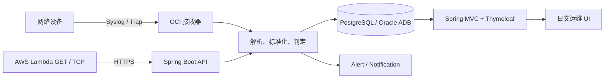

## 5. AWS 与 OCI 职责划分

AWS 使用 EventBridge 定时触发 Java 21 Lambda，从 AWS VPC/客户网络视角执行 SNMP GET 与 TCP Socket connect。OCI 是主运行面，负责 NLB/LB、OKE 接收与 Web/worker、ADB、Functions、Logging、Monitoring、Notifications、Vault 和 Bastion。跨云优先 Site-to-Site VPN/私网路由；学习环境可以 NAT + HTTPS 443。

## 6. 数据流说明

固定处理顺序是：原始数据 → 格式解析 → 标准化 → 设备匹配 → 规则匹配 → 阈值 → 重复抑制 → Event 保存 → Alert 新建/更新 → 幂等通知。每个 Event 保存原文、来源、协议、发生时间、标准状态、错误/指标和 duplicate 标志；Alert 保存当前聚合状态和 occurrence count。

## 7. Syslog 说明

`SyslogReceiver` 同时监听 UDP/TCP 5514（可配置 514），`SyslogParser` 解析 RFC3164/5424 的 PRI、Facility、Severity、Timestamp、Hostname 与 Message。格式错误通过受控异常记录，不让接收线程退出；TCP 按行分帧，UDP 每个 datagram 是一条消息。

本地发送：`scripts/send-syslog.ps1 udp rfc5424` 或 `scripts/send-syslog.sh udp rfc5424`。该命令通过 Maven exec 启动真正的 Java simulator 并发送到 `localhost:5514`。

## 8. SNMP GET 说明

`SnmpV2cQueryClient` 使用 SNMP4J 向 OID 发起 v2c GET，支持 community、timeout、retry，并把 success/value/errorType 保存为事件。`SnmpQueryClient` 是扩展边界，v3 可在不改 Controller/Service 的情况下加入 authPriv 实现。本地 agent 暴露主机 UDP 1161，生产标准端口为 UDP 161。

## 9. SNMP Trap 说明

Trap receiver 默认监听 UDP 1162（生产可配置 162），解析 sysUpTime、snmpTrapOID 与 varbind。`apps/snmp-simulator` 能发送 linkDown/linkUp v2c Trap；运行 `scripts/send-snmp-trap.ps1 linkDown`。生产不应让 v2c 穿越公网，应限制来源并逐步切换 v3。

## 10. TCP Ping 说明

TCP Ping 不是 ICMP。`TcpPingService` 通过 Java Socket 连接目标 host/port，区分 SUCCESS、CONNECTION_REFUSED、TIMEOUT、DNS_ERROR，记录响应毫秒、检查时间和重试次数。运行 `scripts/run-tcp-ping.ps1 localhost 8080` 会调用受 API Key 保护的本地端点并把结果持久化。

## 11. Spring Boot 服务端渲染说明

浏览器 → Security Filter → MVC Controller → Service 事务 → Repository → 数据库 → Model → Thymeleaf → HTML。Controller 只做输入/导航，业务判定在 Service，Entity 与 Form DTO 分离。`open-in-view=false` 防止模板暗中查询数据库，Service 在事务内初始化详情页需要的关系。

## 12. Thymeleaf 说明

20 个日文页面共享深色运维控制台布局、侧栏、状态 badge、分页和响应式表格。模板默认 HTML 转义；少量原生 JavaScript 只负责 Canvas 趋势图与渐进增强。CSP 仅允许同源静态资源，无 CDN/Node 前端构建。

## 13. Java 模块说明

| Module | 职责 | 主要入口 |
|---|---|---|
| `app/bms-app` | MVC、API、协议接收、规则、告警、通知、数据库 | `BmsApplication` |
| `apps/syslog-simulator` | RFC3164/5424 UDP/TCP 发送 | `SyslogSimulator` |
| `apps/snmp-simulator` | SNMPv2c linkDown/linkUp Trap | `SnmpTrapSimulator` |
| `apps/snmp-get-lambda` | AWS Lambda SNMP GET 样例 | `SnmpGetLambdaHandler` |
| `apps/tcp-ping-lambda` | AWS Lambda TCP connect 样例 | `TcpPingLambdaHandler` |
| `apps/alert-function` | OCI Functions 风格告警通知 | `AlertNotificationFunction` |

## 14. 数据转换说明

`IngestRequest` 是协议无关 DTO，来源枚举为 SYSLOG/SNMP_TRAP/SNMP_GET/TCP_PING。Parser 保留 rawMessage 并转换 severity/status/metric；设备按 hostname/IP 匹配，规则按 source/eventKey/target 匹配。未知设备的事实仍保存，方便运维补主数据，而不伪造设备关联。

## 15. 障害判定说明

协议 severity 和监视值先转标准状态；阈值规则可以提升 WARNING/CRITICAL。失败触发/更新活动 Alert；恢复信号把活动 Alert 转 RECOVERED；相同设备、来源和 eventKey 在窗口内增加次数而不是新建告警。所有迁移同时写 `alert_histories` 和 `audit_logs`。

## 16. 告警生命周期说明

正常 → 警告/严重 → 确认或恢复 → 关闭。ACKNOWLEDGED 表示操作员已接管，不代表故障恢复；RECOVERED 表示监控恢复，不代表工单已闭环；CLOSED 是终态。关闭后的记录不能倒退回确认状态，非法迁移返回 HTTP 400。

## 17. PostgreSQL 说明

Compose 使用 PostgreSQL 16.8 Alpine。Flyway V1 创建 11 张业务表与索引，V2 写入 10 台设备和监视/通知主数据；`DemoDataService` 补齐 30 Syslog、20 Trap、20 GET、20 TCP 事件。JPA `ddl-auto=validate`，Testcontainers 使用真实 PostgreSQL 验证驱动/连接边界。

## 18. Oracle ADB 说明

激活 `oracle` profile 后使用 Oracle JDBC/Flyway Oracle。ADB 私有端点、mTLS Wallet、服务名、密码都从环境/Secret 注入。Wallet 不进入镜像/Git。OpenTofu ADB module 默认关闭，创建和销毁都可能产生费用或数据损失。

## 19. Docker 说明

Dockerfile 多阶段执行 Maven package，再把 fat JAR 放入 Java 21 JRE 镜像；运行用户是非 root 10001，并用 Actuator readiness 做 healthcheck。Compose 提供 PostgreSQL、MailHog、SNMP agent、BMS app、Syslog simulator 的共享网络。

## 20. Kubernetes 说明

base 包含 Namespace、Deployment、Service、ConfigMap、Secret sample、ServiceAccount/Role/RoleBinding、PVC、Ingress、NetworkPolicy、HPA、PDB、探针与资源限制。Pod 使用 restricted security、非 root、只读 rootfs、drop ALL capabilities。`kubectl kustomize infra/kubernetes/overlays/kind` 可离线渲染验证。

## 21. OKE 说明

OCI module 创建私有 OKE endpoint 与 Flex Node Pool；环境需以 data source 选择当前支持版本/镜像。Web 两副本配 HPA/PDB，协议接收器单独扩缩，worker 不对外暴露。生产还需 OCI IAM dynamic group/policy、metrics-server、日志采集与 PodDisruption 演练。

## 22. OCI NLB 和 Load Balancer 说明

Syslog UDP/TCP 与 SNMP Trap UDP 必须保留四层协议，使用 OCI NLB；Web/JSON API 需要 HTTPS TLS、Host/Path 路由，使用 OCI Load Balancer 或 Ingress。标准端口为 Syslog 514、GET 161、Trap 162、HTTPS 443、受控 SSH 22；本地高端口避免管理员权限。

## 23. AWS Lambda 说明

两个 handler 都有 JUnit 测试和 JSON payload。EventBridge 每 5 分钟调用，执行角色默认只有日志权限；VPC mode 通过 dynamic block 可选。示例把 API Key 作为 sensitive 输入，但生产应从 Secrets Manager/KMS 注入，不能写日志或 tfvars。

本地模拟：`./mvnw -pl apps/tcp-ping-lambda test package` 验证 handler；再使用 `scripts/run-tcp-ping.*` 验证等价 Spring API 路径。

## 24. OCI Functions 说明

Java Function 示例接受告警 payload，构造通知并保持幂等语义。OpenTofu 创建 Application/Function，生产还需 Dynamic Group、最小 IAM Policy、OCIR、Logging、Notifications/Email Delivery 和 Vault。未配置真实 OCI 时仍可用普通 JUnit 运行函数核心逻辑。

## 25. OpenTofu 说明

八个模块均包含 main/variables/outputs/versions/README/example.tfvars，且 `enabled=false`。local 环境完全不需要 provider/凭据，专供 `fmt/init/validate`；dev 组合 OCI/AWS network；staging/production 文档强调独立账号、state、审批和费用。

## 26. Terraform 与 OpenTofu 比较

二者共享早期 HCL/Provider 协议，但许可证、发布治理和新特性会分化。本仓库只把 OpenTofu 执行结果称为已验证，不声称 Terraform 等价通过。迁移必须备份 state、锁 CLI/provider 版本，并在隔离 state 上比较 plan，不能交替写同一 state。

## 27. VPN 和跨云网络说明

AWS `10.10.0.0/16` 与 OCI `10.20.0.0/16` 不重叠。生产建议 AWS VGW/TGW ↔ OCI DRG 双隧道 VPN，BGP 或对称静态路由；简化路径用 AWS NAT 访问 OCI public HTTPS 443。SNMP/设备管理流量走私网，SSH 仅经 OCI Bastion/Smart Jumper 临时会话。

## 28. 安全设计

- ADMIN 管用户/规则/设备写入；OPERATOR 操作告警；VIEWER 只读。
- BCrypt、本地表单登录、CSRF、CSP、X-Frame-Options、输入验证和统一安全错误页。
- ingestion API 常量时间比较 Key；生产应进一步用 mTLS/OIDC/WAF/限流。
- Secret 外部化；日志禁止 Header/community/password/Wallet，使用 request/correlation ID。
- 容器/Kubernetes/云 IAM 均最小权限，网络默认拒绝。详见 [威胁模型](docs/security/threat-model.md)。

## 29. 项目目录说明

```text
app/bms-app/              Spring Boot 主应用
apps/                     两个 simulator、两个 Lambda、一个 OCI Function
docs/                     架构、数据库、运维、安全、25 个技术文档、截图
infra/docker/             多阶段非 root 镜像
infra/kubernetes/         base、kind overlay 和集群配置
infra/opentofu/           8 modules、4 environments
scripts/                  PowerShell/bash 成对运行与验证脚本
```

## 30. 本地运行方法

```bash
git clone <your-repository-url>
cd hybrid-cloud-bms-monitoring-platform
./mvnw clean verify
./mvnw -pl app/bms-app spring-boot:run
```

`git clone` 取得完整仓库；`cd` 确保 wrapper 与相对路径正确；`clean verify` 编译六个 module、运行测试并生成 JaCoCo 报告；最后命令使用默认 local+postgresql profile 启动，因此应先让 PostgreSQL 可访问。更简单的依赖启动方式是 `docker compose up -d postgresql mailhog snmp-agent`。

浏览 `http://localhost:8080`。本地账户：`admin/Admin123!`、`operator/Operator123!`、`viewer/Viewer123!`，只用于隔离学习环境，生产必须替换。

## 31. Windows 运行方法

要求 JDK 21、Docker Desktop 与 PowerShell。系统不需要全局 Maven，因为 `mvnw.cmd` 会下载锁定版本。

```powershell
Copy-Item .env.example .env
.\scripts\dev-up.ps1
.\scripts\generate-demo-data.ps1
.\scripts\send-syslog.ps1 udp rfc5424
.\scripts\send-snmp-trap.ps1 linkDown
```

`dev-up.ps1` 先执行 Compose 结构验证再 build/up；其余脚本分别确保演示数据、真实 UDP Syslog 与 SNMP Trap 到达应用。停止使用 `.\scripts\dev-down.ps1`，它保留数据库 volume。

## 32. macOS 运行方法

安装 JDK 21、Docker Desktop、bash/sh；首次给脚本执行权限：

```bash
chmod +x mvnw scripts/*.sh
cp .env.example .env
./scripts/dev-up.sh
./scripts/generate-demo-data.sh
./scripts/send-syslog.sh udp rfc5424
./scripts/send-snmp-trap.sh linkDown
```

脚本使用仓库相对路径，不写死 Windows 目录。若 Docker Desktop 未启动，先启动 engine 再执行。

## 33. Docker 运行方法

```bash
docker compose config --quiet
docker compose up -d --build
docker compose ps
docker compose logs -f bms-app
docker compose down
```

第一条只验证 YAML/变量插值；第二条构建并后台启动完整本地环境；`ps` 检查 health；`logs` 跟踪启动和协议接收；`down` 删除容器/网络但保留 volume。只有明确接受本地数据库丢失时才使用 `docker compose down -v`。

## 34. Kubernetes 运行方法

```bash
kubectl kustomize infra/kubernetes/overlays/kind >/dev/null
./scripts/kind-up.sh
kubectl get pods,svc,ingress -n bms-monitoring
kubectl -n bms-monitoring port-forward svc/bms-web-app 8088:80
./scripts/kind-down.sh
```

第一条不改集群，只验证渲染；kind-up 创建本地集群、构建/load 镜像、apply overlay 并等待 rollout；port-forward 在 `http://localhost:8088` 暴露 Web；kind-down 删除名为 `bms-monitoring` 的本地集群。Windows 使用同名 `.ps1`。

## 35. OpenTofu 运行方法

```bash
tofu fmt -recursive -check infra/opentofu
tofu -chdir=infra/opentofu/environments/local init -backend=false
tofu -chdir=infra/opentofu/environments/local validate
tofu -chdir=infra/opentofu/environments/dev init
tofu -chdir=infra/opentofu/environments/dev plan -var-file=dev.auto.tfvars -out=dev.tfplan
tofu -chdir=infra/opentofu/environments/dev apply dev.tfplan
tofu -chdir=infra/opentofu/environments/dev destroy -var-file=dev.auto.tfvars
```

前三条无云验证格式、provider 初始化边界和语法。dev 的 init/plan 需要真实 provider/凭据；plan 只生成变更审查文件。`apply` 会真实创建并收费，`destroy` 会删除资源/数据，二者都必须经过明确审批。本项目交付验证不会自动执行后三条。

## 36. 测试方法

```bash
./mvnw clean verify
./mvnw -pl app/bms-app -Dtest=SyslogParserTest,SnmpTrapParserTest test
docker compose config --quiet
kubectl kustomize infra/kubernetes/overlays/kind >/dev/null
```

全量 verify 覆盖 domain、validation、Mockito service、scheduler、parser、Repository、MockMvc/Security、Lambda/Function 与 PostgreSQL Testcontainers；JaCoCo HTML 在 `app/bms-app/target/site/jacoco/index.html`。后两条分别验证 Compose 和 Kubernetes 声明，不等同于实际容器/集群健康。

## 37. 截图说明

以下由 Playwright 以 1440×960 登录真实 Spring Boot 应用后采集，不是 mockup。脚本为 `scripts/capture-screenshots.mjs`；Node 仅作为浏览器证据工具，不参与应用构建。

### 登录

Controller `LoginController`；Service 无（Security filter）；表无；URL `/login`。

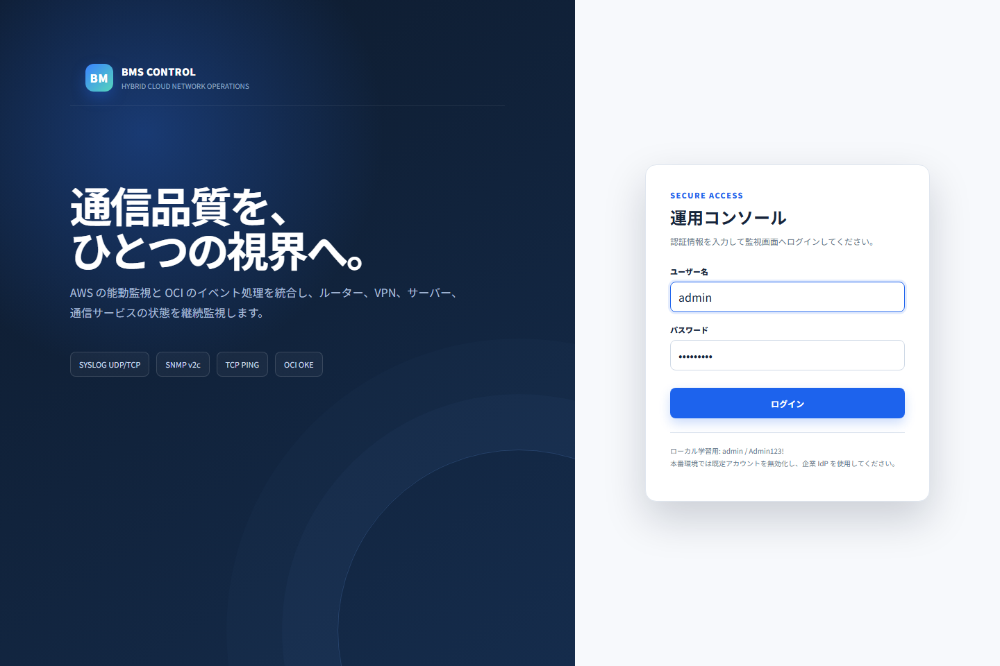

### ダッシュボード

Controller `DashboardController`；Service `DashboardService`；表 `devices/monitoring_events/alerts/tcp_ping_results`；URL `/dashboard`。

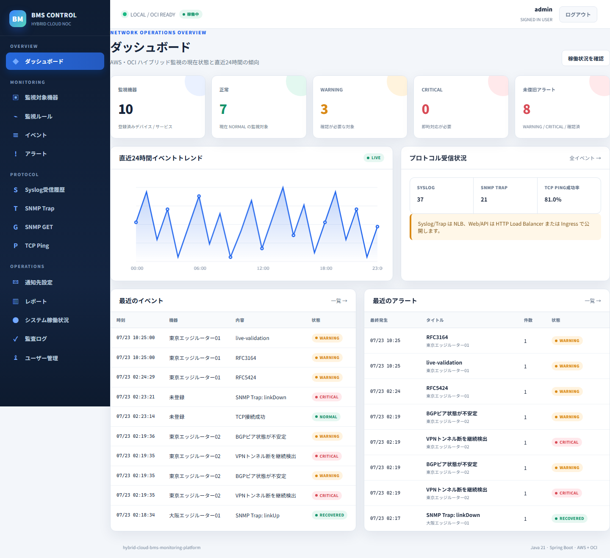

### 監視対象機器一覧

Controller `DeviceController`；Service `DeviceService`；表 `devices`；URL `/devices`。

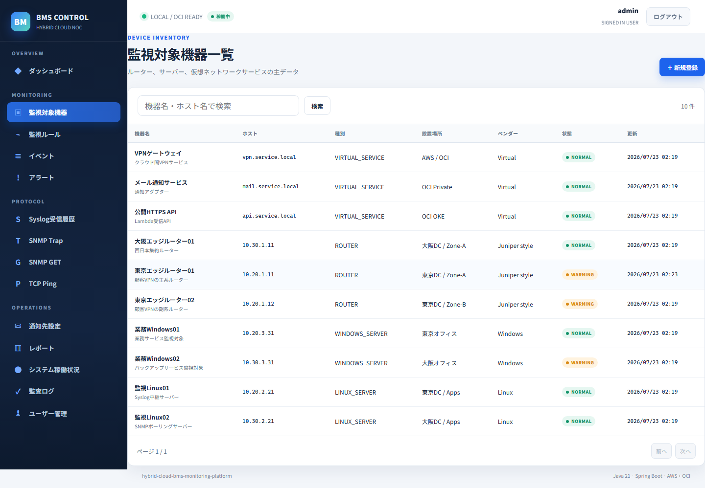

### 機器詳細

Controller `DeviceController`；Service `DeviceService`；表 `devices/monitoring_targets`；URL `/devices/1`。

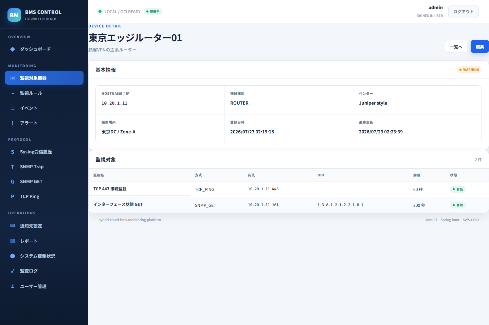

### イベント一覧

Controller `EventController`；Service `EventQueryService`；表 `monitoring_events`；URL `/events`。

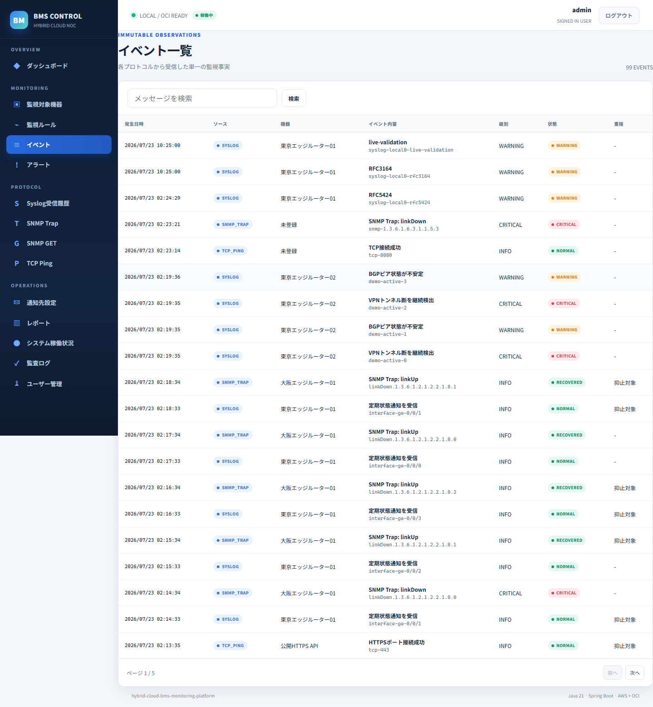

### イベント詳細

Controller `EventController`；Service `EventQueryService`；表 `monitoring_events/devices`；URL `/events/1`。

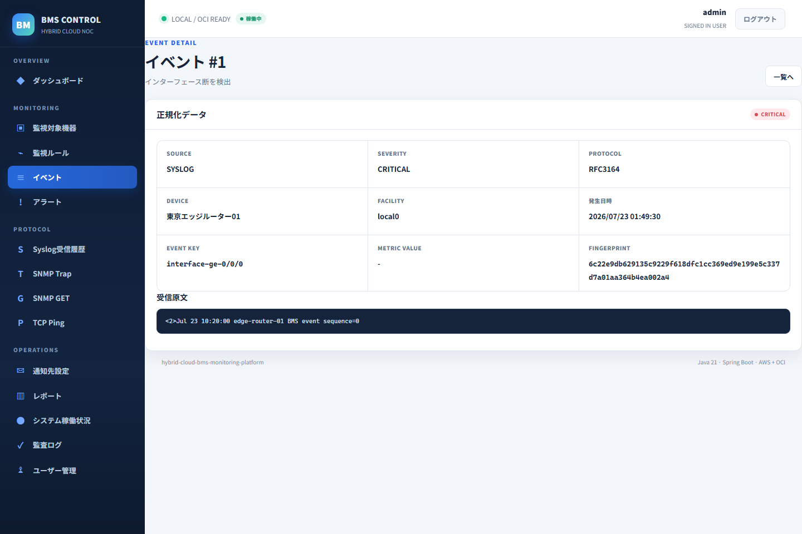

### アラート一覧

Controller `AlertController`；Service `AlertService`；表 `alerts`；URL `/alerts`。

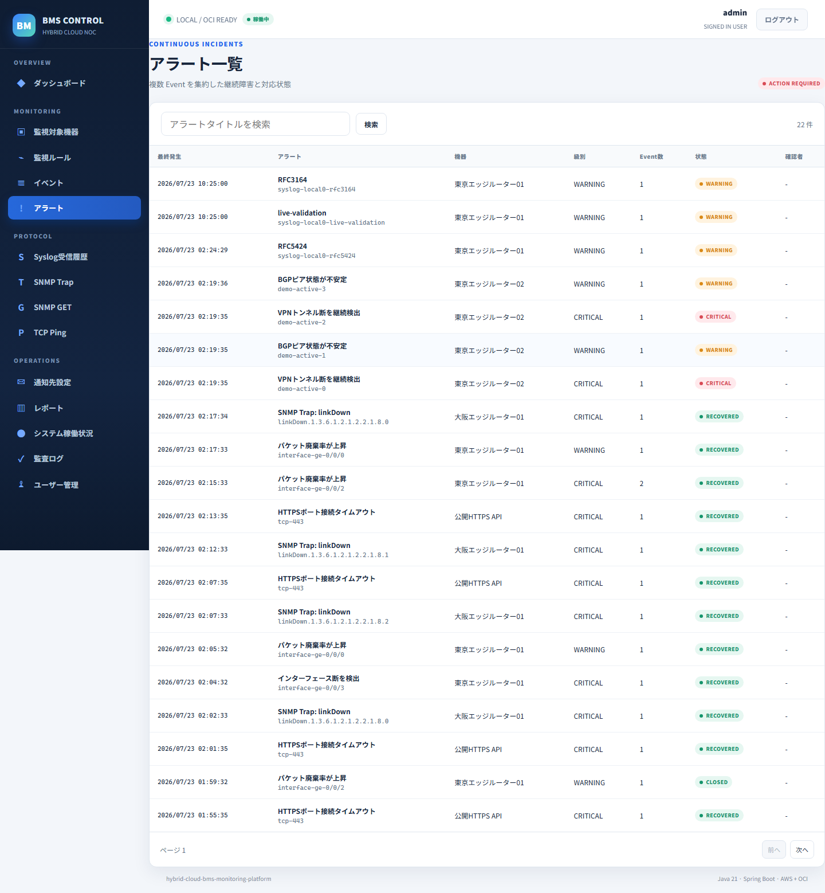

### アラート詳細

Controller `AlertController`；Service `AlertService`；表 `alerts/alert_histories`；URL `/alerts/1`。

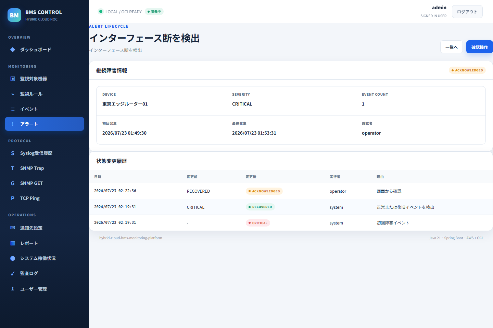

### Syslog受信履歴

Controller `OperationsController`；Service `OperationsViewService`；表 `monitoring_events`；URL `/history/syslog`。


### SNMP Trap受信履歴

Controller `OperationsController`；Service `OperationsViewService`；表 `monitoring_events`；URL `/history/snmp-trap`。

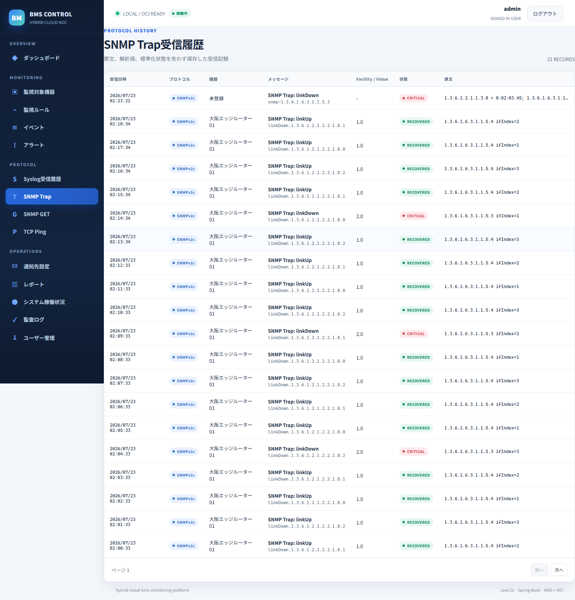

### システム稼働状況

Controller `OperationsController`；Service `OperationsViewService`/Actuator；表/组件 `Flyway/JVM/receiver health`；URL `/system/status`。

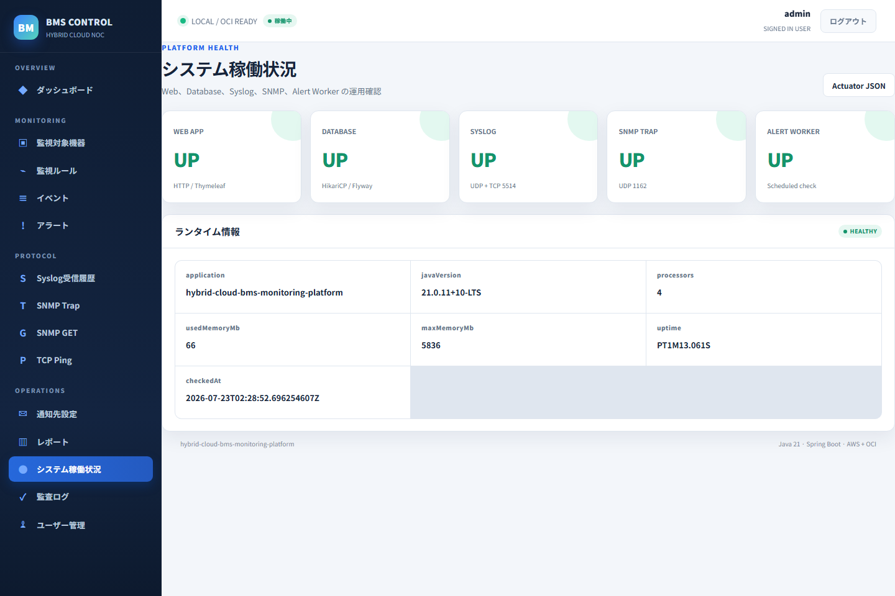

### 履歴トレンドレポート

Controller `OperationsController`；Service `OperationsViewService`；表 `monitoring_events/alerts`；URL `/reports/trends`。

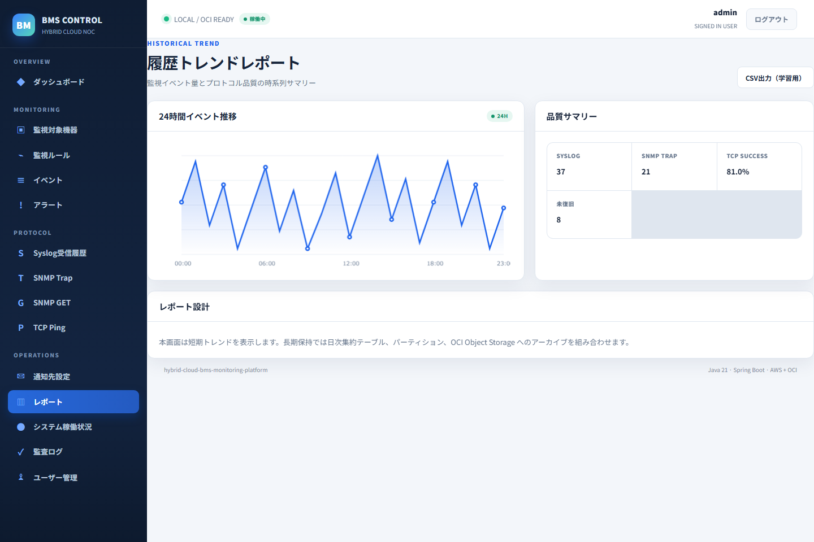

## 38. 常见故障排查

- `JAVA_HOME`/版本错误：`java -version` 必须显示 21；使用 wrapper 而非旧全局 Maven。
- Docker 连接失败：先启动 Docker Desktop，`docker version` 必须同时显示 Client/Server。
- 8080/5432/5514/1162 冲突：用 `Get-NetTCPConnection`、`netstat` 或 `lsof` 查占用并改环境变量。
- 页面 500：按响应 `X-Request-ID` 查日志；不要把堆栈/Secret 复制到公开 issue。
- UDP 无记录：逐层检查发送目标、主机防火墙、Compose/Kubernetes service、receiver health。
- kind 缺失：安装 kind 后再运行脚本；单纯 `kubectl kustomize` 只能证明清单可渲染。
- OpenTofu provider 错：确认 CLI/provider lock 和网络；不要因 validate 失败而直接在云环境试 apply。

详见 [运维 Runbook](docs/operations/runbook.md) 与 [Troubleshooting](docs/technologies/troubleshooting.md)。

## 39. 已知限制

- SNMPv3 目前是扩展接口，运行实现为 v2c；生产安全要求尚需实现 authPriv。
- 内存用户适合本地学习，不是生产 IdP；API Key 也应升级到 mTLS/OIDC 签名凭证。
- Kubernetes 五角色共享代码镜像，角色开关完成逻辑隔离，但未拆成独立制品。
- Oracle ADB/OpenTofu 云资源未在真实账号执行，避免凭据和费用；验证边界会写入 validation report。
- kind 若本机未安装不能执行真实集群部署；HPA 依赖 metrics-server。
- MailHog/本地 SNMP agent 仅用于模拟，不代表 OCI Email Delivery 或真实设备兼容认证。

## 40. 未来扩展方向

实现 SNMPv3 authPriv 与 MIB resolver；加入分布式锁/队列保证多 worker 一次调度；用 OIDC、External Secrets、OCI Vault 和 mTLS 替换本地凭证；接入 OCI Logging/Monitoring/OpenTelemetry/Prometheus；实现表分区与长期归档；加入双隧道 VPN module、Service Gateway、完整 LB listeners/backends；在真实 staging 做 Oracle/OKE/ADB 灰度、容量与灾难恢复演练。

## 进一步阅读

`docs/technologies` 下有 25 份独立说明，每份均包含技术定义、采用理由、项目位置、主要概念/配置、示例、命令和常见错误。跨云网络、容器和协议通信的图形化说明见[云端通信与容器结构设计书](docs/architecture/cloud-communication-and-container-design.md)。实际执行记录、版本、通过/受阻边界见 [验证报告](docs/validation-report.md)。
