# Syslog、SNMP GET、SNMP Trap 与 TCP Ping 图解教程

> 面向网络监控、服务器监控、CPE、交换机、路由器、BMS 和混合云监控系统的入门讲解。

---

## 1. 四种方式分别解决什么问题？

这四种通信方式通常不是互相替代，而是组合使用。

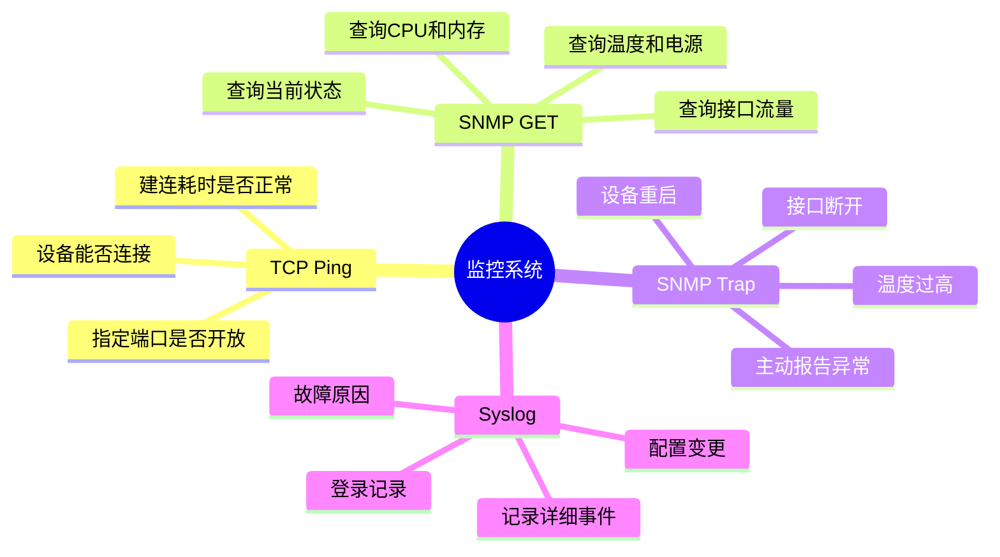

最简单的记忆方法：

| 通信方式 | 核心问题 | 生活类比 |
|---|---|---|
| TCP Ping | 能不能连？ | 敲门，看对方是否开门 |
| SNMP GET | 现在怎么样？ | 主动询问对方当前体温 |
| SNMP Trap | 刚刚发生了什么异常？ | 对方主动打电话报告出事 |
| Syslog | 为什么会这样？ | 查看完整的事件记录和日记 |

```text
TCP Ping：能不能连
SNMP GET：现在怎样
SNMP Trap：突然怎样
Syslog：为什么会这样
```

---

# 2. 整体监控架构

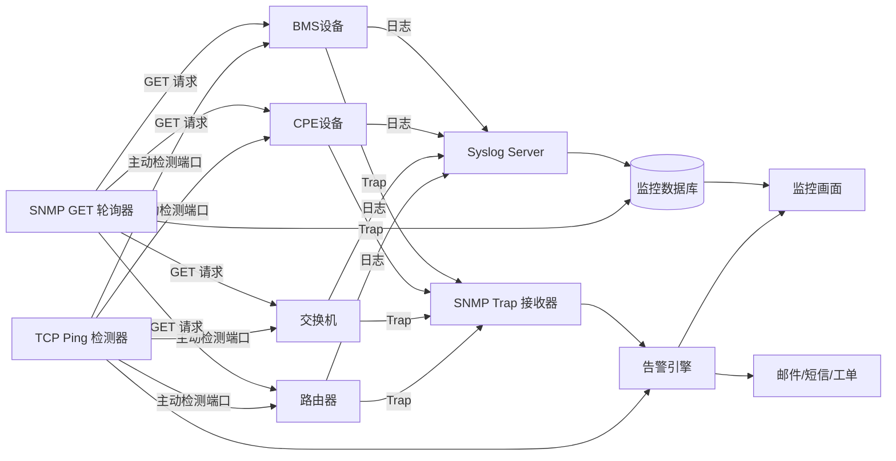

这张图可以概括为：

- TCP Ping 和 SNMP GET 由监控服务器主动发起。
- SNMP Trap 和 Syslog 通常由设备主动发送。
- 四类数据最终汇总到告警引擎、数据库和监控画面。

---

# 3. Syslog

## 3.1 Syslog 是什么？

Syslog 是一种日志传输机制。网络设备、服务器或应用程序把运行日志、错误、警告、安全事件和配置变更发送给日志服务器。

示例：

```text
Jul 29 10:30:22 router-01 Interface GigabitEthernet0/1 changed state to down
```

这条日志表示：

- 设备：`router-01`
- 时间：`Jul 29 10:30:22`
- 对象：`GigabitEthernet0/1`
- 事件：接口状态变为 Down

## 3.2 Syslog 通信方向

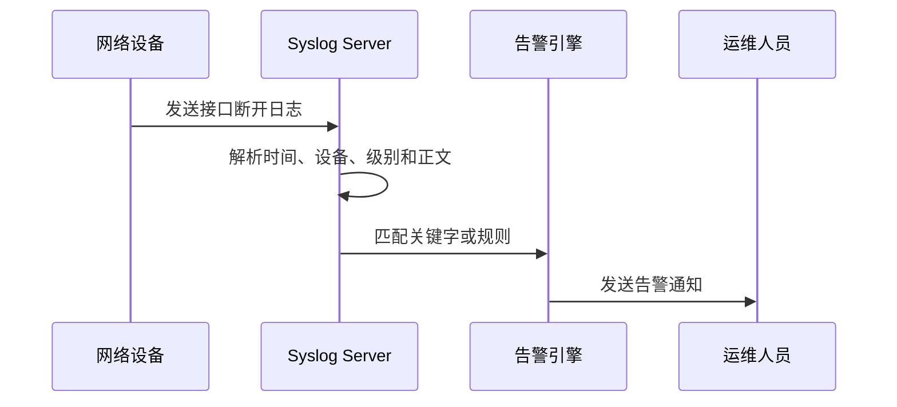

Syslog 的典型方向：

```text
被监控设备  ─────日志────→  Syslog Server
```

## 3.3 常见端口

| 传输方式 | 常见端口 | 特点 |
|---|---:|---|
| UDP | 514 | 简单、速度快，但可能丢失 |
| TCP | 514 | 有连接，可靠性更高 |
| TLS | 6514 | 加密传输，适合安全要求较高的环境 |

## 3.4 Syslog 适合记录什么？

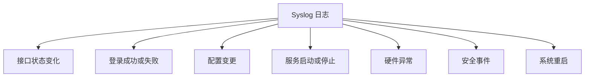

## 3.5 Syslog 的优势与限制

### 优势

- 信息详细。
- 适合调查故障原因。
- 可以保存原始事件记录。
- 可以用于安全审计和配置变更追踪。

### 限制

- 不同厂商的日志格式可能不同。
- 文本解析比结构化指标更复杂。
- UDP Syslog 可能丢失。
- 日志量大时，需要良好的存储、检索和归档设计。

---

# 4. SNMP GET

## 4.1 SNMP GET 是什么？

SNMP GET 是监控服务器主动查询设备状态的方式，属于轮询式监控。

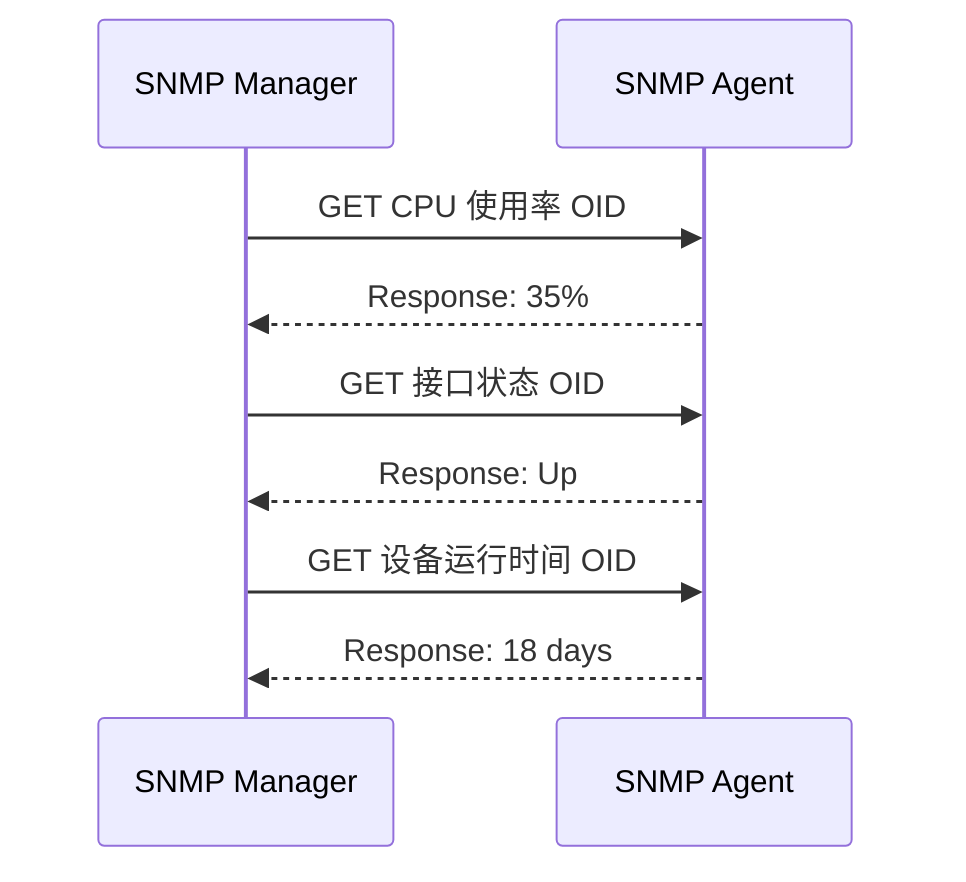

通信方向：

```text
监控服务器 → 设备：请告诉我当前状态
设备 → 监控服务器：返回查询结果
```

## 4.2 OID 是什么？

OID 是 SNMP 中用于标识某个管理对象的编号。

例如：

```text
1.3.6.1.2.1.1.3.0
```

它通常表示：

```text
sysUpTime
```

也就是设备已经运行了多长时间。

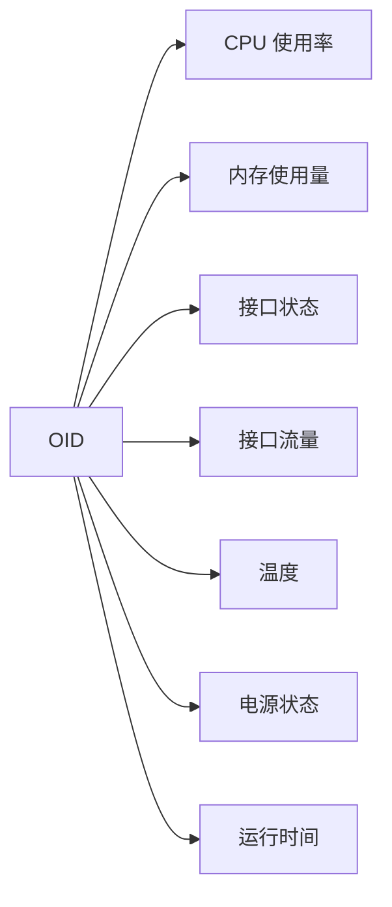

## 4.3 SNMP GET 常见用途

- 查询 CPU 使用率。
- 查询内存使用量。
- 查询接口流量。
- 查询接口 Up/Down 状态。
- 查询设备温度。
- 查询风扇和电源状态。
- 查询设备运行时间。
- 查询设备型号、名称和版本。

## 4.4 SNMP GET 轮询模型

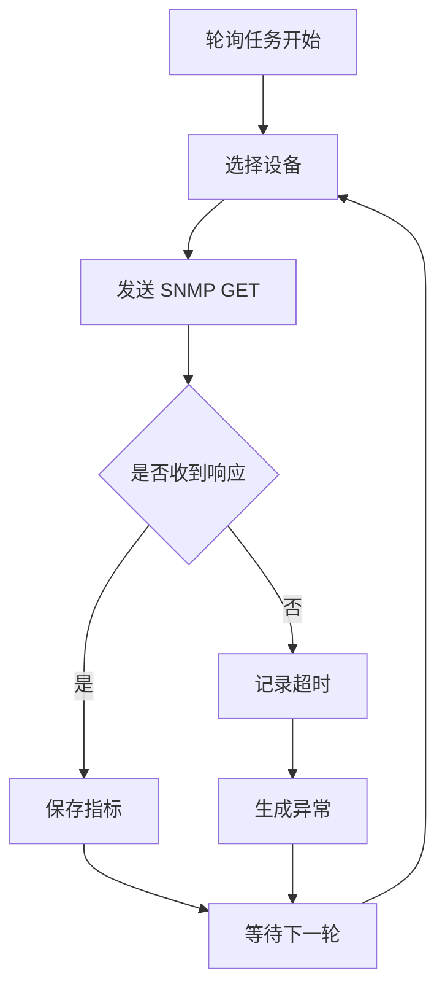

例如每 60 秒执行一次：

```text
10:00:00  查询 CPU：30%
10:01:00  查询 CPU：35%
10:02:00  查询 CPU：52%
10:03:00  查询 CPU：91%  → 触发高负载告警
```

## 4.5 SNMP 版本

| 版本 | 特点 | 安全性 |
|---|---|---|
| SNMPv1 | 早期版本，功能简单 | 较低 |
| SNMPv2c | 性能较好，使用 Community | 较低 |
| SNMPv3 | 支持认证和加密 | 较高 |

正式环境通常优先考虑 SNMPv3。

## 4.6 常见端口

| 用途 | 端口 |
|---|---:|
| SNMP GET 请求和响应 | UDP 161 |
| SNMP Trap 接收 | UDP 162 |

---

# 5. SNMP Trap

## 5.1 SNMP Trap 是什么？

SNMP Trap 是设备检测到事件后，主动向监控系统发送通知的机制。

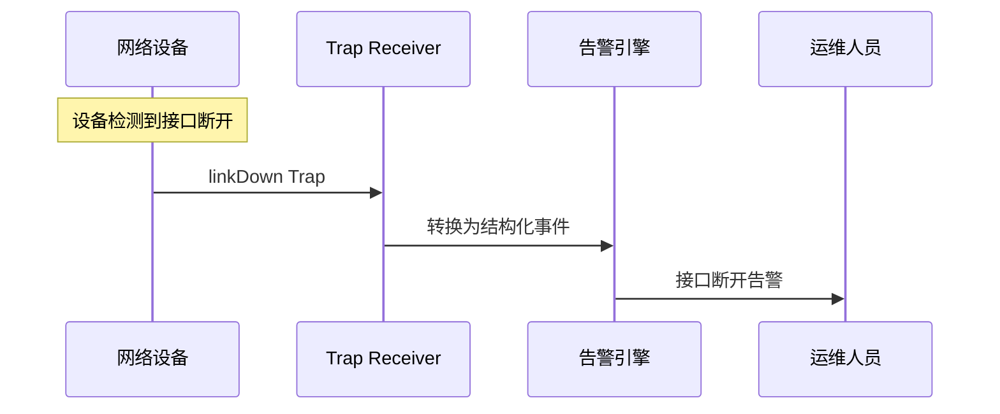

通信方向：

```text
设备  ─────Trap────→  监控服务器
```

## 5.2 Trap 常见事件

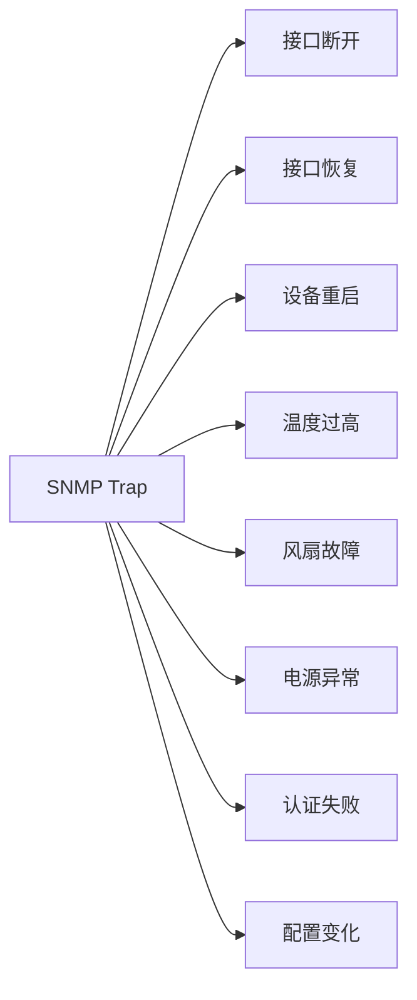

## 5.3 Trap 与 Inform

传统 Trap 通常不要求接收方返回确认。

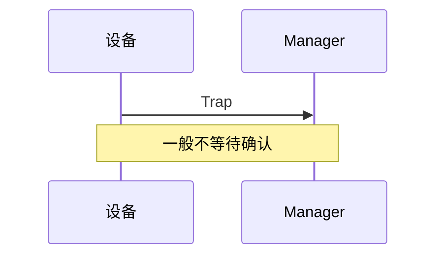

Inform 要求接收方返回确认：

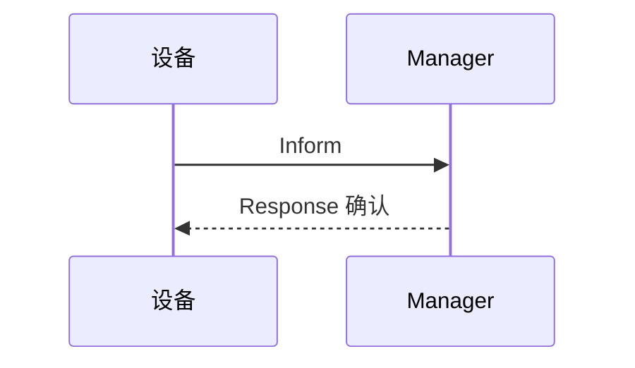

| 项目 | Trap | Inform |
|---|---|---|
| 是否要求确认 | 通常不要求 | 要求 |
| 可靠性 | 较低 | 较高 |
| 开销 | 较小 | 较大 |
| 适合场景 | 普通实时通知 | 重要事件通知 |

## 5.4 Trap 的优势与限制

### 优势

- 事件发生后可以快速通知。
- 不需要等待下一次轮询。
- 数据通常比较结构化。
- 适合直接转换为告警。

### 限制

- 传统 Trap 可能丢失。
- 设备配置错误时可能完全收不到通知。
- 仅依赖 Trap 无法持续生成 CPU、内存和流量趋势。
- 收到 Trap 后，通常还要用 SNMP GET 再次确认状态。

---

# 6. TCP Ping

## 6.1 TCP Ping 是什么？

TCP Ping 并不是像 Syslog、SNMP 那样的单一标准协议名称，而是一种常见的连通性检测方法。

它尝试连接目标主机的指定 TCP 端口，从而判断：

- 目标 IP 是否可达。
- 指定端口是否开放。
- 对应服务是否正在监听。
- 防火墙是否允许连接。
- TCP 建连耗时是否正常。

## 6.2 TCP 三次握手

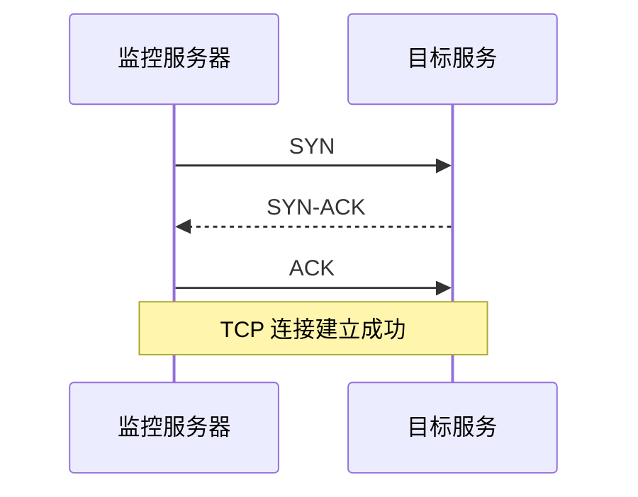

检测 HTTPS 服务时：

```text
目标地址：192.168.1.10
目标端口：443
```

成功表示：

```text
192.168.1.10:443 可以建立 TCP 连接
```

但这不一定表示整个 Web 应用完全正常，只能说明 TCP 端口可以建立连接。

## 6.3 TCP Ping 与 ICMP Ping

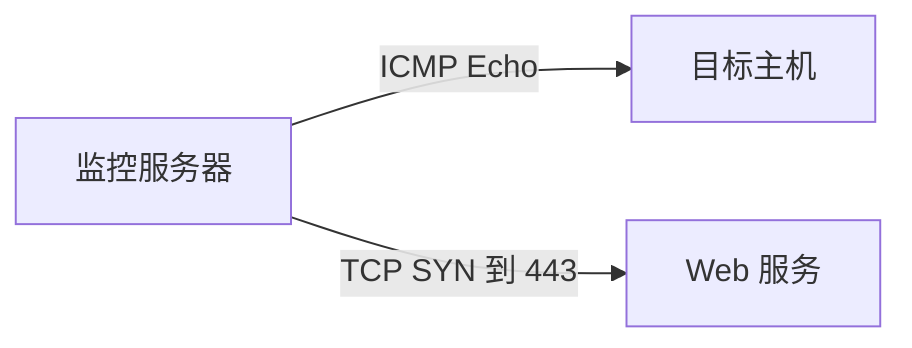

| 项目 | ICMP Ping | TCP Ping |
|---|---|---|
| 检测对象 | 主机网络可达性 | 指定 TCP 服务端口 |
| 使用协议 | ICMP | TCP |
| 是否检测应用端口 | 否 | 是 |
| 可能被防火墙禁止 | 是 | 是 |
| 业务意义 | 主机是否可达 | 服务是否可连接 |

典型情况：

```text
ICMP Ping：失败
TCP Ping 443：成功
```

这可能说明服务器禁止 ICMP，但 HTTPS 服务仍然正常。

## 6.4 常见检测端口

| 服务 | 常见端口 |
|---|---:|
| SSH | 22 |
| HTTP | 80 |
| HTTPS | 443 |
| PostgreSQL | 5432 |
| MySQL | 3306 |
| SMTP | 25 / 587 |
| Redis | 6379 |
| 自定义业务系统 | 根据系统配置 |

## 6.5 TCP Ping 检测流程

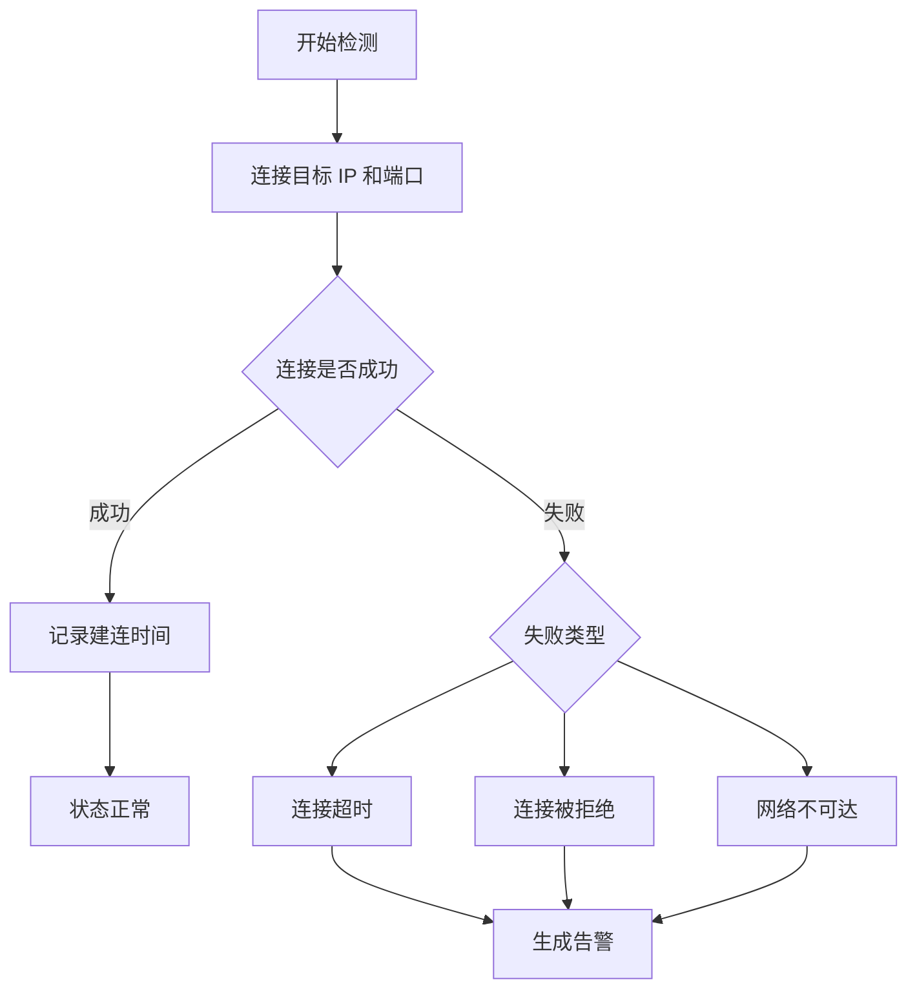

不同失败类型可能意味着：

| 结果 | 可能原因 |
|---|---|
| Connection timeout | 网络中断、防火墙丢弃、目标无响应 |
| Connection refused | 主机可达，但服务未启动或端口未监听 |
| Network unreachable | 路由或网络配置存在问题 |
| Success but slow | 网络拥塞、服务端负载较高 |

---

# 7. 四种方式的核心区别

| 项目 | Syslog | SNMP GET | SNMP Trap | TCP Ping |
|---|---|---|---|---|
| 核心目的 | 收集详细日志 | 查询当前指标 | 接收主动事件 | 检查端口连通性 |
| 发起方 | 通常是设备 | 监控服务器 | 设备 | 监控服务器 |
| 通信模式 | 推送 | 请求—响应、轮询 | 事件推送 | 主动探测 |
| 数据形式 | 文本或半结构化日志 | 结构化指标 | 结构化事件 | 成功、失败、延迟 |
| 实时性 | 较高 | 取决于轮询周期 | 高 | 取决于检测周期 |
| 趋势分析 | 一般 | 非常适合 | 不适合单独使用 | 可分析可用率和延迟 |
| 故障原因分析 | 很适合 | 有限 | 提供事件类型 | 不适合 |
| 常见端口 | 514、6514 | UDP 161 | UDP 162 | 被检测服务端口 |
| 典型问题 | 发生了什么，为什么？ | 当前状态是多少？ | 刚才报告了什么？ | 当前能否连接？ |

---

# 8. 主动查询与主动上报

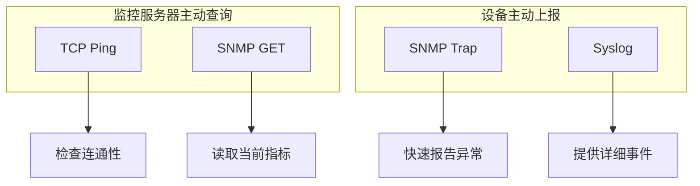

## 监控服务器主动发起

- TCP Ping
- SNMP GET

优点：

- 监控系统可以控制检测周期。
- 即使设备没有主动报警，也可以发现异常。
- 适合生成可用率和趋势数据。

缺点：

- 检测存在周期延迟。
- 设备数量很大时，会产生轮询压力。

## 设备主动上报

- SNMP Trap
- Syslog

优点：

- 事件发生后可以快速通知。
- 不需要频繁询问所有设备。
- 可以保留事件发生时的上下文。

缺点：

- 网络中断时，上报消息也可能无法到达。
- 如果设备配置错误，监控服务器可能收不到任何通知。

---

# 9. 四种方式如何协同工作？

## 场景：路由器接口发生故障

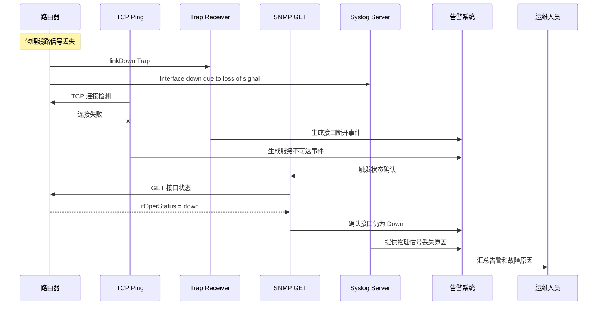

这个流程中，每种方式承担不同角色：

```text
TCP Ping
  → 发现某个服务端口无法连接

SNMP Trap
  → 快速通知接口刚刚发生 Down 事件

SNMP GET
  → 查询并确认接口当前仍然是 Down

Syslog
  → 说明接口断开是因为物理信号丢失
```

---

# 10. 为什么不能只用一种方式？

## 10.1 只用 TCP Ping

可以知道：

```text
端口无法连接
```

但不知道：

- 设备是否彻底宕机。
- 只是服务停止，还是网络断开。
- 是否被防火墙拦截。
- 具体故障原因是什么。

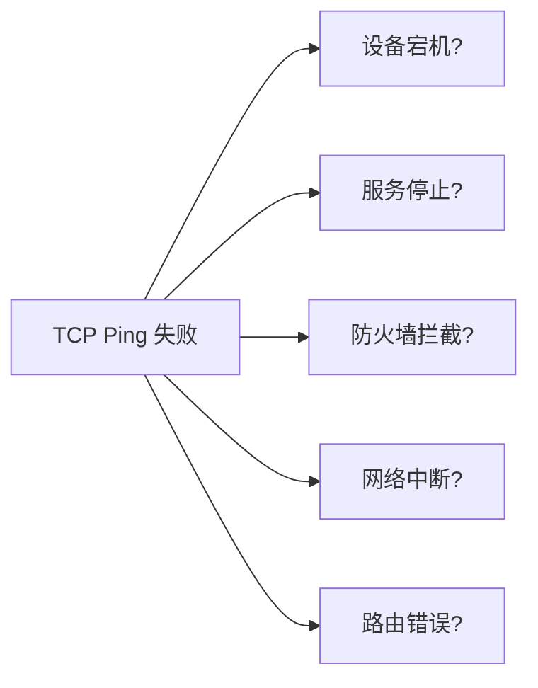

## 10.2 只用 SNMP GET

可以定期获取状态，但存在轮询延迟。

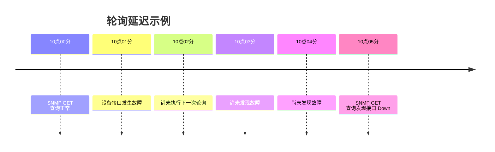

如果轮询周期是 60 秒，理论上可能延迟接近 60 秒才发现问题。

## 10.3 只用 SNMP Trap

Trap 虽然及时，但存在以下问题：

- UDP 消息可能丢失。
- 设备无法联网时，Trap 也发送不出来。
- 不适合持续采集性能趋势。
- 无法保证设备当前状态仍然与事件发生时相同。

## 10.4 只用 Syslog

Syslog 信息详细，但：

- 日志格式可能不统一。
- 仅靠文本关键字难以准确判断所有状态。
- 某些设备不会为每个指标变化生成日志。
- 不适合稳定地采集 CPU、内存和流量曲线。

---

# 11. 推荐的组合设计

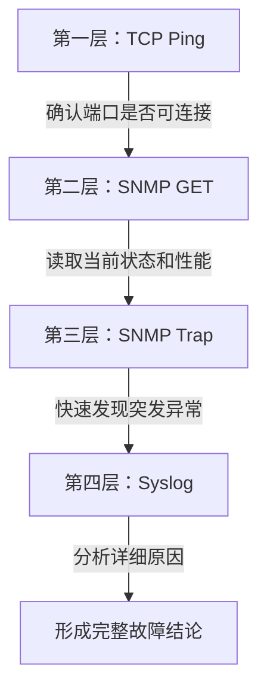

推荐分工：

| 层次 | 技术 | 主要职责 |
|---|---|---|
| 第一层 | TCP Ping | 判断指定服务端口是否可连接 |
| 第二层 | SNMP GET | 获取设备当前状态和性能指标 |
| 第三层 | SNMP Trap | 快速接收设备主动报告的异常 |
| 第四层 | Syslog | 保存详细事件并调查故障原因 |

---

# 12. 一个完整的告警处理流程

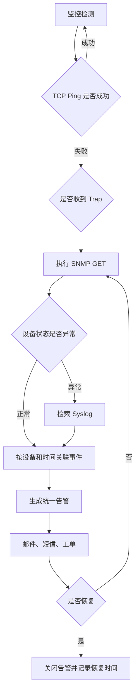

---

# 13. 数据关联方式

在实际监控系统中，需要把四类数据关联起来。

```mermaid
erDiagram
    DEVICE ||--o{ TCP_CHECK : has
    DEVICE ||--o{ SNMP_METRIC : has
    DEVICE ||--o{ SNMP_TRAP : sends
    DEVICE ||--o{ SYSLOG_EVENT : sends
    DEVICE ||--o{ ALARM : produces

    DEVICE {
        string device_id
        string hostname
        string ip_address
        string device_type
    }

    TCP_CHECK {
        datetime checked_at
        int port
        string result
        int latency_ms
    }

    SNMP_METRIC {
        datetime collected_at
        string oid
        string metric_name
        float metric_value
    }

    SNMP_TRAP {
        datetime received_at
        string trap_oid
        string severity
        string event_type
    }

    SYSLOG_EVENT {
        datetime received_at
        string facility
        string severity
        string message
    }

    ALARM {
        datetime opened_at
        string alarm_type
        string status
        string probable_cause
    }
```

常用关联字段：

- 设备 ID。
- IP 地址。
- Hostname。
- 接口编号。
- Trap OID。
- Syslog 中的接口名称。
- 事件发生时间。
- 告警级别。
- 业务系统或站点编号。

---

# 14. 示例：BMS 或 CPE 监控系统

```mermaid
flowchart LR
    subgraph SiteA[客户站点 A]
        CPE1[CPE 路由器]
        Sensor1[温度传感器]
        Power1[电源设备]
    end

    subgraph Cloud[云端监控平台]
        PingService[TCP Ping Service]
        SnmpService[SNMP Poller]
        TrapService[Trap Receiver]
        LogService[Syslog Receiver]
        AlarmService[Alarm Service]
        Pg[(PostgreSQL)]
        UI[监控 Dashboard]
    end

    PingService -->|TCP 22/443| CPE1
    SnmpService -->|UDP 161| CPE1
    SnmpService -->|UDP 161| Sensor1
    SnmpService -->|UDP 161| Power1

    CPE1 -->|UDP 162| TrapService
    Sensor1 -->|UDP 162| TrapService
    Power1 -->|UDP 162| TrapService

    CPE1 -->|514/6514| LogService

    PingService --> AlarmService
    SnmpService --> Pg
    TrapService --> AlarmService
    LogService --> Pg

    AlarmService --> Pg
    Pg --> UI
```

可能的告警例子：

```text
站点：Tokyo-Office-01
设备：CPE-Router-01

21:00:01  SNMP Trap：WAN 接口 Down
21:00:03  TCP Ping：TCP 443 连接失败
21:00:05  SNMP GET：ifOperStatus = down
21:00:06  Syslog：WAN carrier signal lost

统一结论：
WAN 线路因物理信号丢失而断开，导致 HTTPS 管理端口不可访问。
```

---

# 15. 面试或工作中的简洁回答

当别人问这四种方式的区别时，可以这样回答：

> TCP Ping 用于检测目标主机的指定 TCP 端口能否建立连接；SNMP GET 是监控服务器主动轮询设备，用于采集 CPU、内存、接口流量和设备状态；SNMP Trap 是设备在异常发生时主动发送的结构化事件通知；Syslog 则用于传输更详细的运行日志、错误原因和安全记录。实际监控系统通常组合使用：TCP Ping 判断连通性，SNMP GET 采集状态，SNMP Trap 快速发现异常，Syslog 用于故障分析和审计。

---

# 16. 最终总结图

```mermaid
quadrantChart
    title 四种监控方式的定位
    x-axis 被动接收 --> 主动检测
    y-axis 简单状态 --> 详细信息
    quadrant-1 主动且详细
    quadrant-2 被动且详细
    quadrant-3 被动且简单
    quadrant-4 主动且简单
    Syslog: [0.18, 0.90]
    SNMP Trap: [0.25, 0.55]
    SNMP GET: [0.82, 0.72]
    TCP Ping: [0.90, 0.20]
```

> 注：上图用于帮助理解整体定位，不代表严格的协议性能评价。

最终可以记住这句话：

```text
TCP Ping 判断能不能连，
SNMP GET 查询现在怎么样，
SNMP Trap 接收刚刚发生的异常，
Syslog 解释具体发生了什么以及为什么发生。
```

在生产环境中，推荐采用：

```mermaid
flowchart LR
    Ping[TCP Ping<br/>可用性检测]
    Get[SNMP GET<br/>状态与指标]
    Trap[SNMP Trap<br/>实时事件]
    Log[Syslog<br/>详细原因]
    Result[完整监控能力]

    Ping --> Result
    Get --> Result
    Trap --> Result
    Log --> Result
```

**四种方式组合起来，才能同时获得可用性、当前状态、实时事件和详细故障原因。**
