# 云端通信与容器结构设计书

本文重点解释三件事：

1. 网络设备、AWS、OCI 与浏览器之间如何通信。
2. 流量进入 OCI 后如何到达 OKE 中的不同容器。
3. 每种协议使用什么端口、负载均衡器和安全边界，以及失败时从哪里排查。

本文中的图分为三个实现级别：

| 标记 | 含义 |
|---|---|
| 实线 | 当前代码、Docker Compose 或 Kubernetes YAML 已有的路径 |
| 虚线 | OpenTofu 默认关闭的云资源样例，启用前不会创建或收费 |
| “生产补充” | 设计目标，但当前 IaC 尚未完整生成 listener/backend/certificate/VPN 等资源 |

## 1. 系统通信总览

被动监控由设备主动把 Syslog/Trap 发到 OCI；主动监控由 AWS Lambda 定时访问设备，再把结果通过 HTTPS 交给 OCI。浏览器只访问 Web/HTTPS，不直接访问接收器或数据库。

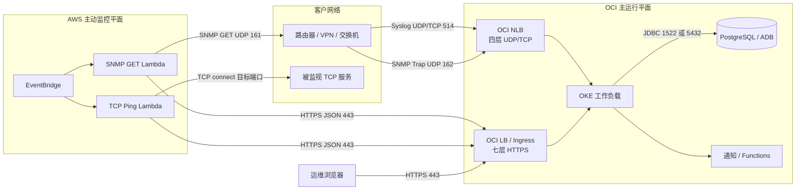

## 2. 云与网络区域划分

公网子网只放负载均衡入口。OKE 节点、ADB、内部服务放私有子网。Bastion 提供短时运维入口，不给节点长期开放公网 SSH。

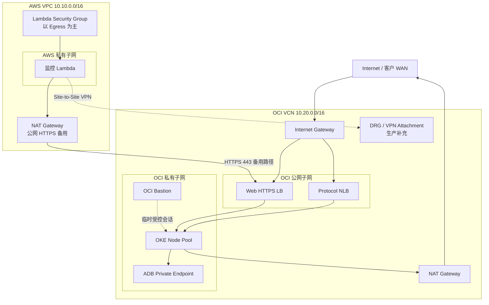

### 设计约束

- AWS `10.10.0.0/16` 与 OCI `10.20.0.0/16` 不得重叠。
- 私有子网默认不能直接接收入站公网连接。
- VPN 路径必须同时配置去程路由、回程路由、AWS SG/NACL、OCI NSG/Security List。
- 没有 VPN 时，只允许 Lambda 经 NAT 调用 OCI 的 HTTPS API；SNMP v2c 不穿越公网。

## 3. OKE 容器与 Service 拓扑

Kubernetes 中使用同一个不可变镜像创建五个逻辑 Deployment。Web 有 ClusterIP Service；Syslog 与 Trap 各有四层 LoadBalancer Service；worker 没有业务入口。

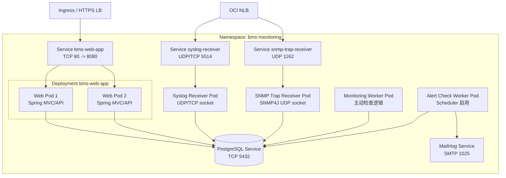

## 4. 一个镜像如何承担五种容器角色

当前设计不是五套不同 JAR，而是同一镜像通过环境变量启停协议接收器和告警调度器。这样先实现独立扩缩和故障隔离，未来再按需要拆成独立制品。

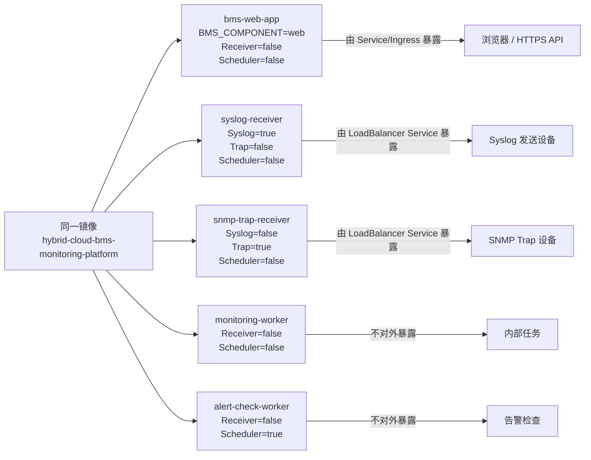

### 当前实现边界

- 五个 Deployment 已独立，接收器和 scheduler 开关已配置。
- 所有角色仍加载同一 Spring Boot 应用上下文；这属于“模块化单体的运行角色隔离”，不是完全独立微服务。
- `monitoring-worker` 当前没有独立对外 Service；后续加入分布式调度锁后再扩多个副本。

## 5. Syslog UDP 通信路径

UDP 没有连接和应用层确认，设备看到“发送成功”不代表平台已入库。因此需要结合 NLB 指标、Pod 接收日志和数据库事件三层确认。

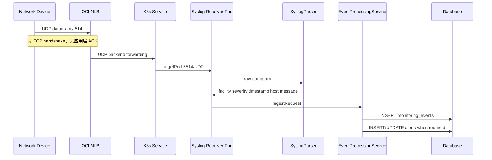

## 6. Syslog TCP 通信路径

TCP 能确认传输连接，但仍不代表业务入库成功。接收器按行分帧；设备必须发送换行或按双方约定关闭连接。

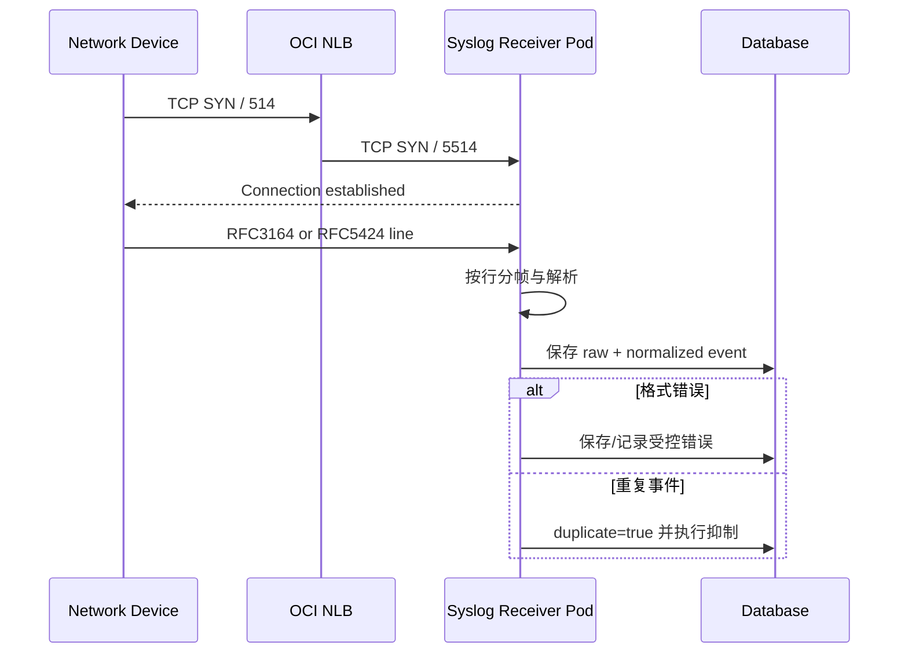

## 7. SNMP Trap 通信路径

Trap 是设备主动发送的 UDP 通知。生产端口是 162，本地/容器端口是 1162。接收器监听通配地址，以便 localhost、Docker、Pod 网卡和 NLB 转发都能到达。

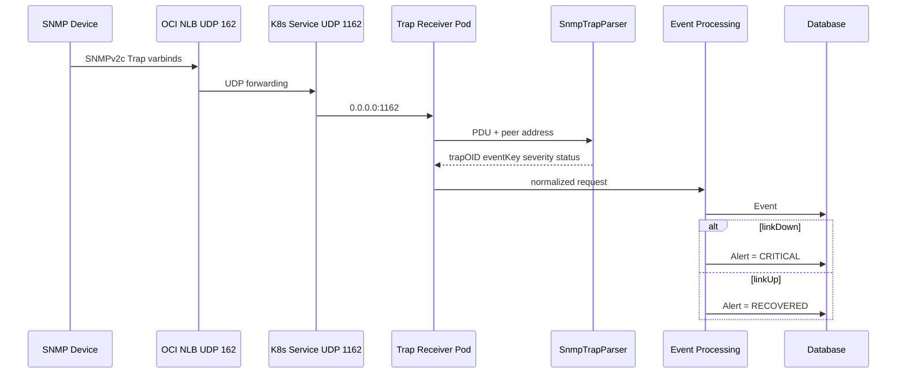

## 8. AWS 主动监控与跨云 HTTPS

EventBridge 触发 Lambda。Lambda 从客户网络视角执行检查，然后只把标准 JSON 结果发到 OCI。OCI 不需要允许 AWS 直接连接数据库。

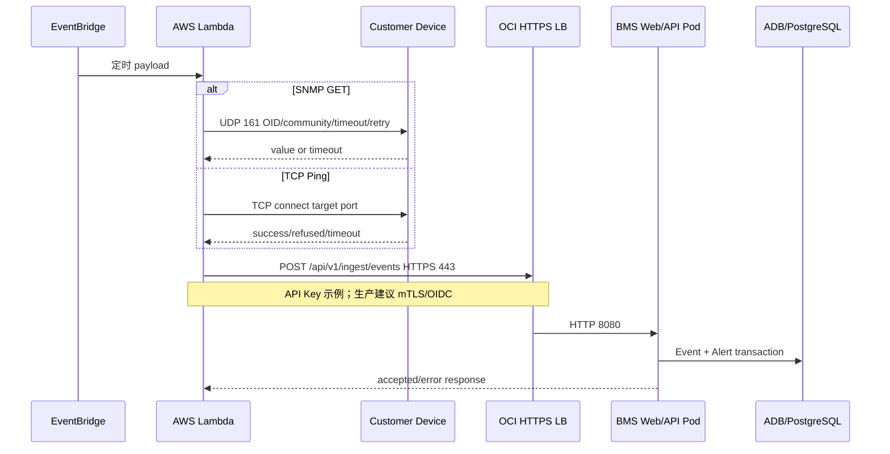

## 9. Web 与 API 的七层入口

Web 和 JSON API 都经过 HTTPS。TLS、证书、Host/Path 路由在 OCI LB 或 Ingress 层处理；Pod 只暴露集群内 HTTP 8080。

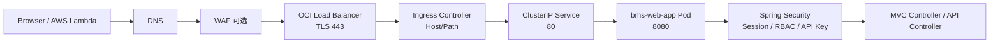

## 10. 为什么协议入口使用 NLB，而 Web 使用 LB

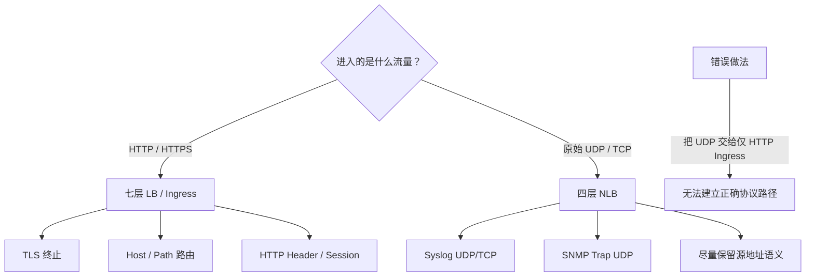

## 11. 端口转换与责任矩阵

| 用途 | 外部标准端口 | 本地/Pod 端口 | 协议 | 入口 | 终点 |
|---|---:|---:|---|---|---|
| Web / API | 443 | 8080 | TCP/HTTPS→HTTP | OCI LB / Ingress | `bms-web-app` |
| Syslog | 514 | 5514 | UDP | OCI NLB | `syslog-receiver` |
| Syslog | 514 | 5514 | TCP | OCI NLB | `syslog-receiver` |
| SNMP Trap | 162 | 1162 | UDP | OCI NLB | `snmp-trap-receiver` |
| SNMP GET | 161 | 161/1161 | UDP | Lambda 出站 | 网络设备 / 本地 agent |
| PostgreSQL | 不公开 | 5432 | TCP | ClusterIP | PostgreSQL Pod |
| Oracle ADB | 不公开 | 1522 等 | TCP/TLS | Private Endpoint | ADB |
| SMTP 模拟 | 不公开 | 1025 | TCP | ClusterIP | MailHog |
| SSH | 不公开 | 22 | TCP | Bastion 临时会话 | 受控目标 |

> 当前 Kubernetes YAML 的 LoadBalancer Service 直接公开 5514/1162。生产的 514→5514、162→1162 listener/backend 映射属于云环境层配置。当前 `oci-load-balancer` 模块只创建 NLB/LB 外壳，尚未创建完整 listener、backend set、证书和 DNS；上线前必须补齐，不能把本图当作已部署事实。

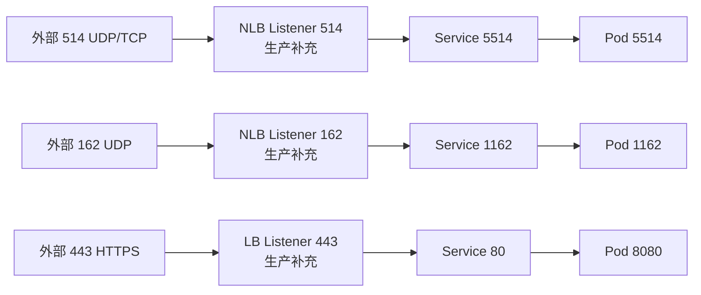

## 12. NetworkPolicy 允许的容器通信

Namespace 先 default deny，再按需要放行。业务 Pod 可以访问数据库、MailHog、DNS 和 HTTPS；数据库与 MailHog 只接受 BMS Pod。

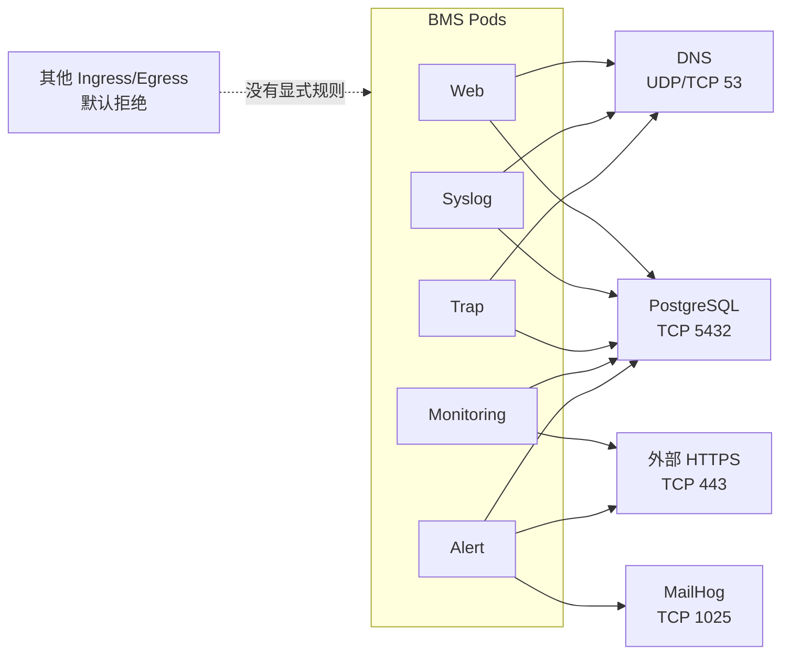

### 注意

当前 `allow-bms-required-traffic` 的入站规则按端口放行，没有限制来源 Pod/namespace/IPBlock。生产应分别为 Web、Syslog、Trap 建立更窄的来源规则，并结合 OCI NSG 限制设备网段。

## 13. Event 与 Alert 的事务关系

Event 是一次观测事实；Alert 是多个 Event 聚合出的持续状态。两者不能合并成同一张表或同一概念。

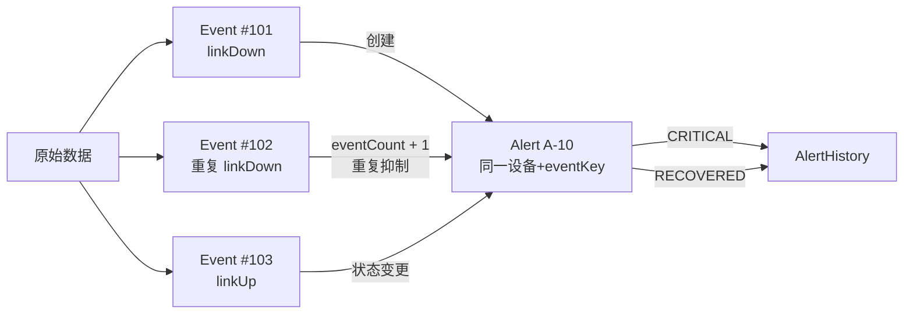

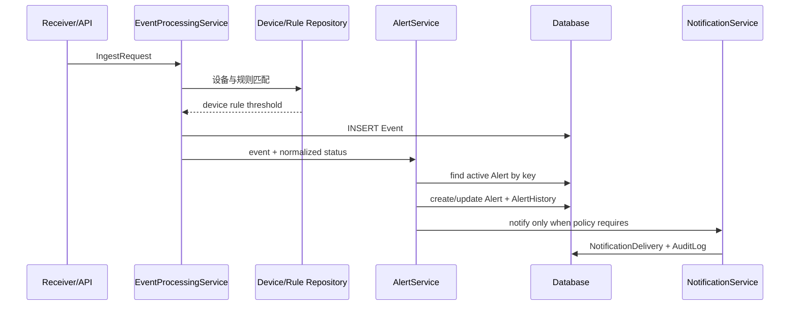

## 14. 告警通知容器路径

本地使用 MailHog。生产可以替换为 OCI Email Delivery、Notifications 或外部邮件网关。物理警报器不由本地代码直接控制，只保留安全 Mock/外部系统接口。

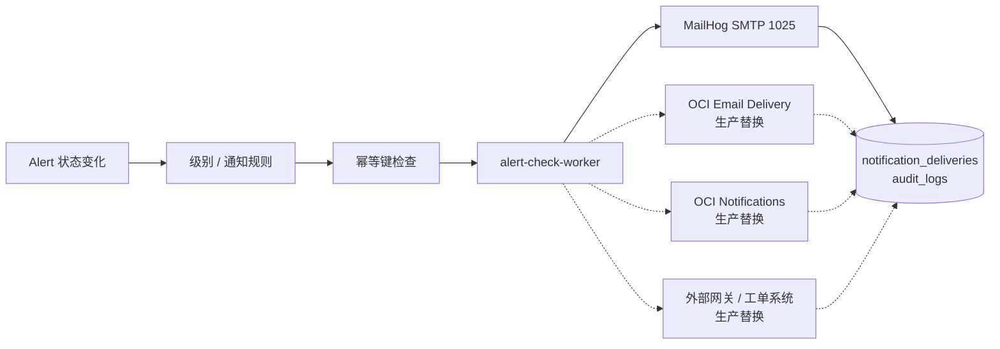

## 15. 扩容、高可用与故障隔离

Web 可以水平扩容；接收器应按协议流量独立扩容，但 UDP 扩容前必须确认 NLB 分流、去重和源地址策略。scheduler 多副本前必须加入分布式锁。

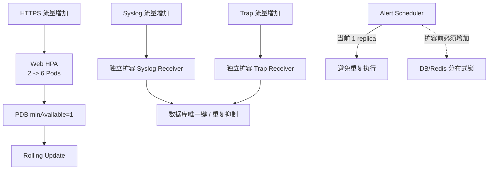

### 组件故障影响

| 故障组件 | 直接影响 | 不应受影响 |
|---|---|---|
| Web Pod | 部分页面/API 请求 | 协议接收、其他 Web Pod |
| Syslog receiver | Syslog 接收 | Trap、Web、已有数据查询 |
| Trap receiver | Trap 接收 | Syslog、Web、已有数据查询 |
| monitoring worker | 主动检查延迟 | 被动接收、页面查询 |
| alert worker | 告警检查/通知延迟 | Event 原始数据接收 |
| Database | 全部持久化路径 | 网络入口可能仍接包，但不能宣称业务成功 |

## 16. 本地 Docker Compose 与云端 OKE 的对应关系

本地 Compose 为单个 `bms-app` 容器同时启用全部角色；OKE 把同一镜像拆成五个 Deployment。两者业务代码相同，但伸缩和故障边界不同。

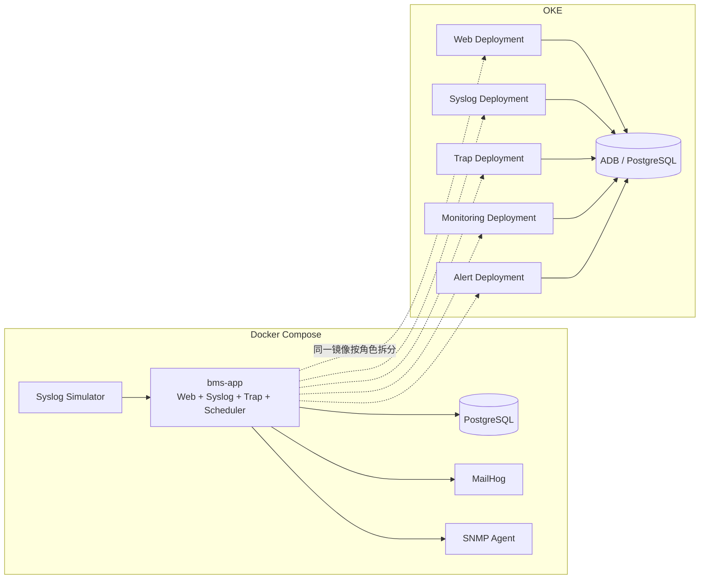

## 17. 从本地到生产的部署演进

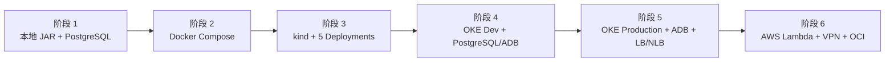

每个阶段必须先验证当前层，再进入下一层：

- JAR：构建、测试、登录、协议模拟。
- Compose：五个服务健康、数据库数据、MailHog。
- kind：五个 Deployment、Service、NetworkPolicy、rollout。
- OKE Dev：私有节点、LB/NLB backend health、日志与成本。
- OKE Production：证书、DNS、Vault、ADB、备份、HPA/PDB。
- Hybrid：双隧道 VPN、路由、Lambda VPC、端到端延迟与重试。

## 18. 通信故障排查图

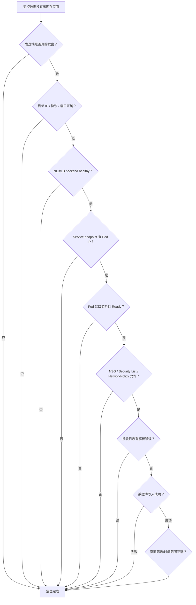

### 按协议检查

| 现象 | 第一检查点 | 第二检查点 | 最终证据 |
|---|---|---|---|
| UDP Syslog 丢失 | 设备目标 IP/514、NLB UDP listener | Service endpoint、Pod 5514/UDP | `monitoring_events.raw_message` |
| TCP Syslog 失败 | TCP handshake、换行分帧 | NLB TCP backend、Pod 5514/TCP | Event 与 receiver 日志 |
| Trap 丢失 | UDP 162、community/来源网段 | Pod 通配监听 1162、NSG/Policy | Trap history 计数增加 |
| Lambda 上报失败 | Lambda CloudWatch、DNS/NAT/VPN | LB 443、API Key/mTLS | API 响应与 Event ID |
| 页面打不开 | DNS/TLS/LB/Ingress | Web Service endpoint、readiness | HTTP 状态与 request ID |
| 通知没发送 | Alert 状态、幂等键 | SMTP/Notifications 可达性 | NotificationDelivery/AuditLog |

## 19. 当前实现与生产补充项

| 领域 | 当前仓库已有 | 生产仍需补充 |
|---|---|---|
| OCI 网络 | VCN、子网、IGW、NAT、NSG 资源样例 | Service Gateway、DRG/VPN、完整 NSG/Security List |
| OCI 入口 | NLB/LB 资源外壳 | listener、backend set、health check、证书、DNS |
| OKE | Cluster/Node Pool 模块与 Kubernetes YAML | OCIR、Ingress Controller、metrics-server、日志采集 |
| 数据库 | PostgreSQL、ADB 模块/Profile | Wallet/Vault 注入、备份、DR、容量测试 |
| 跨云 | HTTPS/VPN 设计说明 | 双隧道、BGP/静态路由、真实设备网段 |
| 认证 | 本地 RBAC、API Key | IdP/OIDC、mTLS、WAF、密钥轮换 |
| 调度 | 单副本 scheduler | 分布式锁、任务租约、失败队列 |

## 20. 相关实现位置

- Kubernetes 五角色：`infra/kubernetes/base/bms-components.yaml`
- Service 与端口：`infra/kubernetes/base/services.yaml`
- 网络策略：`infra/kubernetes/base/network-policy.yaml`
- Compose 本地结构：`docker-compose.yml`
- OCI VCN：`infra/opentofu/modules/oci-network`
- OCI NLB/LB：`infra/opentofu/modules/oci-load-balancer`
- AWS VPC：`infra/opentofu/modules/aws-network`
- Lambda：`apps/snmp-get-lambda`、`apps/tcp-ping-lambda`
- 协议接收器：`app/bms-app/src/main/java/com/example/bms/protocol`
- 运维排查：`docs/operations/runbook.md`

