# 架构图集

以下 12 张 Mermaid 图与当前代码、容器、Kubernetes 和 IaC 目录一一对应；虚线表示只提供部署样例、默认关闭的云资源。

需要深入了解跨云通信、NLB/LB、端口转换、五类 Pod、NetworkPolicy、故障隔离和逐层排查时，请继续阅读包含 20 个专题、19 张图的[云端通信与容器结构设计书](cloud-communication-and-container-design.md)。

## 1. 整体系统

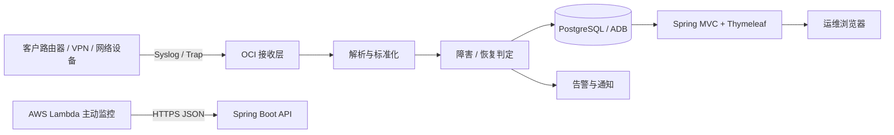

## 2. AWS 与 OCI 混合云网络

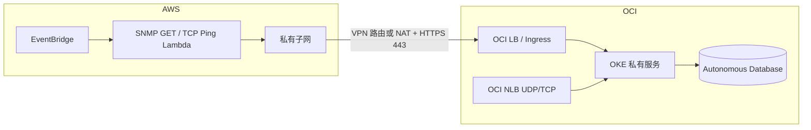

## 3. AWS Lambda 主动监控

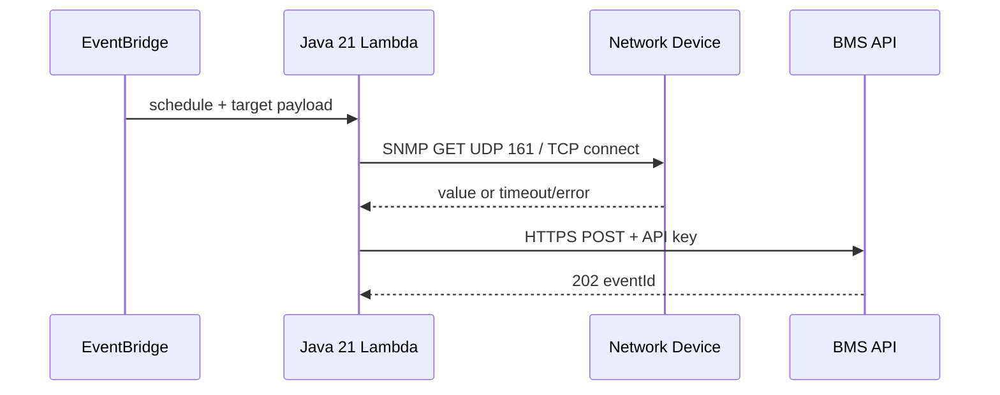

## 4. OCI 运行拓扑

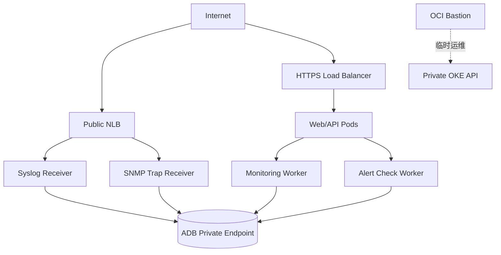

## 5. Syslog 接收链路

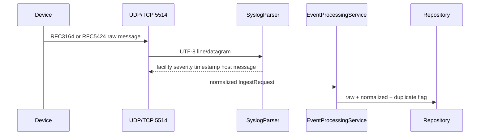

## 6. SNMP GET 与 Trap

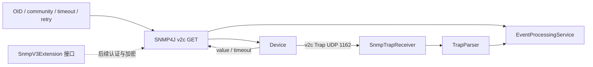

## 7. TCP Ping

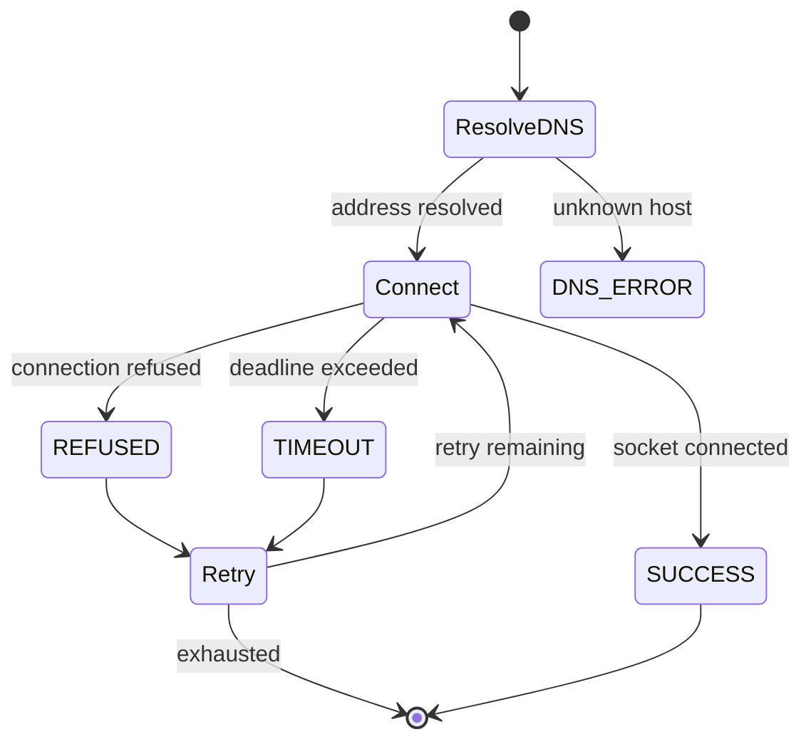

## 8. 事件处理

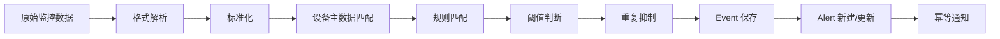

## 9. 告警生命周期

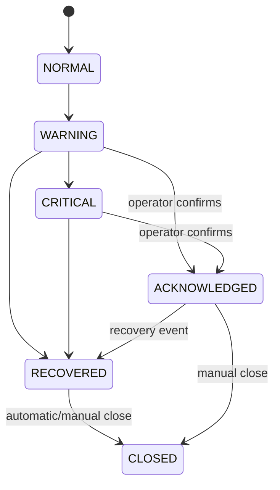

## 10. Spring MVC SSR

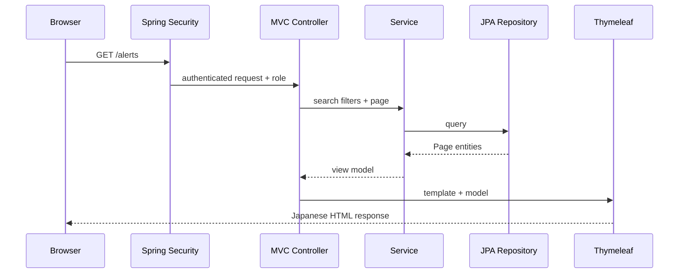

## 11. Kubernetes 工作负载

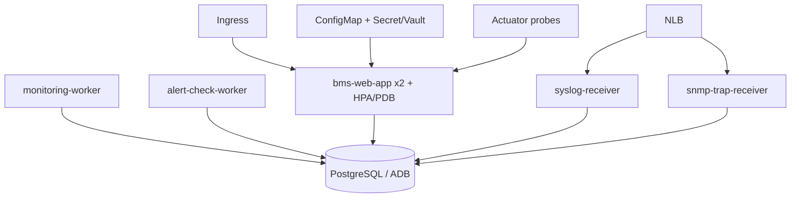

## 12. OpenTofu 模块依赖

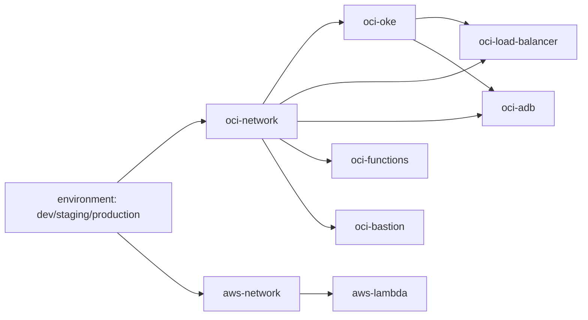
