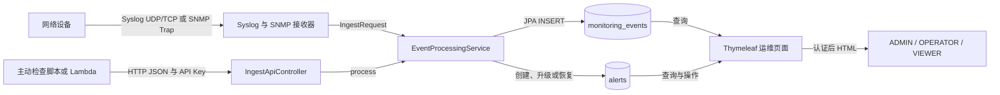
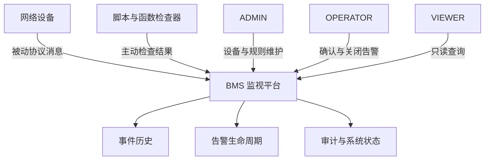
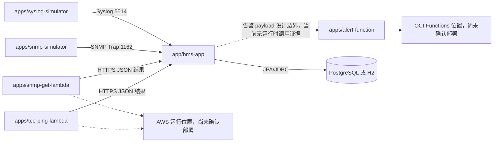

# 从机房告警到可追踪事件：项目全景对话

## 本章目标

从业务问题、用户、模块和本地启动方式入手，建立对整个仓库的第一张心智地图。

## 涉及的关键代码

| 文件路径 | 类、函数或资源 | 作用 |
|---|---|---|
| `app/bms-app/src/main/java/com/example/bms/event/EventProcessingService.java` | `process` | 将四类监视输入归一为事件和告警 |
| `app/bms-app/src/main/java/com/example/bms/security/SecurityConfig.java` | `securityFilterChain` | 定义登录和三类用户的 URL 权限 |
| `pom.xml` | 六个 Maven module | 定义主应用、模拟器与函数模块 |
| `docker-compose.yml` | 五个 Compose service | 提供本地应用与依赖 |

## 本章全景图

### 图表说明

- `ReceiverNode` 对应 `SyslogReceiver` 与 `SnmpTrapReceiver`，`ApiNode` 对应 `IngestApiController`。
- 箭头标出了当前实现中的 UDP/TCP、SNMP、HTTP/JSON 与 JPA 数据流。
- `EventProcessingService.process` 是协议输入汇合点，事件与告警表来自 Flyway V1。
- 运维 UI 是 Thymeleaf 服务端渲染，仓库中没有独立 SPA 或 Redis。
- 图中均为当前代码已实现路径；真实 Lambda 云部署状态不由此图证明。

## 对话式讲解

Speaker 1: 这个名字里同时有 hybrid、cloud、BMS、monitoring，像把技术简历压缩成了一个文件名。它到底解决什么问题？

Speaker 2: 从 `EventProcessingService`、协议接收器和页面代码可以确认，它把网络设备的 Syslog、SNMP Trap、SNMP GET 与 TCP 检查统一保存成事件，再形成可操作的告警。名字很长，主线其实很清楚：事实先落库，故障再聚合。

Speaker 1: 这张全景图里，为什么 Event 和 Alert 要画成两张表？

Speaker 2: 因为箭头表达的是两种不同语义：每次观测都进入 `monitoring_events`，只有需要运维处理的聚合状态才进入或更新 `alerts`。这正是系统避免“一条日志等于一个工单”的关键。

Speaker 1: BMS 是楼宇管理系统吗？

Speaker 2: 不能只看缩写猜。这里的设备种子、事件类型和脚本都指向网络监视场景，包括路由器、VPN、交换机和通信服务，所以本仓库中的 BMS 应按网络运维监视平台理解。

Speaker 1: 谁会真的打开这个系统？

Speaker 2: `SecurityConfig` 定义了 ADMIN、OPERATOR、VIEWER。管理员维护设备和规则，操作员确认或关闭告警，只读用户查看仪表盘、事件和状态。

## 第一部分：参与者与业务结果

Speaker 1: 三类用户、设备和外部检查器站在一起时，谁给谁提供什么？

Speaker 2: 看这张参与者图，重点不是人物头像，而是输入和结果的责任边界。

### 图表说明

- 三个用户角色来自 `SecurityConfig`，设备与规则写页面只授权 ADMIN。
- 网络设备输入对应 Syslog/Trap；检查器输入对应 SNMP GET、TCP Ping 与通用事件 API。
- 输出节点对应事件页面、告警页面、`audit_logs` 与系统状态页。
- 箭头表示当前代码中的交互职责，不代表 ADMIN、OPERATOR、VIEWER 是独立外部系统。
- 仓库中未发现工单系统集成，因此图中没有虚构工单平台。

Speaker 1: 原来 VIEWER 的箭头只有查询，ADMIN 才有维护箭头。

Speaker 2: Exactly。权限图的价值就在于把“菜单看起来不一样”提升为服务端授权事实。

Speaker 1: 前端是不是又有一套 Node 工程？

Speaker 2: 没有。`templates/` 和 `static/` 证明它是 Spring MVC 加 Thymeleaf 的服务端渲染应用。浏览器拿到的是后端已经拼好的 HTML，少量 `app.js` 只做趋势图和渐进增强。

Speaker 1: 那 `package.json` 是不是在偷偷构建 React？

Speaker 2: 不是。仓库中的主构建图由根 `pom.xml` 管理，业务 UI 没有独立 SPA 模块。判断技术栈要看入口和依赖，而不是看见一个文件名就开始脑补。

Speaker 1: 六个 Maven 模块都是什么？

Speaker 2: `app/bms-app` 是主应用；两个 simulator 发送 Syslog 和 Trap；两个 Lambda 模块演示 SNMP GET 与 TCP Ping；`apps/alert-function` 演示 OCI Function 风格的通知处理。

## 第二部分：模块和组件总览

Speaker 1: 六个模块与主应用的关系能展开吗？

Speaker 2: 可以。实线是仓库中明确存在的数据或调用边界，虚线只表示可选云端部署位置，不代表已经部署。

### 图表说明

- 六个模块名称直接来自根 `pom.xml`。
- simulator 到主应用的箭头对应真实协议发送代码；Lambda 到 API 的箭头对应 handler 的结果发布边界。
- 主应用访问数据库是当前实现；PostgreSQL 是 Compose 主路径，H2 用于测试和 capture profile。
- 主应用到 `alert-function` 使用虚线，因为仓库没有证明当前运行时会直接调用该函数。
- 云运行位置使用虚线并明确标记“尚未确认部署”。
- `alert-function` 有可测试核心逻辑，但仓库不能证明 OCI Function 已发布或已由主应用实时调用。

Speaker 1: “混合云”是当前已经跨 AWS 和 OCI 跑起来了吗？

Speaker 2: 不是已部署事实。代码里有 Lambda handler、OCI 风格函数和 OpenTofu 模块，但云资源默认关闭，README 也明确没有真实云 `plan/apply/destroy` 证据。这里是可演进的设计和脚手架。

Speaker 1: 最短的本地启动路径是什么？

Speaker 2: 装 Java 21，先运行 `mvnw.cmd clean verify`，再用 `mvnw.cmd -pl app/bms-app spring-boot:run`。默认 profile 是 `local,postgresql`，所以直接运行前要按脚本或文档准备 PostgreSQL；若走 Compose，则依赖一起启动。

Speaker 1: Compose 帮我启动哪些东西？

Speaker 2: `docker-compose.yml` 有 PostgreSQL、MailHog、SNMP agent、BMS app 和持续发送消息的 Syslog simulator。它们共享 `bms-network`，应用通过服务名访问数据库和邮件，而不是使用宿主机的 `localhost`。

Speaker 1: 我如何知道应用真的启动好了？

Speaker 2: Web 默认是 `http://localhost:8080`，就绪端点是 `/actuator/health/readiness`。Compose 的应用 healthcheck 也检查这个端点。能打开端口不等于数据库迁移成功，所以健康端点比“进程还在”更可靠。

Speaker 1: 数据从哪里来？

Speaker 2: 三类入口：设备直接发 Syslog/Trap；API 触发 TCP Ping、SNMP GET 或上报通用事件；Flyway 和 `DemoDataService` 提供本地学习数据。三条路最终都尽量汇入 `EventProcessingService`。

Speaker 1: 为什么不直接收到一条日志就创建一条告警？

Speaker 2: 因为事件是一次事实，告警是需要处理的聚合状态。`MonitoringEvent` 保留每次观测，`Alert` 记录当前故障、发生次数和生命周期。否则日志一多，值班人员会被同一故障刷屏。

Speaker 1: 项目里有没有消息队列？

Speaker 2: 仓库暂时没有发现 Kafka 或 RabbitMQ。当前处理链是同一进程内的同步调用和数据库事务。学习和本地复现更直接，但高吞吐生产环境要评估 outbox 或队列。

Speaker 1: 数据库只支持 PostgreSQL 吗？

Speaker 2: Compose 主路径是 PostgreSQL，测试和本地还有 H2，依赖里也有 Oracle JDBC 和对应 profile。可是“有驱动与配置”不等于 Oracle ADB 已验证上线，生产 Wallet、服务名和网络仍需外部环境。

Speaker 1: 这个仓库最值得先读哪几个文件？

Speaker 2: 先看根 `pom.xml` 和 `BmsApplication.java`，再看 `IngestApiController`、`EventProcessingService`、`V1__create_bms_schema.sql`、`SecurityConfig`，最后看 Compose 与 Kubernetes。这样从入口走到部署，不会迷路。

## 第三部分：项目学习路线

Speaker 1: 能把这个阅读顺序变成一条不会迷路的路线吗？

Speaker 2: 可以，按“构建图、入口、主链、数据、安全、部署、验证”推进。

```mermaid
flowchart LR
    BuildNode["1. pom.xml 与六模块"]
    EntryNode["2. BmsApplication"]
    ApiNode["3. IngestApiController"]
    DomainNode["4. EventProcessingService"]
    SchemaNode["5. Flyway V1 与 V2"]
    SecurityNode["6. SecurityConfig"]
    RuntimeNode["7. Compose 与 Kubernetes"]
    VerifyNode["8. 测试与 CI"]

    BuildNode --> EntryNode
    EntryNode --> ApiNode
    ApiNode --> DomainNode
    DomainNode --> SchemaNode
    SchemaNode --> SecurityNode
    SecurityNode --> RuntimeNode
    RuntimeNode --> VerifyNode
```

### 图表说明

- 每个节点都是当前仓库中的真实文件或目录，不是通用课程模板。
- 箭头表示推荐学习顺序，不表示代码运行时调用。
- `EventProcessingService` 放在迁移脚本之前阅读，是为了先理解数据为何存在。
- Compose 与 Kubernetes 放在业务链之后，避免把部署资源误当成业务功能。
- 这张图属于学习建议；运行时关系应以前面的全景图和后续请求时序图为准。

Speaker 1: 页面上有日文，文档现在是中文，会不会冲突？

Speaker 2: 不冲突。页面是面向日文运维界面的实现事实，本指南用中文解释代码。类名与路径保持原样，避免翻译后找不到代码。

Speaker 1: 这个项目适合初学者吗？

Speaker 2: 适合按层学习，但不适合一次吞下全部。先跑主应用和设备页面，再跟一条事件链，最后看容器与云模块。像参观机场，先找登机口，不要先研究每一颗铆钉。

Speaker 1: 当前最容易被误解的地方是什么？

Speaker 2: 一是把 Kubernetes 清单当成已上线集群，二是把 OpenTofu 模块当成已创建云资源，三是把 `app_users` 表当成登录用户源。代码事实分别只是部署配置、默认关闭的脚手架和展示数据。

Speaker 1: 学习结束后怎样安全停止，不把本地数据一起删掉？

Speaker 2: 优先使用与启动方式对应的 `dev-down.ps1`、`dev-down.sh` 或普通 Compose stop/down；是否删除 `postgresql-data` 卷要单独确认。停容器和删数据是两件事，别让清理命令顺手把学习记录也“毕业”了。

Speaker 1: 如果我只记住一句话呢？

Speaker 2: 记住：它是一个可本地运行的网络监视模块化单体，用统一事件模型连接协议接收、规则、告警、通知和运维页面，并为容器与混合云迁移保留了明确边界。

## 本章涉及的关键文件

| 文件 | 作用 | 在图中的节点 |
|---|---|---|
| `README.md` | 项目入口与验证边界 | 学习路线与部署边界 |
| `pom.xml` | 六模块构建图和 Java 版本 | 六个 Maven 模块 |
| `app/bms-app/src/main/java/com/example/bms/BmsApplication.java` | 主应用入口 | Spring Boot 主应用 |
| `docker-compose.yml` | 本地服务编排 | PostgreSQL、MailHog 与主应用 |
| `app/bms-app/src/main/resources/application.yml` | 默认端口、profile 和组件开关 | 协议入口与组件角色 |

## 核心知识点回顾

1. 当前实现是服务端渲染的模块化单体，不是独立前后端或微服务集群。
2. Event 表示观测事实，Alert 表示聚合故障。
3. 云模块和 Kubernetes 清单是可验证的配置，但不是已上线证明。

### 启发式思考

1. 如果只把协议接收器独立扩容，数据库事务会成为怎样的新瓶颈？
2. 哪些本地默认值必须在共享环境中强制移除？
3. 如何用最少步骤证明一次 Syslog 最终出现在告警页面？
