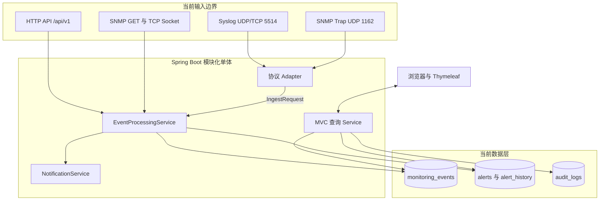
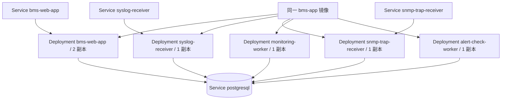
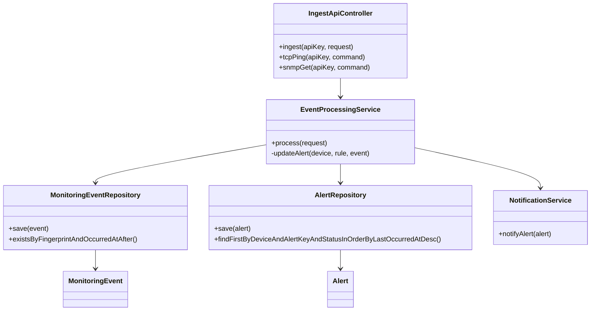
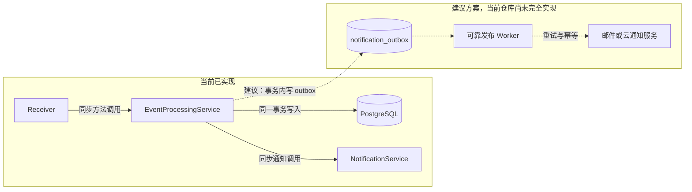

# 同一个镜像，五种职责：架构拆解对话

## 本章目标

理解模块化单体、组件角色、同步数据链和 AWS/OCI 脚手架之间的真实关系。

## 涉及的关键代码

| 文件路径 | 类、函数或资源 | 作用 |
|---|---|---|
| `app/bms-app/src/main/java/com/example/bms/event/EventProcessingService.java` | `process`、`updateAlert` | 协议无关的事务编排 |
| `app/bms-app/src/main/java/com/example/bms/protocol/syslog/SyslogReceiver.java` | `SmartLifecycle` | Syslog UDP/TCP 接收 |
| `app/bms-app/src/main/java/com/example/bms/protocol/snmp/SnmpTrapReceiver.java` | `SmartLifecycle` | SNMP Trap UDP 接收 |
| `infra/kubernetes/base/bms-components.yaml` | 五个 Deployment | 同一镜像的逻辑角色拆分 |

## 本章全景图

### 图表说明

- 输入、应用和数据三个区域均映射到当前源码与 Flyway 表。
- 协议 Adapter 只解析，`EventProcessingService` 统一状态、去重和告警逻辑。
- 浏览器通过 MVC 查询 Service 获取服务端渲染 HTML，不直接访问数据库。
- 图中未加入 Kafka、Redis 或独立前端，因为仓库中未发现这些实现。
- `NotificationService` 是当前同步调用节点；异步 outbox 只会在建议图中出现。

## 第一部分：当前部署结构

### 图表说明

- Deployment 与 Service 名称来自 `bms-components.yaml` 和 `services.yaml`。
- 五个角色使用同一镜像，当前 Web 两副本，其余各一副本。
- Service 只指向需要网络入口的角色；worker 不暴露外部端口。
- 所有角色依赖同一 PostgreSQL 服务，因此数据库仍是共享故障域。
- Kustomize 可渲染这些资源，但本轮没有据此声称真实 OKE 集群已部署。

## 第二部分：应用模块依赖

### 图表说明

- `IngestApiController` 的三个公开方法来自真实 API Controller。
- 两个 Repository 方法来自 Spring Data 接口；长方法名反映活动告警查找条件。
- `process` 保存 Event 后按设备更新 Alert，并对非重复事件调用 `notifyAlert`。
- 类图只显示主依赖，设备、目标、规则和历史 Repository 为避免过载没有展开。
- 图中没有虚构 DTO 转换器或消息队列。

## 第三部分：内部通信与演进边界

### 图表说明

- 左侧实线完全对应当前 `EventProcessingService` 与 `NotificationService` 调用。
- 当前数据库事务与通知边界紧密，慢通知可能延长处理时间。
- 右侧虚线是生产改进建议；仓库中没有 `notification_outbox` 表或发布 Worker。
- 建议箭头表达“事务内记录、事务外重试”，不是当前运行路径。
- 图中没有指定 Kafka 或 RabbitMQ，因为中间件选择需要后续需求证据。

## 本章涉及的关键文件

| 文件 | 作用 | 在图中的节点 |
|---|---|---|
| `app/bms-app/src/main/java/com/example/bms/event/EventProcessingService.java` | 协议无关的事件与告警事务编排 | `EventProcessingService` |
| `app/bms-app/src/main/java/com/example/bms/protocol/syslog/SyslogReceiver.java` | UDP/TCP Syslog 生命周期 | `Receiver`、Syslog 输入 |
| `app/bms-app/src/main/java/com/example/bms/protocol/snmp/SnmpTrapReceiver.java` | SNMP Trap 生命周期 | `Receiver`、Trap 输入 |
| `infra/kubernetes/base/bms-components.yaml` | 五种逻辑角色 | 五个 Deployment |
| `infra/opentofu/environments/dev/main.tf` | AWS/OCI 模块组合入口 | 混合云建议边界 |

---

对话复制区

Speaker 1: 先给我一张不用画图的架构图。

Speaker 2: 设备通过 Syslog 或 Trap 进入接收器；API 或主动检查产生同一种 `IngestRequest`；`EventProcessingService` 匹配设备、目标和规则，写 Event，再创建或更新 Alert，并触发通知；MVC 查询数据库后由 Thymeleaf输出页面。

Speaker 1: 现在有图了，我注意到所有写入都汇到 `EventProcessingService`。

Speaker 2: 对。汇合箭头是架构重点：它让协议差异停在 Adapter 层，领域规则不会复制四份。

Speaker 1: 这算微服务吗？

Speaker 2: 源码和 Maven 依赖表明它不是微服务集合，而是模块化单体。Kubernetes 的五个 Deployment 使用同一镜像，通过 `BMS_COMPONENT` 和 receiver/scheduler 开关承担不同职责。

Speaker 1: 五种职责具体是什么？

Speaker 2: `bms-web-app`、Syslog receiver、SNMP Trap receiver、monitoring worker 和 alert-check worker。Web 对外提供页面/API，两个 receiver 接协议，worker 执行主动检查或告警扫描。

Speaker 1: 同一镜像到底怎样变成五个角色？

Speaker 2: 由 Deployment 中的 `BMS_COMPONENT` 和 receiver/scheduler 开关决定。下图是当前 Kubernetes 清单，不是建议架构。

Speaker 1: 同一镜像扮演五个角色有什么好处？

Speaker 2: 构建物一致，迁移简单，领域模型也不需要跨服务复制。像同一套工具箱发给不同班组，每个班组只打开自己需要的工具。

Speaker 1: 坏处呢？

Speaker 2: 镜像更大，角色隔离依赖配置正确，部署时也要谨防同时打开重复调度器。生产中应让开关互斥，并对接收器和 worker 分别设置资源与扩容策略。

Speaker 1: `EventProcessingService` 为什么像交通枢纽？

Speaker 2: 它集中处理协议无关的规则：设备匹配、阈值、严重度、SHA-256 指纹、重复窗口、Event 保存、Alert 状态和通知。协议 Adapter 只解析，避免四套协议各写一套告警逻辑。

Speaker 1: 能把这个“交通枢纽”的类依赖画得更像代码吗？

Speaker 2: 下面的类名和方法都来自当前 Java 文件，箭头表示构造器依赖或方法调用。

Speaker 1: 它一次处理用了多少个 Repository？

Speaker 2: 代码注入了设备、目标、规则、事件、告警、告警历史和 TCP 结果等 Repository，再调用 `NotificationService`。这些操作由 `@Transactional` 包围，核心数据库状态要么一起提交，要么回滚。

Speaker 1: 通知也在事务里，安全吗？

Speaker 2: 当前实现便于保证“保存告警后再通知”的顺序，但外部邮件变慢会拖长事务。生产改进通常是事务内写 outbox，事务外可靠投递；这属于建议，不是当前已实现功能。

Speaker 1: 当前通信和建议改进放在一张图里，会不会让人误以为都做好了？

Speaker 2: 所以要用实线与虚线明确分区。右侧标题已经写明“当前仓库尚未完全实现”。

Speaker 1: 为什么接收器实现 `SmartLifecycle`？

Speaker 2: 这样 Syslog 与 Trap 监听能跟随 Spring 容器启动和停止，健康指标也能知道接收器是否运行。否则线程可能先于依赖启动，关闭时还握着端口。

Speaker 1: Syslog 为什么同时支持 UDP 和 TCP？

Speaker 2: `SyslogReceiver` 分别监听同一配置端口的 UDP 与 TCP。UDP 一报一包、成本低但可能丢；TCP 按行分帧、有连接状态。项目让两条输入都归一到相同处理链。

Speaker 1: Trap 接收器为什么绑定 `0.0.0.0`？

Speaker 2: `SnmpTrapReceiver` 要接收容器网络、宿主 loopback 和外部接口送来的 UDP 包。测试 `receivesTrapSentToIpv4Loopback` 对本机 IPv4 回环做了回归验证，避免只绑定特定地址导致“发得出、收不到”。

Speaker 1: AWS Lambda 在哪一层？

Speaker 2: `apps/snmp-get-lambda` 与 `apps/tcp-ping-lambda` 是主动检查边缘。它们可以在 AWS 侧接近目标网络执行检查，再用 HTTPS/API Key 把结果送回主应用。

Speaker 1: OCI Function 又做什么？

Speaker 2: `apps/alert-function` 接收告警 payload，构造通知并抑制重复。它是函数核心逻辑示例；真实 OCI Application、镜像仓库、IAM 和通知服务仍需要环境配置。

Speaker 1: AWS 和 OCI 之间现在有真实 VPN 吗？

Speaker 2: 不能确认。`infra/opentofu` 和架构文档描述了非重叠 CIDR、VPN、LB、OKE 等资源，但默认 `enabled=false`，没有实际云执行证据。

Speaker 1: 为什么保留 Oracle ADB 配置，同时本地用 PostgreSQL？

Speaker 2: PostgreSQL 便于本地复现；Oracle profile 为目标环境兼容性留出口。这样的迁移路径降低学习成本，但 SQL、Flyway 和方言差异必须在真实 Oracle 环境再验证。

Speaker 1: 页面查询为什么有 JPA 又有 JDBC？

Speaker 2: 实体生命周期和关系适合 JPA；协议趋势统计用 `ProtocolStatisticsJdbcRepository` 写显式聚合 SQL更直接。工具不是宗教，按查询形状选就好。

Speaker 1: `open-in-view=false` 对架构有何影响？

Speaker 2: 模板渲染时不能偷偷触发数据库查询，所以 Service 必须在事务内准备详情页需要的关联。这样查询边界更明确，也减少 N+1 问题藏在 HTML 渲染阶段。

Speaker 1: 架构里有没有缓存层？

Speaker 2: 没发现 Redis 或应用缓存配置。数据库是当前事实源。页面和统计规模变大后可以评估缓存，但现在加一层只会让一致性故事更复杂。

Speaker 1: 架构的首要扩展点在哪里？

Speaker 2: 协议侧有 `SnmpQueryClient` 接口，部署侧有组件开关，云侧有模块化 OpenTofu。最自然的演进是先拆高负载接收器和可靠通知，而不是一上来把所有类改成微服务。

Speaker 1: 怎样判断这个架构设计是否成功？

Speaker 2: 看三件事：不同协议是否进入同一事件语义；Event、Alert、通知是否保持可追踪；角色拆分后是否仍能独立健康检查和扩容。仓库已提供结构，生产答案仍需要负载和故障演练。

核心知识点回顾

1. 源码是模块化单体，Kubernetes 通过配置把同一镜像拆为逻辑角色。
2. 协议解析与领域判断分离，核心事务集中在 `EventProcessingService`。
3. 混合云是代码与 IaC 支持的演进方向，不是当前部署事实。

启发式思考

1. 如何防止两个 alert worker 同时处理同一条任务？
2. 哪个调用最适合先从数据库事务中移出？
3. 从同镜像多角色迁移到独立服务时，哪些领域对象不应复制？

启发式思考参考答案

1. 当前 `AlertCheckScheduler.checkAlerts` 只是记录最后运行时间的心跳，并没有共享任务可竞争；现阶段最直接的控制是只让 `alert-check-worker` 打开 scheduler 开关。若以后扩展为真正扫描超时目标，多副本必须加入数据库行锁、租约或 leader election，并让每个任务拥有唯一业务键和幂等状态迁移。只靠“希望集群只启动一个 Pod”不够，因为滚动发布期间可能短暂并存两个实例。

2. 最适合先移出的是 `NotificationService` 的物理邮件发送。当前 `EventProcessingService` 在事件和 Alert 处理链中调用通知，外部 SMTP 延迟会放大事务与接收线程耗时。建议在保存 Alert 的同一事务内写入 outbox/通知意图，提交后由独立 worker 重试发送；设备、事件、告警和历史等需要一致提交的数据仍留在原事务。

3. 不应在多个服务中各复制一套可独立写入的 `Device`、`MonitoringEvent`、`Alert` 和 `AlertHistory` JPA 实体与表。迁移时应确定数据所有者，通过稳定 ID、事件契约或只读 API 共享必要信息，而不是双写同一业务事实。尤其 Alert 状态机与历史必须只有一个权威写入方，否则确认、恢复和关闭会产生相互冲突的版本。
