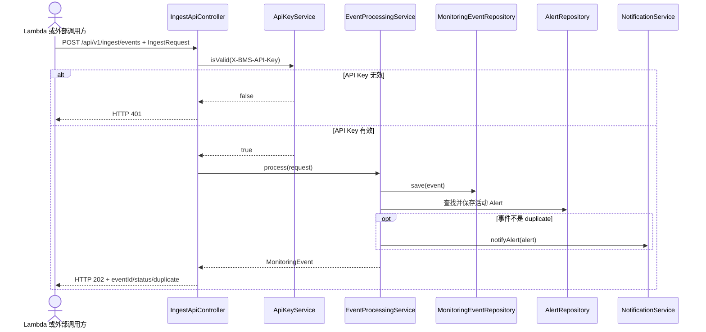
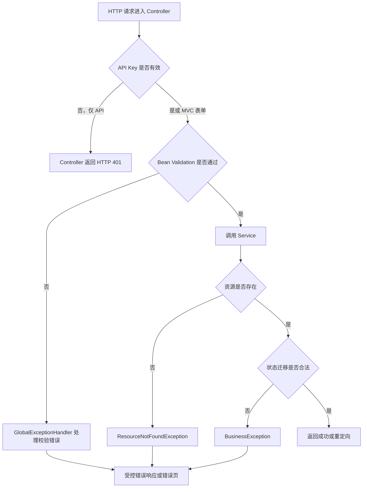
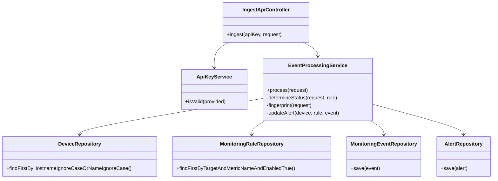
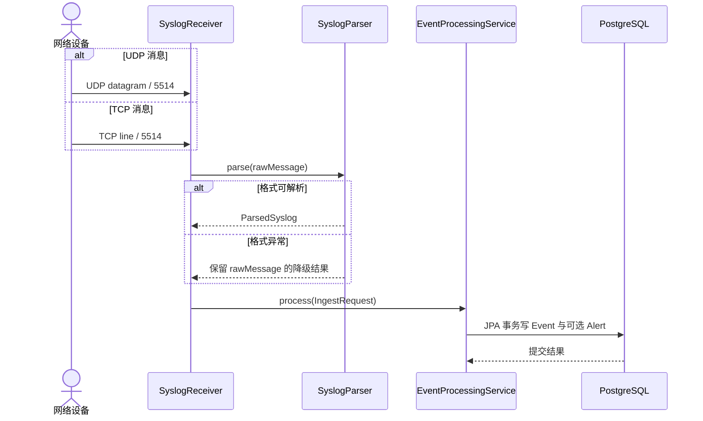

# 一次请求如何变成一条告警：调用链对话

## 本章目标

沿 JSON 写入、浏览器设备维护和被动协议三条代表性路径，追踪输入、事务、返回与页面显示。

## 涉及的关键代码

| 文件路径 | 类、函数或资源 | 作用 |
|---|---|---|
| `app/bms-app/src/main/java/com/example/bms/web/IngestApiController.java` | `ingest` | 校验 API Key 与事件请求 |
| `app/bms-app/src/main/java/com/example/bms/event/EventProcessingService.java` | `process` | 匹配、去重、保存和告警聚合 |
| `app/bms-app/src/main/java/com/example/bms/web/GlobalExceptionHandler.java` | 异常处理方法 | 将校验与业务异常转换为响应 |
| `app/bms-app/src/main/java/com/example/bms/device/DeviceService.java` | `create`、`update` | 设备表单事务与审计 |

## 本章全景图

### 图表说明

- API 路径、HTTP 401/202 和三个返回字段来自 `IngestApiController.ingest`。
- `ApiKeyService.isValid` 在 Controller 内执行，Spring Security 对 `/api/**` 是 `permitAll`。
- `EventProcessingService` 同步保存事件并更新告警；非重复事件才触发通知。
- `alt` 与 `opt` 分别表达真实失败分支和重复抑制条件。
- 当前链路没有消息队列，因此时序图不虚构异步 broker。

## 对话式讲解

Speaker 1: 我们先跟一条最完整的 API 请求，入口在哪里？

Speaker 2: `POST /api/v1/ingest/events`。`IngestApiController.ingest` 读取 `X-BMS-API-Key`，校验 `IngestRequest`，再调用 `EventProcessingService.process`。

Speaker 1: Spring Security 不是已经保护 API 了吗？

Speaker 2: URL 配置对 `/api/**` 是 `permitAll`，并忽略 CSRF，因为调用方不是浏览器表单。真正的 API Key 检查在每个 Controller 方法里由 `ApiKeyService.isValid` 完成。

Speaker 1: Key 不对会发生什么？

Speaker 2: Controller 返回 HTTP 401 和通用错误 `invalid API key`。代码不会把正确 Key 或请求 Header 写进响应。

Speaker 1: JSON 字段不合法呢？

Speaker 2: `@Valid` 触发 `IngestRequest` 的约束；TCP 与 SNMP 命令还限制端口、超时和重试范围。`GlobalExceptionHandler` 将校验和业务错误转换为受控响应。

## 第一部分：错误处理分支

Speaker 1: 参数错误、业务错误和找不到资源最后走的是同一条路吗？

Speaker 2: 都由统一异常处理边界接住，但错误来源和响应语义不同。

### 图表说明

- API Key 401 在 `IngestApiController.unauthorized` 中直接返回，不先抛异常。
- Bean Validation 来自 `@Valid`、`@NotBlank`、`@Min` 和 `@Max`。
- `ResourceNotFoundException` 与 `BusinessException` 分别表达缺失资源和非法状态迁移。
- `GlobalExceptionHandler` 是 MVC/API 的统一受控错误边界。
- 图未为每个异常硬写状态码；具体映射应以处理器方法为准。

Speaker 1: 通过校验以后，第一步查什么？

Speaker 2: `process` 用 host 按 hostname 或 name 匹配 `Device`，再按事件来源找到启用的 `MonitoringTarget`，最后按 metric 名匹配 `MonitoringRule`。

## 第二部分：Controller、Service 与 Repository

Speaker 1: 时序图告诉我先后顺序，能再看一眼类之间谁依赖谁吗？

Speaker 2: 可以。这里把写入链真正使用的 Repository 展开，避免把 Spring Data 当成一个黑盒盒子。

### 图表说明

- Controller 只负责 HTTP 输入、API Key 和响应，状态判断位于 Service 私有方法。
- 设备按 host 匹配，规则按 target、metric 与 enabled 状态匹配。
- `fingerprint` 使用 SHA-256，为事件去重查询提供键。
- Repository 调用由 Spring Data JPA 实现，箭头不表示 Repository 彼此调用。
- 为保持图可读，Target、History、TCP Result Repository 没有展开，但仍在真实构造器中。

Speaker 1: 找不到设备会拒绝吗？

Speaker 2: 不会。事件仍以空 device/target 关联保存。这样未知来源的事实不会丢，但也不会凭空创建设备或告警关联。

Speaker 1: 状态怎么判断？

Speaker 2: 优先使用请求显式状态；失败布尔值映射 CRITICAL；有指标和规则时比较 warning/critical threshold；否则按严重度映射。这个顺序写在 `determineStatus`。

Speaker 1: 重复事件怎样识别？

Speaker 2: 由 source、host、eventKey、message 拼接后计算 SHA-256 指纹，再查询规则抑制窗口内是否存在。默认窗口 300 秒，事件仍保存，只把 `duplicate` 标为 true。

Speaker 1: 为什么重复也要保存？

Speaker 2: 因为“重复”仍是设备确实发来的事实。丢掉会破坏审计和频率分析；项目只抑制重复通知，不抹掉观测。

Speaker 1: 告警什么时候新建？

Speaker 2: 对已匹配设备，非 NORMAL/RECOVERED 事件先查同设备与 alertKey 的活动告警。没有就创建 `Alert` 和首条 `AlertHistory`；已有就增加 occurrence 并在级别变化时补历史。

Speaker 1: 恢复又怎样处理？

Speaker 2: NORMAL 或 RECOVERED 会把活动告警转为 RECOVERED，并把设备状态改回 NORMAL。它不是直接 CLOSED，因为技术恢复和工单闭环不是同一件事。

Speaker 1: 返回给调用方什么？

Speaker 2: API 返回 HTTP 202，body 有 `eventId`、`duplicate` 和标准化后的 `status`。202 表示请求已被接受并保存，不虚构后续外部通知一定成功。

Speaker 1: TCP Ping API 的链更长吗？

Speaker 2: `POST /api/v1/monitoring/tcp-ping` 先由 `TcpPingService.check` 真实尝试 Socket connect并保存结果，再组装 `IngestRequest` 进入事件处理。协议标记避免第二次保存同一 TCP 结果。

Speaker 1: SNMP GET 会不会把 community 记进数据库？

Speaker 2: Controller 的 `SnmpGetCommand` 在内存中持有 community，调用 `SnmpV2cQueryClient`；构造事件 raw message 时只写 OID 和 value。代码注释也明确 community 不写日志。

Speaker 1: 被动 Syslog 走 Controller 吗？

Speaker 2: 不走 HTTP Controller。`SyslogReceiver` 从 UDP datagram 或 TCP 行读取文本，`SyslogParser` 转成结构化结果，再组装 `IngestRequest` 调同一个 Service。

## 第三部分：被动协议线程的调用

Speaker 1: 它不走 HTTP，那“请求生命周期”还怎么画？

Speaker 2: 把网络消息当成起点即可。接收循环在独立线程中运行，但业务处理仍是同步方法调用，不是消息队列消费。

### 图表说明

- UDP datagram 与 TCP 行分帧来自 `SyslogReceiver` 的两条接收路径。
- `SyslogParser` 对 RFC3164/5424 风格消息解析，并在坏格式时保留原文。
- Receiver 线程直接调用 `EventProcessingService`，仓库中没有 Kafka consumer。
- 数据库箭头表示同一事务内的多次 JPA 操作，不是一条手写 SQL。
- 该线程模型已由代码确认；真实高并发吞吐尚未通过负载测试确认。

Speaker 1: 浏览器创建设备的链路呢？

Speaker 2: 浏览器提交 `/devices` 表单，`DeviceController` 用 `@Valid DeviceForm` 检查输入，`DeviceService.create` 映射为实体、Repository 保存并记录审计，最后重定向详情或列表页。

Speaker 1: 为什么要 Form DTO，不直接绑定 Entity？

Speaker 2: `DeviceForm` 只暴露允许用户填写的字段和约束，避免客户端顺便修改 ID、审计时间或内部关联。就像酒店前台给你登记表，不会把总账本递过来。

Speaker 1: 告警确认如何知道操作者？

Speaker 2: `AlertController` 从已认证 Principal 取用户名，调用 `AlertService.acknowledge`。Service 更新状态、写 `AlertHistory`，再通过 `AuditService` 记录操作者与资源。

Speaker 1: 如果确认一个已关闭告警呢？

Speaker 2: `AlertService` 抛出 `BusinessException`，因为 CLOSED 是终态。`GlobalExceptionHandler` 负责把它转成可理解的错误，而不是让数据库状态倒退。

Speaker 1: 页面显示数据时会不会又触发一堆懒加载？

Speaker 2: `open-in-view=false` 禁止这种隐形行为。比如 `AlertService.get` 在只读事务中显式初始化 device 和可空 rule，Controller 拿到适合渲染的对象后再交给模板。

Speaker 1: 如何端到端证明这条链？

Speaker 2: 本地启动依赖和应用，发送一条带有效 Key 的事件，检查 202 与 eventId，再打开事件和告警页面，同时查看数据库或日志中的 correlation ID。测试覆盖切片，完整运行验证仍要依赖本机服务状态。

## 本章涉及的关键文件

| 文件 | 作用 | 在图中的节点 |
|---|---|---|
| `app/bms-app/src/main/java/com/example/bms/web/IngestApiController.java` | JSON、TCP Ping 和 SNMP GET API | `IngestApiController` |
| `app/bms-app/src/main/java/com/example/bms/event/EventProcessingService.java` | 事件、告警和通知主调用链 | `EventProcessingService` |
| `app/bms-app/src/main/java/com/example/bms/web/DeviceController.java` | 设备表单流程 | MVC Controller |
| `app/bms-app/src/main/java/com/example/bms/device/DeviceService.java` | 设备事务与审计 | Service 层 |
| `app/bms-app/src/main/java/com/example/bms/web/GlobalExceptionHandler.java` | 统一错误映射 | 错误处理节点 |

## 核心知识点回顾

1. API Key、Bean Validation、事务和受控错误分别承担不同边界。
2. 重复事件仍保存，只抑制通知。
3. 页面写操作和协议输入最终都把业务规则放在 Service，而不是模板或解析器。

### 启发式思考

1. 如何把 API Key 检查移到 Filter 又不破坏现有测试？
2. 多实例下仅靠数据库查询能否稳定避免重复通知？
3. HTTP 202 与同步数据库事务之间是否存在语义张力？
