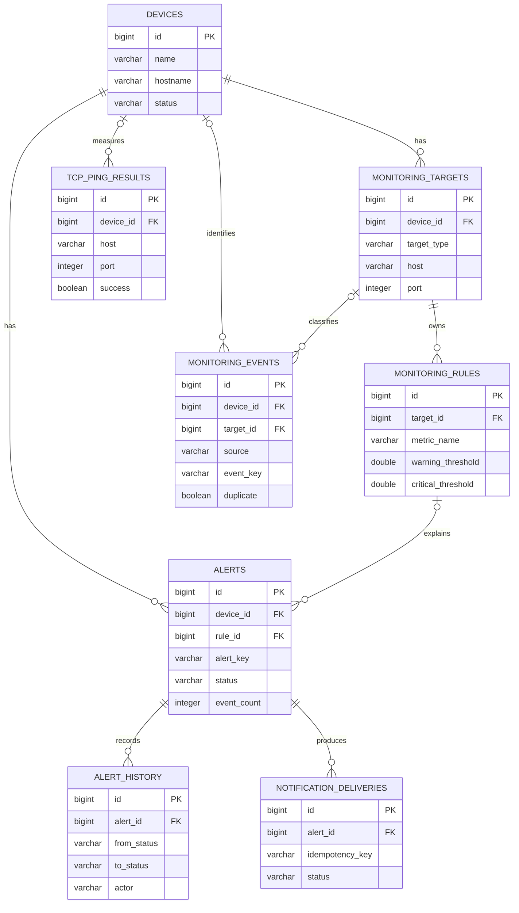
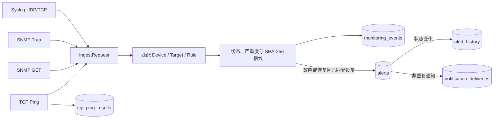
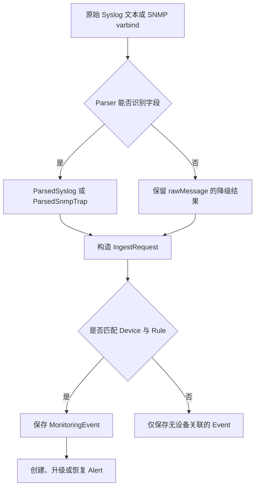
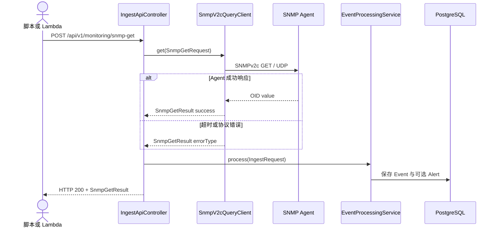
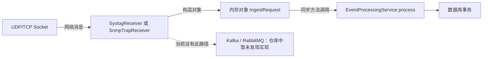

# 数据不是垃圾桶：数据层与协议集成对话

## 本章目标

理解 11 张表、JPA 关系、Flyway、去重逻辑，以及四种监视输入如何变成统一数据。

## 涉及的关键代码

| 文件路径 | 类、函数或资源 | 作用 |
|---|---|---|
| `app/bms-app/src/main/resources/db/migration/V1__create_bms_schema.sql` | 11 张表与索引 | 数据结构事实来源 |
| `app/bms-app/src/main/java/com/example/bms/event/EventProcessingService.java` | `process` | 数据转换、去重与聚合 |
| `app/bms-app/src/main/java/com/example/bms/protocol/syslog/SyslogParser.java` | `parse` | Syslog 字段解析 |
| `app/bms-app/src/main/java/com/example/bms/protocol/snmp/SnmpV2cQueryClient.java` | `get` | SNMPv2c GET |

## 本章全景图

### 图表说明

- 表名、字段和外键全部来自 Flyway `V1__create_bms_schema.sql`。
- `device_id`、`target_id`、`rule_id` 的可空关系按迁移中的 `NOT NULL` 与否绘制。
- Event 与 Alert 没有直接外键；它们通过设备、规则和业务 key 形成处理关系。
- 为保持可读性，图中省略了无外键的 `notification_targets`、`audit_logs` 与 `app_users`。
- 图表示当前已实现数据模型，不包含建议中的 outbox、分区或归档表。

## 第一部分：从输入到数据表

### 图表说明

- 四种 EventSource 均在当前枚举和 API/接收器代码中存在。
- 每次输入都会保存 Event；Alert 更新要求先匹配到设备。
- `alert_history` 只在创建或状态变化等生命周期节点写入。
- TCP 检查另存 `tcp_ping_results`；本地 API 用协议标记避免重复保存。
- 箭头表示当前同步数据流，仓库中没有 Redis、Kafka 或 Elasticsearch。

## 第二部分：协议数据转换

### 图表说明

- Parser 对应 `SyslogParser` 与 `SnmpTrapParser`，输出类均真实存在。
- 解析失败不等于丢弃，测试确认 Syslog 原文会保留。
- `IngestRequest` 是协议无关 DTO，之后才做设备、目标与规则匹配。
- 未知设备不会被自动创建，事件以空关联保存。
- “创建、升级或恢复”由 `EventProcessingService.updateAlert` 决定。

## 第三部分：外部系统集成时序

### 图表说明

- API 路径和方法来自 `IngestApiController.snmpGet`。
- `SnmpV2cQueryClient` 通过 SNMP4J 对目标 Agent 发送 UDP GET。
- 成功与失败都会转成 `IngestRequest`，从而留下事件事实。
- community 只用于请求，不在图中传给数据库，也不应写入日志。
- 真实 AWS Lambda 部署与目标网络可达性尚未由本轮运行验证。

## 第四部分：当前消息生产与消费边界

### 图表说明

- “生产者”是 Receiver，“消费者”是 `EventProcessingService`，对象不离开 JVM。
- 实线对应当前代码；指向 broker 的虚线明确标为不存在路径。
- 同步调用简化一致性，但接收线程会受数据库和通知耗时影响。
- UDP 在进入应用前不提供传输确认，数据库事务无法弥补网络层丢包。
- 若未来引入 broker，需要重新定义顺序、重复、重试和死信语义。

## 本章涉及的关键文件

| 文件 | 作用 | 在图中的节点 |
|---|---|---|
| `app/bms-app/src/main/resources/db/migration/V1__create_bms_schema.sql` | 11 张表与索引 | ER 图所有表 |
| `app/bms-app/src/main/resources/db/migration/V2__seed_master_data.sql` | 本地主数据 | Device、Target 与 Rule 基线 |
| `app/bms-app/src/main/java/com/example/bms/event/MonitoringEvent.java` | 事件实体 | `MONITORING_EVENTS` |
| `app/bms-app/src/main/java/com/example/bms/alert/Alert.java` | 告警聚合实体 | `ALERTS` |
| `app/bms-app/src/main/java/com/example/bms/reporting/ProtocolStatisticsJdbcRepository.java` | JDBC 统计查询 | 数据库查询边界 |

---

对话复制区

Speaker 1: 数据库里到底有多少张业务表？

Speaker 2: `V1__create_bms_schema.sql` 创建 11 张：devices、monitoring_targets、monitoring_rules、monitoring_events、alerts、alert_history、notification_targets、notification_deliveries、tcp_ping_results、audit_logs 和 app_users。

Speaker 1: 为什么设备、目标和规则要拆三张表？

Speaker 2: 设备是资产；目标描述对该设备用哪种协议、主机、端口或 OID 监视；规则描述指标阈值与抑制窗口。拆开后同一设备能有多种检查，而不把所有协议字段塞进一行。

Speaker 1: Event 和 Alert 再讲一次区别。

Speaker 2: Event 是不可忽略的一次观测，Alert 是围绕设备和 alertKey 聚合的当前问题。`monitoring_events` 有原文、来源、状态、指纹和发生时间；`alerts` 有当前状态、次数、首次与最近发生时间。

Speaker 1: ER 图讲关系，能不能再画数据到底流向哪里？

Speaker 2: 可以。四种输入先统一成 `IngestRequest`，再由同一 Service 决定写哪些表。

Speaker 1: 告警历史为什么不能只看 Alert 的更新时间？

Speaker 2: 更新时间只能说“变过”，不能说从什么状态变到什么状态、谁操作、原因是什么。`alert_history` 保存 before、after、actor 和 reason，适合审计生命周期。

Speaker 1: `audit_logs` 又和告警历史重复了吗？

Speaker 2: 不重复。告警历史是领域状态迁移；审计日志覆盖设备创建、告警确认和关闭等用户动作。一个回答“对象怎么变”，另一个回答“谁做了什么”。

Speaker 1: Flyway 为什么比 JPA 自动建表麻烦？

Speaker 2: `ddl-auto=validate` 只验证实体与既有结构，不擅自改库；Flyway 脚本可审查、可排序、可重复部署。数据库不是草稿纸，生产迁移必须留下版本。

Speaker 1: V2 填了什么数据？

Speaker 2: 它插入设备、监视目标、规则、通知目标、展示用户和审计种子。它让本地 UI 一启动就能学习，但这些是演示主数据，不是生产资产清单。

Speaker 1: `DemoDataService` 和 V2 有什么区别？

Speaker 2: V2 是数据库迁移的一部分，负责基线主数据；`DemoDataService` 可生成大量协议事件用于页面和截图。生产环境不应误开自动演示数据。

Speaker 1: JPA Repository 都是简单 CRUD 吗？

Speaker 2: 不全是。`AlertRepository` 与 `MonitoringEventRepository` 使用 `@EntityGraph` 预取页面所需关联，也有按活动状态、指纹窗口和时间排序的派生查询。

Speaker 1: 为什么报表不用 JPA？

Speaker 2: `ProtocolStatisticsJdbcRepository` 用 JDBC 做按协议统计。聚合 SQL 直接、结果扁平，比为一张报表构造复杂实体图更清楚。

Speaker 1: 数据库索引对应哪些访问模式？

Speaker 2: V1 对事件时间、来源加时间、指纹加时间、告警状态与设备 key、TCP 检查时间和审计时间建索引。它们映射列表排序、去重和活动告警查找。

Speaker 1: 指纹会不会把原始消息泄漏出去？

Speaker 2: 数据库保存的是 SHA-256 十六进制摘要，不是拼接文本本身；但事件表仍明确保存 rawMessage。日志原文可能含设备信息，生产中需要保留期、访问控制和脱敏策略。

Speaker 1: Syslog 解析失败会丢数据吗？

Speaker 2: `SyslogParserTest.preservesMalformedRawMessage` 明确验证格式异常仍保留原文。解析字段可能降级，但接收线程不应因为一条坏消息退出。

Speaker 1: “解析、归一、聚合”听起来像三个相似动词，实际边界在哪里？

Speaker 2: 这张转换图把每一步输入与输出写开。

Speaker 1: Trap 的 linkDown 和 linkUp 怎么关联恢复？

Speaker 2: `SnmpTrapParserTest` 验证两者使用同一个 alertKey：linkDown 生成 CRITICAL，linkUp 生成恢复语义。只有 key 一致，`EventProcessingService` 才能找到活动告警并恢复。

Speaker 1: TCP Ping 真的是 ping 吗？

Speaker 2: 不是 ICMP。`TcpPingService` 用 Java Socket connect，区分成功、拒绝、超时和 DNS 错误，并记录耗时与重试。名字通俗，协议事实要看实现。

Speaker 1: SNMP GET 为什么抽了 `SnmpQueryClient` 接口？

Speaker 2: 当前 `SnmpV2cQueryClient` 用 SNMP4J 实现 v2c，接口让 Controller 不依赖具体版本，将来可加入 v3 authPriv 或测试替身。

Speaker 1: SNMP GET 从 API 到设备再回数据库的往返怎样发生？

Speaker 2: 下面只画当前 v2c 实现；SNMPv3 是改进方向，不会混进当前时序。

Speaker 1: 有没有异步消息中间件保证数据不丢？

Speaker 2: 没有发现。UDP 本身也可能丢包，当前数据库事务只能保证进入应用后的写入一致性。生产要从协议、缓冲、重试和 outbox 分别设计可靠性。

Speaker 1: 没有 broker，还能谈“生产与消费”吗？

Speaker 2: 可以，但要说准确：接收器生产内存中的 `IngestRequest`，Service 在同一进程同步消费，不是 Kafka 语义。

Speaker 1: PostgreSQL 和 Oracle 能完全共用迁移吗？

Speaker 2: 仓库提供两个 profile 与驱动，但不能据此保证所有 DDL、索引和 SQL 在 ADB 等价通过。需要在真实 Oracle 测试环境验证 Flyway 方言和 JDBC 聚合查询。

Speaker 1: 为什么 Testcontainers 很重要？

Speaker 2: H2 不能完整代表 PostgreSQL。`PostgresqlContainerTest` 至少验证真实驱动和连接边界，不过 Docker 不可用时它会跳过，所以报告必须区分“测试套件通过”和“容器数据库测试实际运行”。

Speaker 1: 数据层目前最大的生产风险是什么？

Speaker 2: 同步写入链加上单库、单表事件增长。没有压测和保留策略证据时，最先应量化事件写入率、索引膨胀、归档需求和通知对事务时长的影响。

核心知识点回顾

1. 设备、目标、规则、事件和告警分别表达不同生命周期。
2. Flyway 控制结构，JPA 验证并操作实体，JDBC处理聚合。
3. 协议可靠性、事务可靠性和通知可靠性不能混为一谈。

启发式思考

1. 事件保留一年后，哪些索引与分区策略最先需要调整？
2. Oracle 兼容性应怎样加入 CI 而不依赖生产 ADB？
3. outbox 表应与哪些当前实体处于同一事务？

启发式思考参考答案

1. 首先按 `occurred_at` 评估 `monitoring_events` 的时间分区和保留/归档，因为列表查询、来源趋势和指纹窗口都依赖时间。应复核 `(source, occurred_at)`、`(fingerprint, occurred_at)` 索引的体积与写放大，并让去重查询只扫描近期分区；大范围只按时间检索可评估 BRIN，小窗口和组合条件仍适合 B-tree。调整前必须用实际查询计划和事件增长率验证，不能只因为“数据多”就盲目增加索引。

2. 可以在 CI 的独立 Job 中启动许可允许的临时 Oracle 测试实例，激活 `oracle` profile，执行 Flyway migrate/validate、关键 Repository 查询和 JDBC 报表测试。它不需要生产 ADB Wallet 或生产密码，但仍能发现方言、IDENTITY、时间类型和 SQL 函数差异。若托管 runner 资源不足，可在受控自托管 runner 或定期兼容性流水线执行，并把“临时 Oracle 通过”与“ADB 网络、Wallet、服务名已验证”分开报告。

3. outbox 记录应与产生通知意图的 `Alert` 更新、必要的 `AlertHistory` 和对应 `MonitoringEvent` 处于同一数据库事务。事务只保证“业务状态与待发送意图同时提交”，不应在事务内调用 SMTP。outbox 至少要保存 Alert ID、目标、事件次数或幂等键、payload 版本和状态，之后由独立发布器领取、发送并更新结果。
