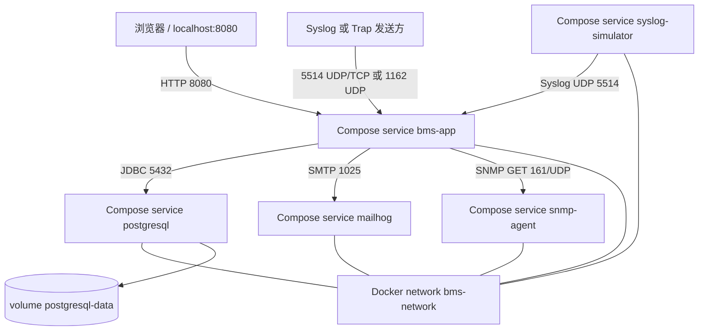
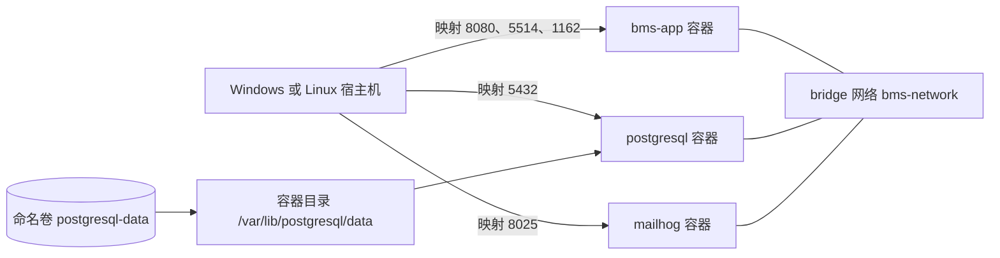
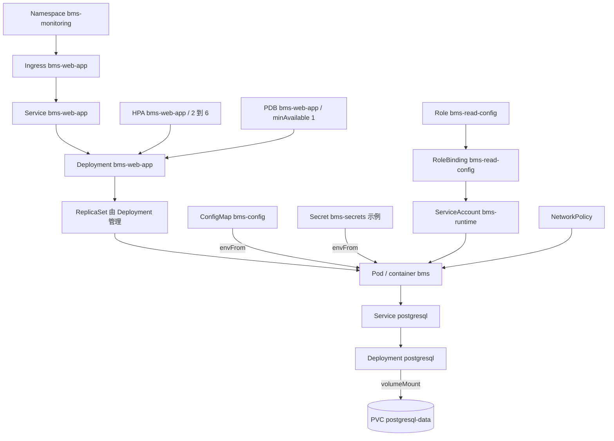
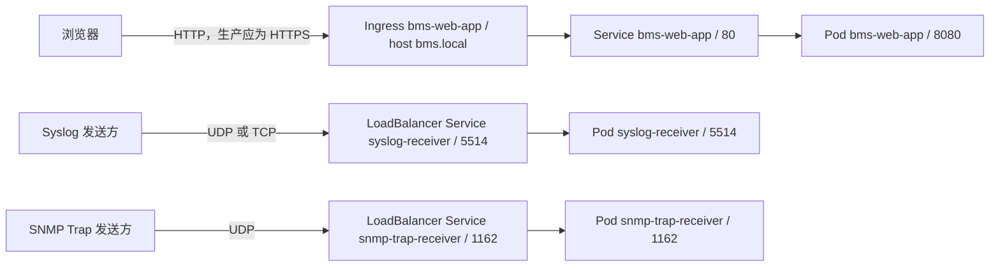
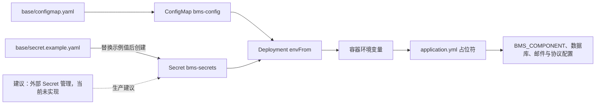
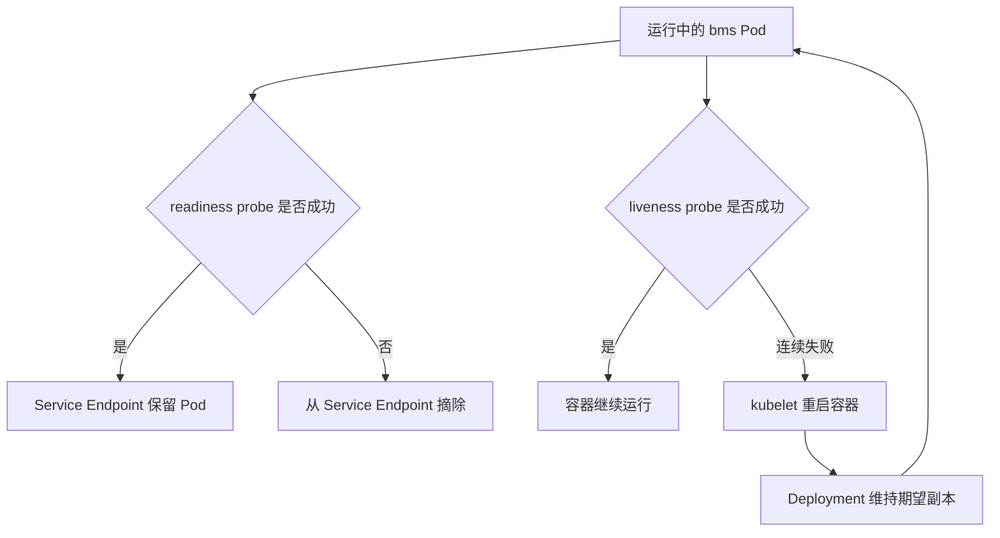

# 从 JAR 到 kind，再到云脚手架：基础设施对话

## 本章目标

把 Docker、Compose、Kubernetes、Kustomize 和 OpenTofu 映射到仓库中的实际文件与验证边界。

## 涉及的关键代码

| 文件路径 | 类、函数或资源 | 作用 |
|---|---|---|
| `docker-compose.yml` | 五个 service、网络与卷 | 本地完整编排 |
| `infra/docker/bms-app.Dockerfile` | 多阶段镜像 | Java 21 非 root 运行时 |
| `infra/kubernetes/base/bms-components.yaml` | 五个 Deployment | 集群逻辑角色 |
| `infra/kubernetes/base/availability.yaml` | Ingress、HPA、PDB | 流量与可用性 |
| `infra/kubernetes/base/network-policy.yaml` | 四个 NetworkPolicy | 默认拒绝与必要放行 |

## 本章全景图

### 图表说明

- 五个 service 名称、端口、网络和卷来自当前 `docker-compose.yml`。
- service 之间通过 `bms-network` 和服务名通信，容器内不使用宿主 `localhost` 找数据库。
- `postgresql-data` 只挂载 PostgreSQL 数据目录。
- Syslog simulator 是本地持续输入，SNMP agent 为主动 GET 提供测试目标。
- Compose 配置可解析已验证，但 Docker Engine 当前不可用，不能据图声称容器正在运行。

## 第一部分：Docker 网络与持久化

### 图表说明

- 宿主端口映射只用于从宿主或外部访问；容器互访使用 bridge 网络。
- `bms-app` 通过 `postgresql:5432` 与 `mailhog:1025` 访问依赖。
- 命名卷独立于单个 PostgreSQL 容器，普通重建容器不会自动删除数据。
- `docker compose down -v` 会触及卷，因此不能把“停止”与“删除数据”混为一谈。
- 图表示 Compose 配置关系，未表示当前 Docker Engine 运行状态。

## 第二部分：Kubernetes 资源关系

### 图表说明

- Ingress、Service、Deployment、ConfigMap、Secret、ServiceAccount、Role、RoleBinding、HPA 与 PDB 名称来自 base YAML。
- ReplicaSet 是 Deployment 控制器产生的运行对象，不是仓库中的独立 YAML。
- `envFrom` 将 ConfigMap 和 Secret 注入容器环境；PostgreSQL Deployment 通过 volumeMount 使用 PVC。
- HPA 调整副本，PDB 约束自愿驱逐，NetworkPolicy 限制网络流量。
- Kustomize 渲染已通过，但资源是否已由真实集群创建尚未运行验证。

## 第三部分：请求进入 Kubernetes

### 图表说明

- Web Service 80 到 Pod 8080，来自 `services.yaml` 与 `bms-components.yaml`。
- Syslog Service 同时定义 UDP/TCP 5514；Trap Service 定义 UDP 1162。
- Ingress host 是 `bms.local`，class 为 nginx；真实控制器存在与否需集群验证。
- 生产 443、514、162 到内部端口的映射属于云 LB 后续工作，当前 YAML 未完整实现。
- 图中没有让 UDP/TCP 穿过 HTTP Ingress，避免协议层级错误。

## 第四部分：配置与 Secret 注入

### 图表说明

- `bms-config` 与 `bms-secrets` 名称来自 YAML，二者都由 `envFrom` 注入。
- `application.yml` 用环境变量覆盖本地回退值。
- `BMS_COMPONENT` 和 receiver/scheduler 开关在各 Deployment 中另行指定。
- `secret.example.yaml` 只提供字段形状，不应承载真实生产值。
- 外部 Secret 管理使用虚线并标为建议，当前仓库未发现相应 Operator 配置。

## 第五部分：健康检查与恢复

### 图表说明

- 两个 probe 都访问 Spring Actuator 的健康端点，配置位于 Deployment。
- readiness 失败影响接流量，不必然重启进程。
- liveness 失败由 kubelet 处理容器重启；Deployment 继续维持副本数。
- 数据库不可用是否影响各健康组取决于 Actuator 健康配置，图不声称重启能修数据库。
- PDB 只影响自愿驱逐，不参与这条容器崩溃恢复链。

## 本章涉及的关键文件

| 文件 | 作用 | 在图中的节点 |
|---|---|---|
| `infra/docker/bms-app.Dockerfile` | 多阶段非 root 镜像 | `bms-app` 容器 |
| `docker-compose.yml` | 本地完整依赖编排 | 五个 service、网络与卷 |
| `infra/kubernetes/base/bms-components.yaml` | 五角色 Deployment | Deployment、Pod 与 Probe |
| `infra/kubernetes/base/availability.yaml` | HPA、PDB、Ingress | Ingress、HPA、PDB |
| `infra/opentofu/environments/local/main.tf` | 无凭据静态验证环境 | OpenTofu 验证边界 |

---

对话复制区

Speaker 1: 镜像和容器到底有什么区别？

Speaker 2: 镜像是只读交付模板，容器是它的一次运行实例。`bms-app.Dockerfile` 构建镜像，Compose 或 Kubernetes 再用它启动一个或多个进程。

Speaker 1: Dockerfile 做了什么？

Speaker 2: 它先在 Maven/Java 21 构建阶段打包主应用，再把可执行 JAR 复制到较小的 Java 21 JRE 运行阶段，并以 UID 10001 的非 root 用户启动。

Speaker 1: 为什么要多阶段构建？

Speaker 2: 运行镜像不需要 Maven、源码和完整 JDK。把厨房和餐桌分开，最终端上来的只有菜，不把烤箱也搬给用户。

Speaker 1: Compose 中数据库数据会随容器消失吗？

Speaker 2: PostgreSQL 使用命名卷 `postgresql-data` 挂载数据目录。删除容器不会自动删卷，但执行带 volume 删除的清理命令会丢本地数据，脚本使用前要看清范围。

Speaker 1: 能把“容器、网络、卷”拆开画吗？它们总在一条命令里出现，我容易混。

Speaker 2: 网络负责找人，卷负责记事，容器负责干活。三个对象的生命周期不同。

Speaker 1: 服务之间怎样找到彼此？

Speaker 2: 它们在 `bms-network` 上通过服务名解析。`bms-app` 的 `DB_HOST=postgresql`、`MAIL_HOST=mailhog` 就是例子；容器中的 localhost 只指向容器自身。

Speaker 1: Compose 的 healthcheck 能证明生产可用吗？

Speaker 2: 只能证明当前容器的 readiness HTTP 检查通过。它不证明协议端口从外部网络可达、数据备份有效或系统满足 SLO。

Speaker 1: Kubernetes base 有哪些资源？

Speaker 2: Namespace、五个应用 Deployment、多个 Service、ConfigMap、示例 Secret、ServiceAccount/Role/RoleBinding、PostgreSQL PVC 与 Deployment、MailHog、NetworkPolicy、HPA、PDB 和 Ingress。

Speaker 1: 资源名这么多，谁管谁？

Speaker 2: 先看 Web 主线，再把配置、安全、存储与可用性挂到相应节点上。

Speaker 1: Deployment 如何管理 Pod？

Speaker 2: Deployment 声明副本、标签、镜像、环境变量、探针和资源。控制器让实际 Pod 数向期望值收敛；Web 初始两副本，其余逻辑角色当前各一副本。

Speaker 1: Service 如何找到 Pod？

Speaker 2: Service selector 匹配 Pod 标签并提供稳定地址。Web Service 把 80 转到容器 8080；协议 Service 分别暴露 Syslog 5514 和 Trap 1162。

Speaker 1: Web、Syslog 和 Trap 是不是都经过 Ingress？

Speaker 2: 不是。Ingress 只承接 HTTP；原始 UDP/TCP 协议由各自的 LoadBalancer Service 进入。

Speaker 1: 为什么协议 Service 用 LoadBalancer，Web 又有 Ingress？

Speaker 2: Syslog/Trap 需要保留原始 UDP/TCP 四层流量，通常交给网络负载均衡；Web 的 HTTP/HTTPS 适合 Ingress 做主机和路径路由。kind 本地环境不等于 OCI 真实 LB。

Speaker 1: ConfigMap 和 Secret 的区别？

Speaker 2: ConfigMap 放非敏感配置，Secret 放凭据材料。但 Kubernetes Secret 默认只是编码，不自动等于加密保险箱；生产应结合集群加密和外部 Secret 管理。

Speaker 1: 示例 Secret 会不会被直接部署？

Speaker 2: 文件名是 `secret.example.yaml`，应复制并替换后使用，不能把真实值提交到 Git。文档也不能复述任何真实凭据。

Speaker 1: ConfigMap、Secret、环境变量和 Spring 配置最后怎么合在一起？

Speaker 2: Pod 通过 `envFrom` 收到两类值，Spring 再用 `${VAR:default}` 解析；生产环境必须在默认值之前把秘密换掉。

Speaker 1: Probe 在这里怎么工作？

Speaker 2: Spring Actuator 提供 liveness 与 readiness。前者判断进程是否需重启，后者判断是否可以接流量。把两者混成一个会让临时数据库故障引发不必要重启。

Speaker 1: Probe 失败以后，Kubernetes 到底做什么？

Speaker 2: readiness 先摘流，liveness 连续失败才促使 kubelet 重启容器；两条线不要画成同一个按钮。

Speaker 1: HPA 根据什么扩容？

Speaker 2: `availability.yaml` 将 Web 从最少 2 扩到最多 6，依据资源指标。实际生效还需要 metrics-server，仓库清单不证明集群已安装它。

Speaker 1: PDB 能保证永不宕机吗？

Speaker 2: 不能。它限制自愿中断时可同时驱逐的 Pod 数，不阻止节点硬故障、应用崩溃或全部副本访问同一失效数据库。

Speaker 1: NetworkPolicy 是不是一加就安全？

Speaker 2: base 先默认拒绝，再为应用、PostgreSQL 和 MailHog放行必要流量，这是好基础。但还取决于 CNI 是否执行策略，也要补足 DNS、Ingress 和云负载均衡路径验证。

Speaker 1: restricted security 体现在哪？

Speaker 2: Pod 配置非 root、禁止提权、只读 root filesystem，并 drop `ALL` Linux capabilities，同时设置资源 requests/limits。临时写入需要显式可写卷。

Speaker 1: `kind-up` 做了什么意义上的验证？

Speaker 2: 它面向本地 kind 集群构建或加载镜像、应用 Kustomize 清单并等待资源。即使成功，也只验证本地 Docker/kind 路径，不代表 OKE、NLB、证书或云 IAM 已完成。

Speaker 1: OpenTofu local 环境为什么没有云凭据？

Speaker 2: 它专为 `fmt/init -backend=false/validate` 设计，验证语法与模块装配。dev 环境才组合 AWS/OCI 模块，而且开关默认关闭。

Speaker 1: 为什么不能随便跑 `plan`？

Speaker 2: Provider 初始化可能需要凭据和网络，plan 也会读取真实云状态；apply/destroy 更会产生费用或删除资源。没有明确授权时只做无凭据静态验证。

Speaker 1: 真正生产化还缺什么？

Speaker 2: 至少包括镜像仓库、正式域名与证书、四层 LB、私网路由/VPN、托管数据库高可用、Secret/IAM、日志采集、备份、告警、容量和灾难恢复演练。

核心知识点回顾

1. Compose 提供本地复现，Kubernetes 清单提供集群部署形状，OpenTofu 提供云资源脚手架。
2. 探针、HPA、PDB 和 NetworkPolicy 各自只解决一部分问题。
3. 配置可渲染与生产已上线是两个完全不同的结论。

启发式思考

1. UDP receiver 扩容时负载均衡和事件去重会怎样互动？
2. 哪些组件适合用托管服务替代示例 Deployment？
3. 怎样在不接触生产凭据的情况下增加 IaC 可信度？
