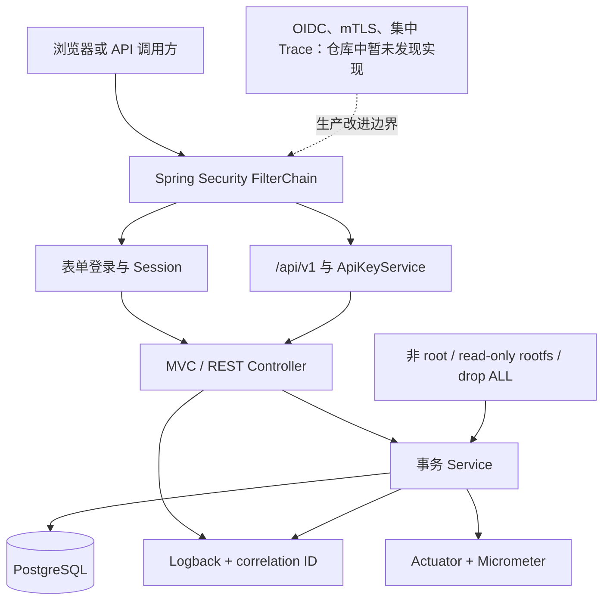
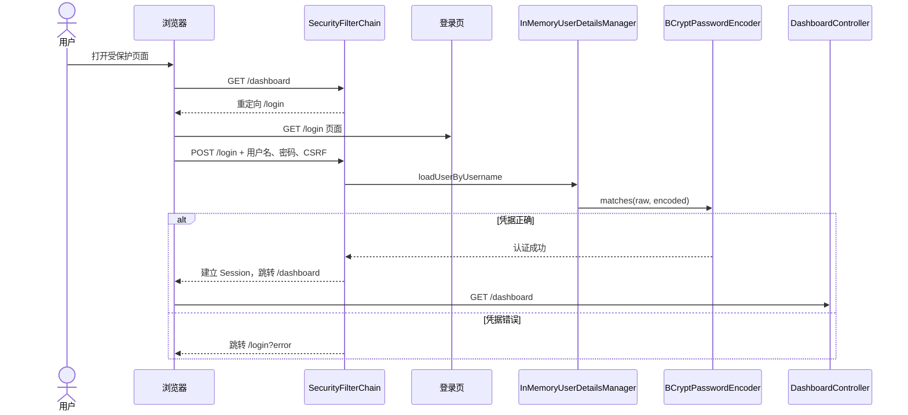
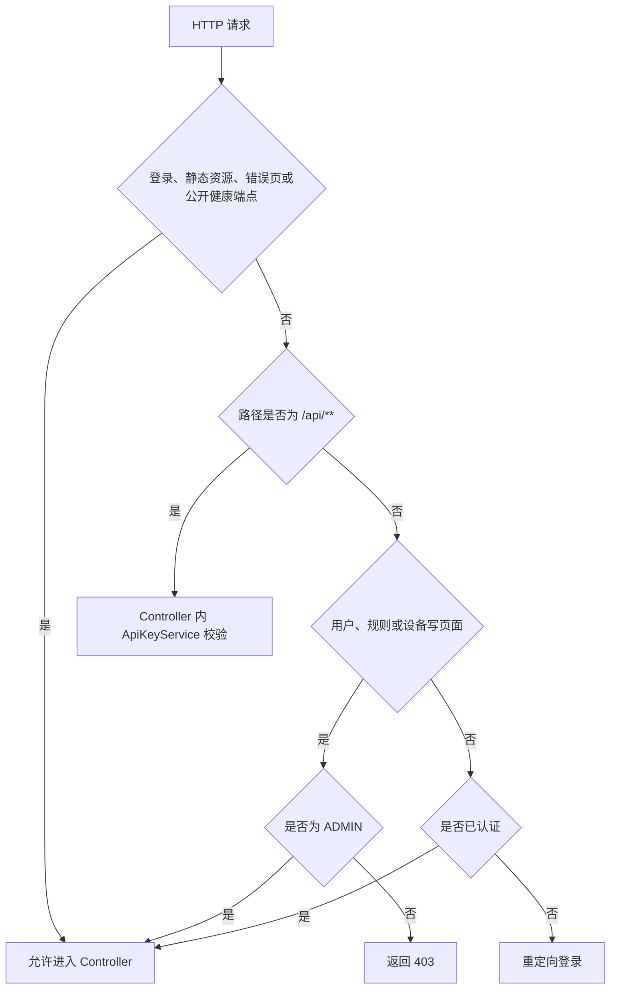
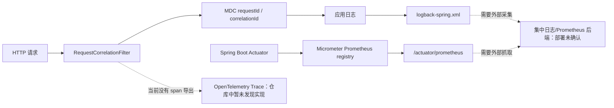
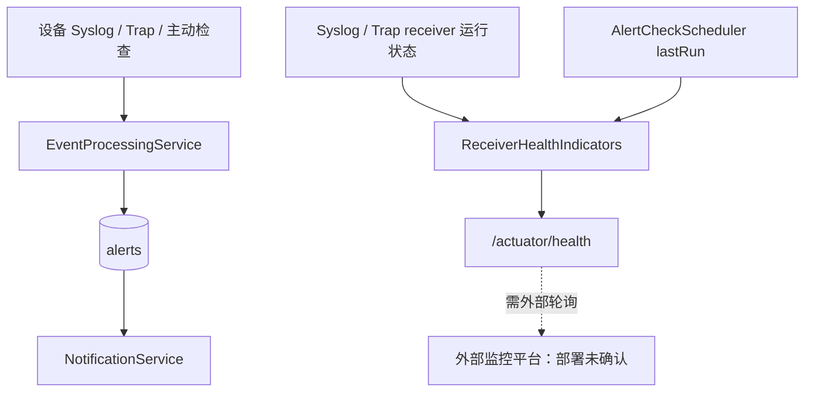
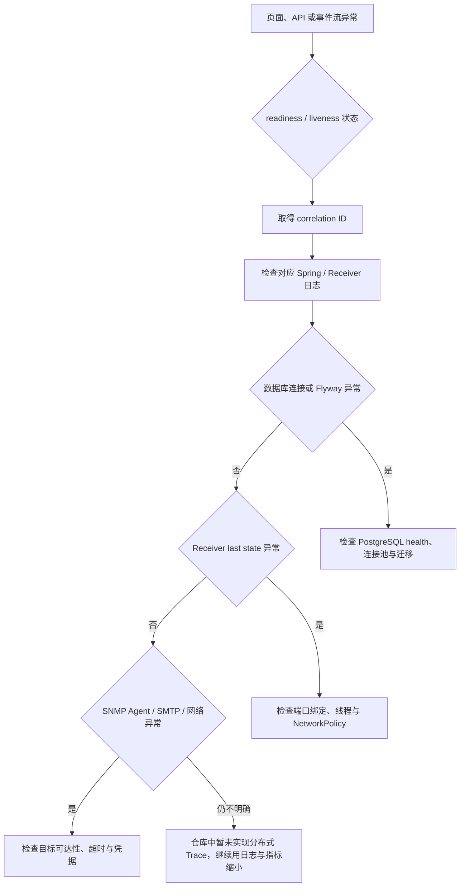

# 看得见，也守得住：安全与可观测性对话

## 本章目标

审视登录、权限、API Key、容器安全、日志、指标和健康检查，并识别当前没有实现的保护。

## 涉及的关键代码

| 文件路径 | 类、函数或资源 | 作用 |
|---|---|---|
| `app/bms-app/src/main/java/com/example/bms/security/SecurityConfig.java` | `securityFilterChain`、`userDetailsService` | 登录、角色与安全 Header |
| `app/bms-app/src/main/java/com/example/bms/security/ApiKeyService.java` | `isValid` | API Key 常量时间比较 |
| `app/bms-app/src/main/java/com/example/bms/security/RequestCorrelationFilter.java` | `doFilterInternal` | 请求关联 ID |
| `app/bms-app/src/main/java/com/example/bms/infrastructure/ReceiverHealthIndicators.java` | HealthIndicator bean | 协议接收器健康 |
| `app/bms-app/src/main/resources/application.yml` | Actuator 配置 | 健康、指标与 Prometheus 端点 |

## 本章全景图

### 图表说明

- 浏览器表单与 API Key 是当前两条认证路径，二者最终进入 Controller。
- `RequestCorrelationFilter` 与 Logback 提供请求日志关联，Micrometer 暴露指标。
- 容器安全节点来自 Dockerfile 与 Kubernetes securityContext。
- OIDC、mTLS 和集中 Trace 明确标记为“暂未发现实现”，不是当前能力。
- 图表示应用安全边界，不证明外部 WAF、SIEM 或企业 IdP 已部署。

## 第一部分：身份认证流程

### 图表说明

- 登录页、默认成功 URL 和失败 URL 来自 `SecurityConfig`。
- 三个用户由 `InMemoryUserDetailsManager` 创建，密码用 BCrypt cost 12 编码。
- 浏览器表单受 CSRF 保护，API 路径才被排除。
- `app_users` 表未出现在图中，因为当前认证代码不读取它。
- 企业 IdP/OIDC 是生产建议，不属于此当前登录时序。

## 第二部分：权限校验

### 图表说明

- 决策条件来自 `SecurityConfig.authorizeHttpRequests`。
- `/api/**` 在 FilterChain 中 permitAll，但仍由 Controller 检查 API Key。
- 用户、规则和设备写页面要求 ADMIN；其他页面要求已认证。
- `SecurityIntegrationTest` 覆盖匿名跳转、VIEWER 拒绝与 ADMIN 允许。
- 菜单可见性不是授权依据，真正边界在服务端 FilterChain。

## 第三部分：日志、指标与缺失的 Trace

### 图表说明

- correlation ID 来自 `RequestCorrelationFilter`，格式由 `logback-spring.xml` 使用。
- Actuator 与 Prometheus registry 依赖在 `app/bms-app/pom.xml` 中存在。
- 应用暴露 Prometheus 端点，但仓库不能证明外部 Prometheus 已抓取。
- OpenTelemetry Trace 明确标记为未发现实现。
- 虚线表示需要外部运行环境或当前缺失路径。

## 第四部分：告警与健康信号

### 图表说明

- 上半链是设备业务告警，下半链是应用健康信号，二者不应混为同一表。
- `ReceiverHealthIndicators` 读取 receiver 运行状态和 scheduler 最后运行状态。
- Actuator endpoint 是当前实现；外部监控抓取与告警规则未由仓库证明。
- `NotificationService` 处理业务 Alert，不等同于 Kubernetes Probe。
- 图中没有虚构 PagerDuty、Datadog 或云监控实例。

## 第五部分：故障定位流程

### 图表说明

- 起点是实际症状，先看 Probe/Actuator，再用 correlation ID 缩小日志。
- 数据库、Receiver 与外部协议目标分别有不同检查路径。
- `ReceiverHealthIndicators` 能辅助判断接收器与 scheduler，但不能替代端到端发送验证。
- 分布式 Trace 明确标为未实现，因此不把它列成当前排障工具。
- 具体恢复动作仍应遵循 `docs/operations/runbook.md` 并避免破坏数据。

## 本章涉及的关键文件

| 文件 | 作用 | 在图中的节点 |
|---|---|---|
| `app/bms-app/src/main/java/com/example/bms/security/SecurityConfig.java` | 表单登录、RBAC、CSRF 和安全 Header | FilterChain、用户与角色判断 |
| `app/bms-app/src/main/java/com/example/bms/security/ApiKeyService.java` | API Key 比较 | API Key 分支 |
| `app/bms-app/src/main/java/com/example/bms/security/RequestCorrelationFilter.java` | 请求关联 ID | Filter、MDC |
| `app/bms-app/src/main/java/com/example/bms/infrastructure/ReceiverHealthIndicators.java` | 接收器健康信息 | Receiver Health |
| `app/bms-app/src/main/resources/logback-spring.xml` | 日志格式 | Logback 节点 |

---

对话复制区

Speaker 1: 登录账号从数据库的 `app_users` 表读取吗？

Speaker 2: 不是。`SecurityConfig.userDetailsService` 创建三个内存用户，密码来自配置并用 BCrypt cost 12 编码。`app_users` 表目前用于运维页面展示，不是认证源。

Speaker 1: 那浏览器登录到底经过哪些对象？

Speaker 2: 认证用户源在内存中，成功后建立 Session；数据库中的 `app_users` 不在这条时序里。

Speaker 1: 这适合生产吗？

Speaker 2: 适合本地复现，不适合企业身份治理。代码注释也建议生产替换为 OIDC 或企业 IdP，同时保留角色映射。

Speaker 1: 三个角色怎样分权？

Speaker 2: ADMIN 可访问用户、规则和设备写页面；其他已认证用户可看大部分页面。告警操作还应结合 Controller 或方法授权与测试确认，不能只靠菜单隐藏。

Speaker 1: 能把 URL 权限判断画成决策树吗？

Speaker 2: 可以，但要严格按 `requestMatchers` 的顺序理解。

Speaker 1: CSRF 为什么只忽略 API？

Speaker 2: 浏览器表单使用 session，需要 CSRF token 防跨站请求；机器调用 API 使用 API Key，没有浏览器表单 token，所以 `/api/**` 被忽略。代价是 API 认证必须自己足够严格。

Speaker 1: CSP 配置了什么？

Speaker 2: 资源默认只允许同源，图片额外允许 data，禁止 object 和第三方 frame，并限制 base URI。`frameOptions.deny` 再阻止点击劫持。

Speaker 1: API Key 比密码安全吗？

Speaker 2: 它只是另一种共享秘密。`ApiKeyService` 做常量时间比较是好事，但本地默认值明确可猜，生产必须替换、轮换、最小授权，并考虑 mTLS 或 OIDC。

Speaker 1: 为什么 `/api/**` 在 Security 层 `permitAll` 让人紧张？

Speaker 2: 因为每新增一个方法都必须记得手动调 `ApiKeyService`。当前四个方法都检查了，但统一认证 Filter 更不易漏，也方便审计和限流。

Speaker 1: SNMP community 会去哪儿？

Speaker 2: v2c 请求内存里会使用它，配置也能从环境变量注入。代码特意不把 community 写到事件原文或日志；不过 v2c 本身不加密，网络隔离仍是必要条件。

Speaker 1: 本地配置里有密码回退值，这是硬编码密码吗？

Speaker 2: 它们是明显标注的本地开发默认值，属于风险事实而非真实 Secret。共享或生产环境必须覆盖，最好让生产 profile 在缺值时直接失败。

Speaker 1: 输入校验覆盖哪些地方？

Speaker 2: `DeviceForm` 限制名称、hostname 等字段；API record 限制非空、端口 1–65535、超时 100–30000 毫秒和重试 0–5。JPA 参数化查询也降低 SQL 注入风险。

Speaker 1: XSS 怎么防？

Speaker 2: Thymeleaf 默认转义文本，CSP 限制脚本来源。仍要检查任何 `th:utext` 或动态 HTML 使用；本次扫描没有把“默认安全”夸大为“绝对无 XSS”。

Speaker 1: 容器层做了哪些保护？

Speaker 2: Docker 运行用户是非 root 10001；Kubernetes 进一步设置 `runAsNonRoot`、禁止提权、只读 rootfs、drop ALL capabilities 和资源限制。

Speaker 1: RBAC 的 Role 能做什么？

Speaker 2: `bms-read-config` 给 `bms-runtime` ServiceAccount 读取必要配置资源的命名空间级权限。生产仍应核对应用是否真的需要调用 Kubernetes API，若不需要可进一步删除权限。

Speaker 1: 日志如何串起一次请求？

Speaker 2: `RequestCorrelationFilter` 为 HTTP 请求创建或传递 correlation ID，`logback-spring.xml` 将它纳入日志上下文。它帮助在单体日志中追踪一次请求，不等于分布式 tracing。

Speaker 1: 三种可观测数据分别流向哪里？

Speaker 2: 当前仓库实现日志与 Prometheus 指标；Trace 只画成明确缺口。

Speaker 1: 项目有哪些 Metrics？

Speaker 2: Actuator 暴露 `metrics` 和 `prometheus`，Micrometer Prometheus registry 在依赖中。JVM、HTTP 和自定义健康状态可被抓取，但仓库没有证明生产 Prometheus 已部署或保留数据。

Speaker 1: 健康检查能看到接收器吗？

Speaker 2: `ReceiverHealthIndicators` 把 Syslog、Trap 和 scheduler 状态接入健康体系。这样 Web 活着但 UDP 线程死掉时，不会只得到一张虚假的绿灯。

Speaker 1: 业务告警和系统健康告警是一回事吗？

Speaker 2: 不是。业务 Event/Alert 处理设备故障，Actuator Health 反映应用组件状态。

Speaker 1: liveness 和 readiness 有什么实战区别？

Speaker 2: liveness 失败倾向于重启容器，readiness 失败只应停止接流量。数据库临时不可用通常先影响 readiness，别让重启风暴雪上加霜。

Speaker 1: 有没有 OpenTelemetry 或 Jaeger？

Speaker 2: 仓库暂时没发现。当前有日志 correlation 和 Micrometer 指标，没有完整 trace span、采样器或后端配置。

Speaker 1: 安全事件有没有专门告警？

Speaker 2: 审计日志记录关键业务动作，但未发现 SIEM 转发、登录失败阈值或 API Key 滥用检测。生产中需要把认证、授权和异常流量纳入告警。

Speaker 1: 数据库挂了会怎样定位？

Speaker 2: 先看 readiness 和 Spring 日志中的 correlation/SQL 异常，再看 PostgreSQL health、连接与 Flyway 状态。Kubernetes 可能停止给 Web 发流量，但不会自动修复数据库数据。

Speaker 1: 值班时我该从哪个信号开始，才不会在日志海里游泳？

Speaker 2: 从用户症状到健康、日志、依赖逐层缩小，最后区分数据库、接收器和外部目标。

Speaker 1: 最优先的安全改进是什么？

Speaker 2: 去除生产默认秘密、统一 API 认证与限流、接企业 IdP、限制 SNMP 来源并规划 v3，然后把审计与日志送到受保护的集中平台。顺序应由威胁模型与部署暴露面决定。

核心知识点回顾

1. 当前登录是内存用户，数据库用户表不是认证源。
2. API Key、CSRF、CSP、输入校验和容器安全各保护不同边界。
3. 现有可观测性是日志、指标和健康检查，不包含完整分布式 tracing。

启发式思考

1. 将 API Key 移入 Filter 后，如何保留统一的 401 格式？
2. 哪些指标能最早发现接收器线程仍活着但已不处理消息？
3. 企业 IdP 接入后，当前三角色如何映射并审计？

启发式思考参考答案

1. Filter 应设置 `status=401`、`Content-Type=application/json`，输出与当前 Controller 相同且不泄露原因的 `{"error":"invalid API key"}`，然后立即结束链路。最好把错误对象与序列化集中到一个小型响应组件或 AuthenticationEntryPoint，避免 Filter 和 Controller 再次分叉；同时保留 correlation ID，让 401 可以在日志中定位，但绝不记录 Key 本身。

2. 仅有 `isRunning=true` 不够，应记录“最后成功接收时间”“最近一分钟接收数”“解析成功/失败数”“处理异常数”和“从接收到数据库提交的延迟”。再从外部定期发送带唯一标识的合成 Syslog/Trap，并检查 Event 是否在时限内出现。线程存活但 `lastReceivedAt` 长时间不变或合成事件缺失，通常比 JVM health 更早暴露端口、NetworkPolicy 或接收循环问题。

3. 将 IdP 的 group/role claim 通过明确白名单映射为 `ROLE_ADMIN`、`ROLE_OPERATOR`、`ROLE_VIEWER`，未知组默认无权限，不能直接信任任意 claim 字符串。审计日志应记录稳定的 subject、issuer、显示名和本次映射角色，并保留关键授权决策；不要记录 access token、ID token 或敏感 claim。角色映射变更也应作为受审计配置管理。
