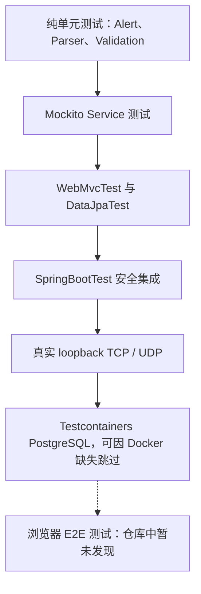
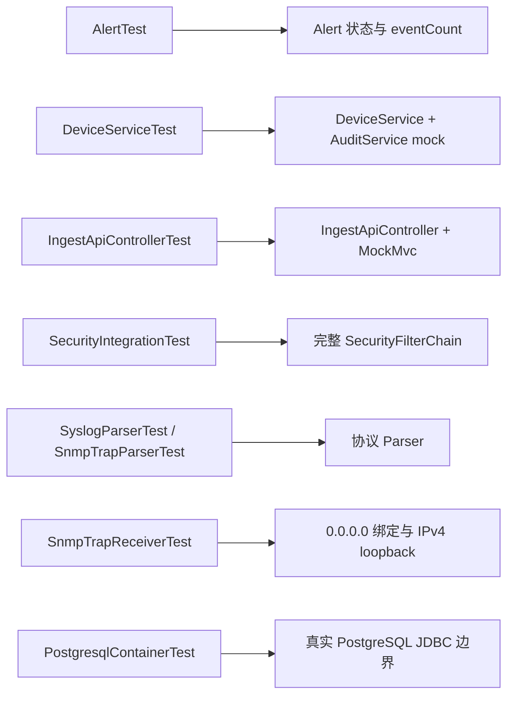
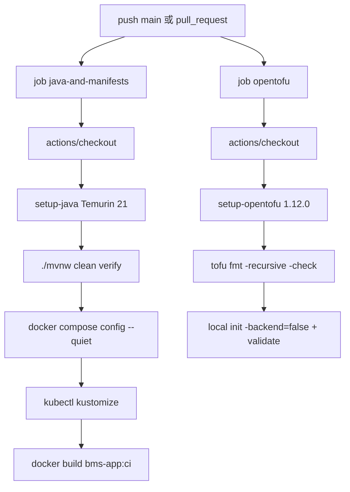
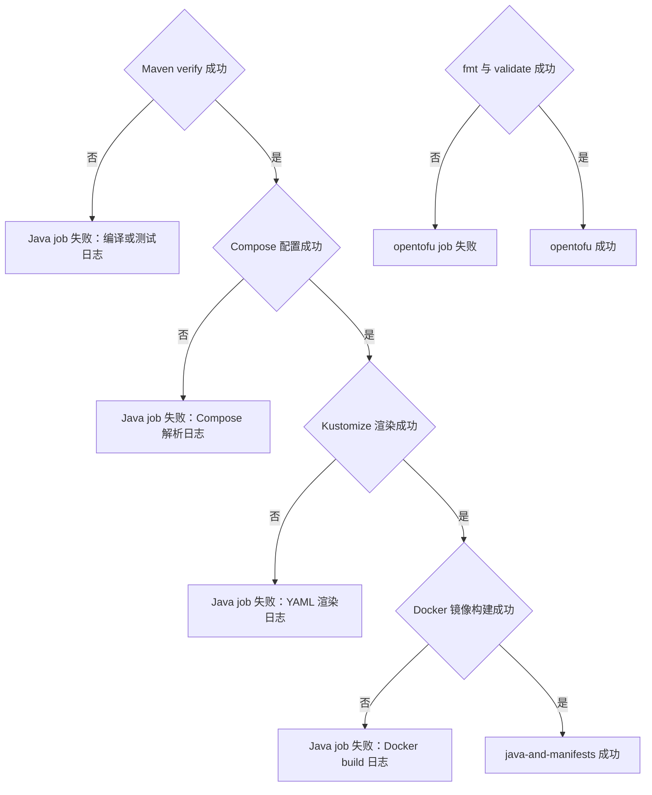

# 绿灯也要问证据：测试与 CI/CD 对话

## 本章目标

理解测试金字塔、真实网络回归、Testcontainers 跳过边界，以及 GitHub Actions 实际做了什么。

## 涉及的关键代码

| 文件路径 | 类、函数或资源 | 作用 |
|---|---|---|
| `app/bms-app/src/test/java/` | 14 个主应用测试类 | 领域、MVC、安全、协议和数据库测试 |
| `apps/snmp-get-lambda/src/test/java/` | `SnmpGetLambdaHandlerTest` | 无真实网络的 handler 测试 |
| `apps/tcp-ping-lambda/src/test/java/` | `TcpPingLambdaHandlerTest` | 多目标发布测试 |
| `apps/alert-function/src/test/java/` | `AlertNotificationFunctionTest` | 通知与重复抑制 |
| `.github/workflows/ci.yml` | 两个 job | Java、清单、镜像与 OpenTofu 校验 |

## 本章全景图

### 图表说明

- 层次来自当前测试注解和测试方法，不以虚构覆盖率排序。
- loopback 测试真实打开本地 TCP/UDP 边界，但不依赖外部设备。
- PostgreSQL Testcontainers 测试标记 `disabledWithoutDocker = true`。
- 仓库有截图脚本，但未发现将浏览器场景作为 CI E2E 断言的测试套件。
- 箭头表示由快到慢、由小到大的测试层次，不表示运行依赖。

## 对话式讲解

Speaker 1: 这个项目有多少种测试？

Speaker 2: 有纯领域单元测试、Mockito Service 测试、Bean Validation、JPA slice、MockMvc Web slice、Spring Security 集成、真实 loopback Socket、协议解析、Lambda/Function 核心逻辑和 Testcontainers PostgreSQL。

Speaker 1: 为什么不全用 `@SpringBootTest`？

Speaker 2: 全量上下文慢且定位困难。`@WebMvcTest` 只看 Controller 与 HTTP 行为，`@DataJpaTest` 看实体和 Repository，纯单元测试看状态机；真正需要完整安全链时才启动全应用上下文。

Speaker 1: 最小的领域测试例子是什么？

Speaker 2: `AlertTest.lifecycleKeepsEventCountAndOperator` 直接操作 `Alert`，验证事件次数和操作者。没有数据库和网络，失败时很容易定位领域规则。

Speaker 1: Service 测试验证什么？

Speaker 2: `DeviceServiceTest` 用 mock Repository 验证 DTO 映射、保存和审计；`AlertServiceTest` 验证不允许已关闭告警倒退。它关注协作与事务规则。

Speaker 1: Controller 测试能发现漏 API Key 吗？

Speaker 2: `IngestApiControllerTest.rejectsMissingApiKey` 明确检查缺 Key 的 401，另一个测试检查必填字段。若新增 API，应该复制这种安全边界测试。

Speaker 1: 安全角色有测试吗？

Speaker 2: `SecurityIntegrationTest` 验证匿名用户跳转登录、VIEWER 不能打开管理员用户页、ADMIN 可以访问。它运行完整 Security FilterChain。

Speaker 1: 协议解析怎么测？

Speaker 2: `SyslogParserTest` 覆盖 RFC3164、RFC5424 和坏格式原文保留；`SnmpTrapParserTest` 覆盖 linkDown 严重状态与 linkUp 恢复 key。

## 第一部分：测试对象与文件映射

Speaker 1: 能把“哪个测试守哪段代码”画出来吗？

Speaker 2: 当然。这里列代表性映射，避免把文件列表误当成覆盖率报告。

### 图表说明

- 所有测试类名来自当前 `src/test/java`。
- `DeviceServiceTest` 使用 mock Repository 和 AuditService；Web 测试使用 MockMvc。
- `SnmpTrapReceiverTest` 是真实 UDP loopback 回归，不是纯 mock。
- `PostgresqlContainerTest` 需要可用 Docker Engine；本轮被跳过。
- 映射图不声称未列出的分支已覆盖，也不代表存在覆盖率门槛。

Speaker 1: 网络代码可以只 mock 吗？

Speaker 2: 不够。`TcpPingServiceTest` 在 loopback 打开与关闭真实端口，验证成功和 connection refused；`SnmpTrapReceiverTest` 真正向 IPv4 loopback 发 UDP Trap，防止绑定地址回归。

Speaker 1: Testcontainers 测什么？

Speaker 2: `PostgresqlContainerTest` 启动真实 PostgreSQL 并检查连接，弥补 H2 与 PostgreSQL 差异。它标了 `disabledWithoutDocker = true`。

Speaker 1: “测试通过”时它可能根本没跑？

Speaker 2: 对。Docker Engine 不可用时这个测试是 skipped，不是 passed。报告要分别写总测试结果和容器测试是否实际启动，绿灯不能替空白作证。

Speaker 1: 根 Maven 的 JaCoCo 有覆盖率门槛吗？

Speaker 2: `jacoco-maven-plugin` 会准备 agent 并生成报告，但配置中没有发现最低覆盖率 fail threshold。因此不能声称达到某个覆盖率标准。

Speaker 1: CI 何时触发？

Speaker 2: `.github/workflows/ci.yml` 对 main push 和所有 pull request 触发，权限只有 `contents: read`，分为 `java-and-manifests` 与 `opentofu` 两个 job。

## 第二部分：真实 CI Pipeline

Speaker 1: 两个 job 是先后执行还是并行？

Speaker 2: YAML 中没有 `needs`，所以它们可并行。每个 job 内的 step 才按顺序执行。

### 图表说明

- Job 名、action、Java/OpenTofu 版本与命令均来自 `.github/workflows/ci.yml`。
- 两个 Job 没有依赖边，因此 GitHub Actions 可以并行调度。
- Java Job 先验证 Maven，再验证 Compose/Kustomize，最后构建镜像。
- OpenTofu Job 仅检查格式和无 backend 的 local validate，不执行 plan/apply。
- 工作流未包含镜像推送或生产部署，所以图在构建处结束。

Speaker 1: Java job 做哪些事？

Speaker 2: Checkout，安装 Temurin 21，给 Unix 脚本执行权限，运行 `./mvnw --batch-mode clean verify`，校验 Compose，渲染 Kustomize，最后构建非 root 应用镜像。

Speaker 1: `docker compose config --quiet` 能证明容器跑起来吗？

Speaker 2: 不能。它验证 YAML 插值和服务连线的静态有效性；真正运行还取决于镜像拉取、端口、健康检查和 Docker Engine。

## 第三部分：构建失败分支

Speaker 1: CI 任一步失败后，后面还会继续吗？

Speaker 2: 同一 Job 默认停止后续 step；另一个并行 Job 仍可独立完成。

### 图表说明

- 同一 GitHub Actions Job 中，默认只有前一步成功才执行下一步。
- Java 与 OpenTofu Job 独立，因此一个失败不自动取消另一个已经运行的 Job。
- 失败节点代表应检查的日志类别，不是代码中自定义的错误处理。
- 镜像构建失败归入 Java Job 失败；图没有虚构自动重试。
- 当前没有部署 Job，因此不存在 CI 内的自动回滚分支。

Speaker 1: `kubectl kustomize` 又能证明什么？

Speaker 2: 证明 overlay 能渲染成 Kubernetes 资源，不能证明 API Server 接受、Pod 就绪、LoadBalancer 分配地址或 NetworkPolicy 路径正确。

Speaker 1: 镜像构建为什么值得单独做？

Speaker 2: Maven 成功不代表 Dockerfile 路径、阶段 COPY 或运行镜像依赖正确。构建至少验证镜像装配；运行用户和 healthcheck 仍可再做容器级测试。

Speaker 1: OpenTofu job 会创建云资源吗？

Speaker 2: 不会。它做递归格式检查，再对 local 环境 `init -backend=false` 和 `validate`。没有云凭据，也没有 plan/apply/destroy。

Speaker 1: 当前 GitHub 上有失败检查需要修吗？

Speaker 2: 本次通过 GitHub 连接器检查时，没有开放的当前用户 PR，也没有近期 Issue，所以不存在可定位的 PR 检查对象。我们只能验证当前工作树，不能虚构远端失败。

Speaker 1: 文档改动也要跑 Maven 吗？

Speaker 2: 业务代码未变，最直接的是链接、路径、敏感信息和格式检查；但完整 `clean verify` 能确认工作区基线未意外破坏。是否运行容器相关检查要看本机工具和 Engine 状态。

## 第四部分：部署验证边界

Speaker 1: 通过这些检查后，哪些结论能说，哪些不能说？

Speaker 2: 看验证阶梯，每一层只能领取自己那一层的结论。

### 图表说明

- 实线层是 CI 配置中明确执行的检查。
- 本轮本地实际通过 Maven、Compose config 和 Kustomize render；Testcontainers 因 Docker 不可用跳过。
- CI 在 Ubuntu runner 会执行 Docker build，但本轮没有在当前主机重跑运行容器。
- kind 运行和真实云集成使用虚线，表示本轮未验证。
- 任何静态成功都不能改写为“生产部署成功”。

Speaker 1: 还缺哪些测试最值得加？

Speaker 2: 首先是 `EventProcessingService` 的真实事务并发与重复通知、通知失败/outbox、Kubernetes 容器启动、Oracle profile 迁移、负载和故障注入。它们是改进建议，不是当前覆盖事实。

## 本章涉及的关键文件

| 文件 | 作用 | 在图中的节点 |
|---|---|---|
| `app/bms-app/src/test/java/` | 主应用各层测试 | 测试层次与映射节点 |
| `app/bms-app/src/test/java/com/example/bms/protocol/snmp/SnmpTrapReceiverTest.java` | IPv4 loopback Trap 回归 | Receiver loopback |
| `app/bms-app/src/test/java/com/example/bms/infrastructure/PostgresqlContainerTest.java` | 可选真实 PostgreSQL 测试 | Testcontainers 层 |
| `pom.xml` | Surefire 与 JaCoCo 配置 | Maven verify |
| `.github/workflows/ci.yml` | 两个 CI job | `java-and-manifests`、`opentofu` |

## 核心知识点回顾

1. 测试按领域、切片、集成和真实外部边界分层。
2. skipped Testcontainers 不能算实际通过。
3. Compose 配置、Kustomize 渲染和 OpenTofu validate 都是静态证据，不是运行态证明。

### 启发式思考

1. 怎样在 CI 中明确显示 Testcontainers 是运行还是跳过？
2. 哪个并发场景最可能让重复通知穿透？
3. 文档-only PR 应保留哪些昂贵检查？
