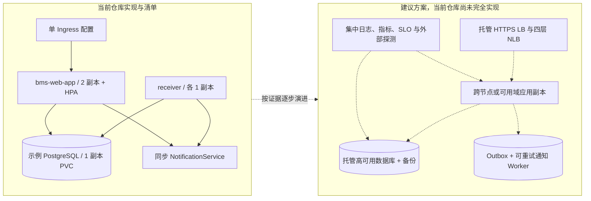
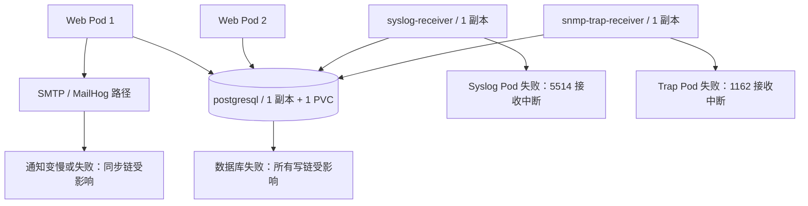
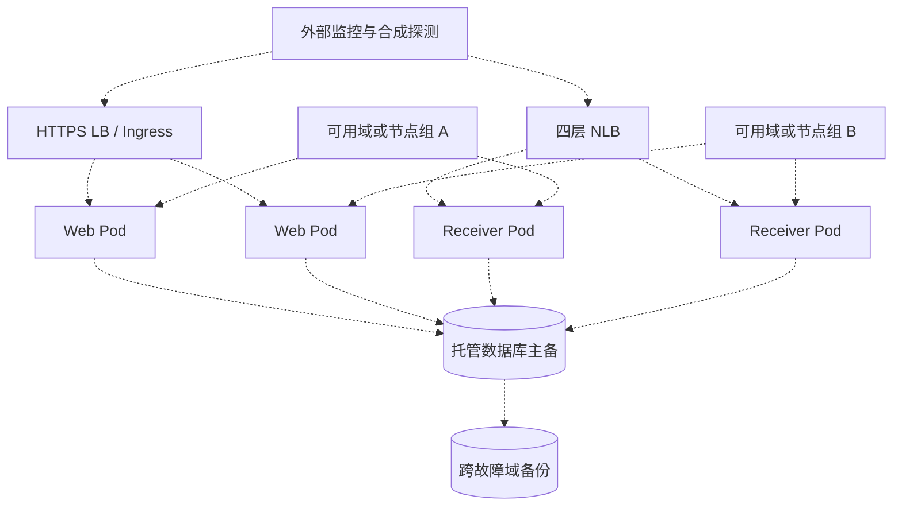
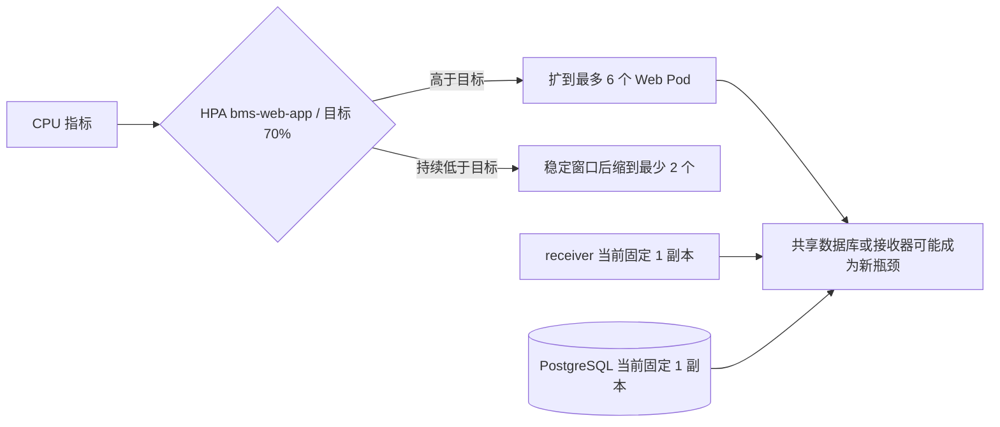
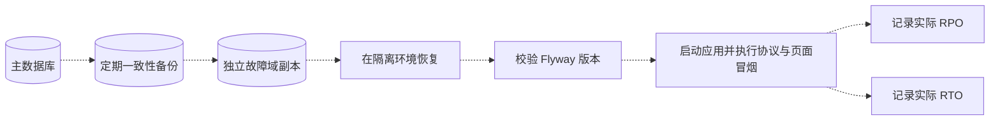
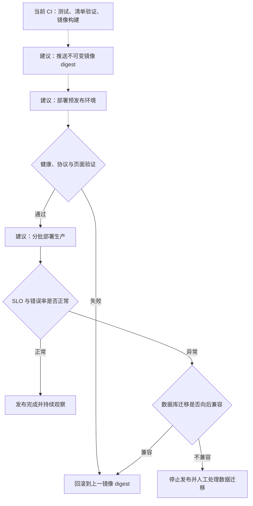

# 从能运行到敢值班：生产就绪对话

## 本章目标

以故障、安全、容量、数据和运维为线索，区分当前能力与生产化待办。

## 涉及的关键代码

| 文件路径 | 类、函数或资源 | 作用 |
|---|---|---|
| `infra/kubernetes/base/bms-components.yaml` | 五个 Deployment | 当前集群部署形状 |
| `infra/kubernetes/base/availability.yaml` | HPA、PDB、Ingress | 当前可用性基础 |
| `infra/kubernetes/base/postgresql.yaml` | 单副本 PostgreSQL 与 PVC | 当前示例数据层 |
| `app/bms-app/src/main/java/com/example/bms/notification/NotificationService.java` | `notifyAlert` | 当前同步通知边界 |
| `infra/opentofu/environments/production/README.md` | 生产前置条件 | 尚待落实的环境治理 |

## 本章全景图

### 图表说明

- 左侧来自当前 Kubernetes 与 Java 实现：Web 可扩缩，接收器和数据库仍有单副本。
- 右侧标题明确标记为建议，不代表仓库已经具备托管数据库、跨域调度或 outbox。
- 当前 OpenTofu 主要提供资源外壳，LB listener、backend、证书、DNS 与 VPN 仍需补充。
- 应用高可用、数据高可用和通知可靠性是三个独立问题。
- 演进箭头表示建议顺序，真实方案需要负载、RPO/RTO 与预算决策。

## 对话式讲解

Speaker 1: 代码能跑，为什么还不能直接上生产？

Speaker 2: 能跑只证明一条路径成立。生产还要求身份治理、容量、备份、故障恢复、网络边界、Secret、升级回滚、值班和 SLO，这些不能由一个本地启动截图替代。

Speaker 1: 当前最明确的生产就绪优点是什么？

Speaker 2: 有结构化迁移、事务边界、角色权限、审计、健康端点、非 root 容器、资源限制、NetworkPolicy、PDB/HPA、CI 和运维 runbook。它不是空白脚手架。

Speaker 1: 最明显的阻塞项呢？

Speaker 2: 本地默认秘密、内存用户、v2c、同步通知、示例单副本数据库，以及没有真实云/集群和负载验证。每一项都需要环境证据才能关闭。

Speaker 1: 数据库不可用时会怎样？

Speaker 2: 事务写入失败，API 或接收器记录异常，readiness 可能转失败。Event 不会被数据库接受；UDP 发送方通常也不会自动重试，所以需要上游可靠性或接收缓冲设计。

## 第一部分：单点故障

Speaker 1: 当前最需要圈红的单点在哪里？

Speaker 2: 数据库、两个协议接收器和同步通知路径最明显。Web 两副本并不会自动消除它们。

### 图表说明

- Web 当前两副本，但 receiver 与 PostgreSQL 清单各一副本。
- 所有角色共享 PostgreSQL，因此数据库故障影响面最大。
- UDP sender 通常不会因 Pod 中断得到应用级重试保证。
- 同步通知可能影响事务时长，具体失败语义需结合 `NotificationService`。
- 这张图分析当前单点，不表示生产环境已经发生这些故障。

Speaker 1: 邮件服务不可用会拖垮事件写入吗？

Speaker 2: 当前通知在事件事务链上，具体失败处理要看 `NotificationService`。生产上更稳妥的是写 outbox 后异步重试，并为永久失败建立死信和人工补偿。

Speaker 1: 容器崩溃 Kubernetes 会恢复吗？

Speaker 2: Deployment 会尝试重建 Pod，liveness 也可触发重启。但若原因是坏配置、数据库宕机或所有节点资源不足，重启只会循环，不会创造奇迹。

Speaker 1: PDB 和两副本能保证 Web 高可用吗？

Speaker 2: 只提高自愿维护时的可用性。还要反亲和、跨可用域节点、数据库高可用、LB 健康检查和容量。当前清单不能证明这些外部条件。

## 第二部分：建议的高可用设计，当前仓库尚未完全实现

Speaker 1: 如果要补全高可用，目标拓扑应该是什么样？

Speaker 2: 下图只表达建议能力，不绑定具体云产品承诺。

### 图表说明

- 全部使用虚线，因为跨域调度、receiver 多副本、托管主备和外部探测尚未完整实现。
- HTTPS 与原始 UDP/TCP 分别使用应用层 LB 和四层 NLB。
- 数据库主备与备份是不同机制：前者处理可用性，后者处理恢复。
- receiver 多副本必须验证 UDP 分配、重复包与源地址语义。
- 实施前需补反亲和、拓扑约束、容量和故障演练。

Speaker 1: UDP 接收器只有一副本危险吗？

Speaker 2: 有单点和维护中断风险。扩到多副本前又要确认 LoadBalancer 的 UDP 分配、源地址、重复包和有状态接收行为。副本数不是越大越自动安全。

Speaker 1: 如何定义 SLO？

Speaker 2: 可从事件接收到持久化延迟、告警生成延迟、通知成功率、协议丢弃率、页面可用性和恢复时间定义。仓库没有现成生产 SLO，必须结合业务等级制定。

Speaker 1: 容量规划需要哪些数据？

Speaker 2: 每秒 Syslog/Trap 数、消息大小、设备数、规则数、活跃告警、保留期、查询并发和通知扇出。没有这些数据就报一个吞吐数字，是把猜测穿上西装。

## 第三部分：扩缩容边界

Speaker 1: HPA 看到 CPU 70% 后，是不是整个系统一起扩？

Speaker 2: 当前 HPA 只指向 `bms-web-app`，数据库和接收器不会跟着自动扩。

### 图表说明

- HPA min 2、max 6、CPU averageUtilization 70 与 300 秒缩容稳定窗口来自 YAML。
- 当前 HPA 目标只有 Web Deployment。
- receiver 与 PostgreSQL 不随 Web 自动扩容。
- metrics-server 是 HPA 生效前提，仓库不证明集群已安装。
- 生产扩容应结合事件率、数据库写入和延迟，而不只看 Web CPU。

Speaker 1: 数据保留和归档现在实现了吗？

Speaker 2: 未发现自动分区、TTL 或归档任务。事件和审计会持续增长，生产需要保留政策、分区/归档、索引维护和合法删除流程。

Speaker 1: 备份只要给 PVC 做快照吗？

Speaker 2: 不够。要验证可恢复的一致性备份、RPO/RTO、恢复到新环境、Flyway 版本兼容和 Secret/配置恢复。托管数据库通常比示例单 Pod 更合适。

## 第四部分：建议的灾难恢复流程，当前仓库尚未实现

Speaker 1: 真正的恢复演练要经过哪些步骤？

Speaker 2: 备份只有成功恢复过，才从“希望”升级为“证据”。

### 图表说明

- 全部为建议流程；当前仓库没有自动备份、跨域复制或恢复演练实现。
- 恢复后必须验证 Flyway schema 与应用版本，不只检查数据库进程启动。
- 协议与页面冒烟用于确认恢复数据可被真实业务路径使用。
- RPO/RTO 必须来自演练测量，仓库中没有可引用的生产目标。
- Secret、DNS、镜像和网络配置也应纳入完整恢复，但图聚焦数据主线。

Speaker 1: 发布与回滚怎么做？

Speaker 2: 当前 CI 构建但未发现生产 CD。应使用不可变镜像 digest、分阶段发布、数据库向后兼容迁移和明确回滚条件；Flyway 已执行的破坏性迁移不能靠回滚镜像自动撤销。

## 第五部分：建议的发布与回滚，当前仓库尚未实现

Speaker 1: 没有 CD 时，怎样画发布图才不冒充现状？

Speaker 2: 把整条线标成建议，并在回滚节点强调数据库迁移约束。

### 图表说明

- 当前事实只到 CI 构建；Registry、预发布和生产发布均为建议。
- 使用虚线区分尚未实现的 CD 路径。
- 回滚镜像不能自动逆转已执行的破坏性 Flyway 迁移。
- 发布门禁应包含健康、协议输入和页面冒烟，而不只看 Pod Running。
- 仓库中未发现生产 CD 工作流，因此没有虚构平台或部署命令。

Speaker 1: 监控告警系统自身如何避免“监控盲区”？

Speaker 2: 将接收率、解析失败、最后消息时间、队列/事务延迟、通知失败和健康端点送到独立监控平台，并从外部做合成探测。不能只让系统自己宣布自己健康。

Speaker 1: 安全上线门槛是什么？

Speaker 2: 生产 profile 禁止默认秘密，企业 IdP 与最小角色，API mTLS/OIDC/限流，SNMP 私网与 v3 计划，镜像/SBOM/依赖扫描，集中审计，Secret 轮换和渗透测试。

Speaker 1: 混合云网络最容易踩什么坑？

Speaker 2: CIDR 重叠、回程路由、MTU、DNS、NAT、UDP 状态和安全列表。OpenTofu 中的非重叠网段只是起点，必须以端到端流量测试验证。

Speaker 1: 故障演练从哪里开始？

Speaker 2: 先在非生产环境依次停止 PostgreSQL、MailHog、receiver 和 worker，观察 readiness、日志、数据丢失与恢复；再做节点驱逐、网络中断和重复消息。

Speaker 1: 哪些改进不该现在就做？

Speaker 2: 没有容量证据时不要先拆十几个微服务，也不要为不存在的多区域流量设计复杂共识。先解决明确风险，用指标决定下一步。

Speaker 1: 生产就绪清单如何保持真实？

Speaker 2: 每项写“证据、负责人、环境、日期和结果”，区分配置存在、静态验证、集成验证与生产演练。一个 YAML 文件不能给自己颁发上线证书。

Speaker 1: 如果只能先做三件事？

Speaker 2: 第一移除生产默认秘密并统一身份；第二把通知改成可靠异步边界；第三建立真实 PostgreSQL/Kubernetes 的负载与故障基线。它们同时降低安全、数据和运维风险。

## 本章涉及的关键文件

| 文件 | 作用 | 在图中的节点 |
|---|---|---|
| `docs/operations/runbook.md` | 运维与故障处理入口 | 故障与恢复流程 |
| `docs/security/threat-model.md` | 威胁和控制 | 生产安全边界 |
| `app/bms-app/src/main/java/com/example/bms/notification/NotificationService.java` | 当前通知边界 | 同步通知、建议 outbox |
| `infra/kubernetes/base/availability.yaml` | HPA、PDB 与 Ingress | 扩缩容与可用性 |
| `infra/opentofu/environments/production/README.md` | 生产环境前置条件 | 建议生产架构 |

## 核心知识点回顾

1. 生产就绪需要运行证据，不是配置文件数量。
2. 数据库、通知和 UDP 输入的失败语义不同。
3. 应以 SLO、容量与演练推动演进，而不是先行微服务化。

### 启发式思考

1. 哪条 SLO 最能代表网络运维人员的真实体验？
2. 如何设计一次不丢数据的数据库维护窗口？
3. 哪些生产就绪证据必须由独立系统采集？
