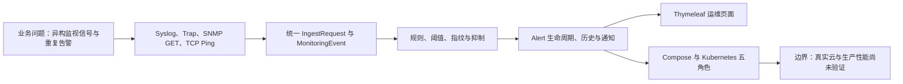
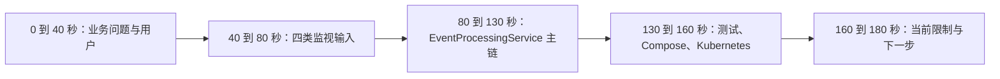
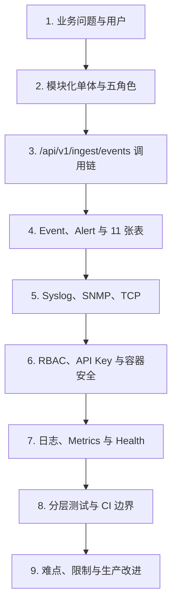
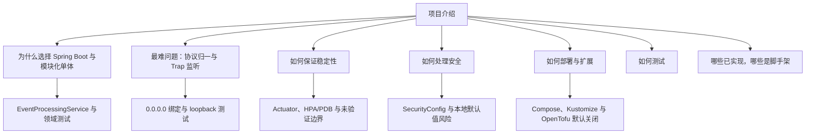
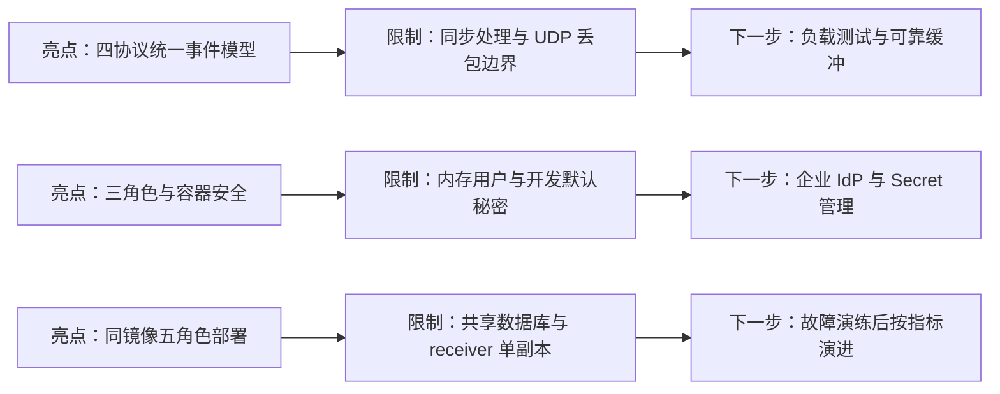

# 把项目讲清楚：面试表达对话

## 本章目标

提供忠于代码的 3 分钟、10 分钟介绍和常见追问回答，避免把个人贡献或部署状态说成未经证明的事实。

## 涉及的关键代码

| 文件路径 | 类、函数或资源 | 面试中用于证明 |
|---|---|---|
| `app/bms-app/src/main/java/com/example/bms/event/EventProcessingService.java` | `process` | 异构协议统一与告警聚合 |
| `app/bms-app/src/main/java/com/example/bms/security/SecurityConfig.java` | `securityFilterChain` | 认证授权与当前限制 |
| `app/bms-app/src/test/java/com/example/bms/protocol/snmp/SnmpTrapReceiverTest.java` | loopback 测试 | 真实网络边界回归 |
| `infra/kubernetes/base/bms-components.yaml` | 五角色 Deployment | 模块化单体的部署演进 |
| `.github/workflows/ci.yml` | 两个 Job | 实际验证范围 |

## 本章全景图

### 图表说明

- 这条逻辑链将业务问题映射到真实协议、DTO、Service、实体、页面与部署配置。
- `EventProcessingService` 连接模型、规则和告警，是介绍中的主要代码证据。
- Compose/Kubernetes 说明交付形状，不应被说成生产上线证明。
- 边界节点主动提醒面试者不要虚构真实云部署和性能数字。
- 箭头是讲解逻辑，也与主要数据流一致，但不是逐方法时序图。

## 对话式讲解

Speaker 1: 先来一个 3 分钟开场，我该怎么说？

Speaker 2: “这是一个 Java 21 与 Spring Boot 3.5 的网络 BMS 监视平台。它接收 Syslog、SNMP Trap，并执行 SNMP GET 和 TCP connect 检查，把不同协议统一成 MonitoringEvent，再按设备、规则和抑制窗口形成 Alert。页面用 Spring MVC 与 Thymeleaf，数据用 Flyway 管理的 PostgreSQL；仓库还提供 Docker Compose、Kubernetes 五角色部署和默认关闭的 AWS/OCI OpenTofu 模块。”

## 第一部分：三分钟介绍路线

Speaker 1: 三分钟里每一段大概讲什么，才不会前两分钟都在报技术名？

Speaker 2: 按问题、方案、主链、验证、边界五步走。

### 图表说明

- 时间分配是表达建议，不是代码运行时序。
- 主链必须落到 `IngestApiController`、`EventProcessingService` 与 Event/Alert。
- 验证段只说实际存在的测试和 CI，不声称 Testcontainers 本轮运行。
- 边界段说明云模块默认关闭、生产性能没有基线。
- 这张图帮助控制节奏，完整技术关系以前面的全景图为准。

Speaker 1: 还要补一句边界吗？

Speaker 2: 要。“本地应用与测试可运行，云模块是迁移脚手架；我不会把它描述成已经在真实 AWS/OCI 生产环境上线。”这句话很加分，因为工程判断包含证据边界。

Speaker 1: 10 分钟版本怎么展开？

Speaker 2: 按业务问题、架构、代表性调用链、数据模型、安全与可观测性、基础设施、测试、难点和改进九段。每段用一个具体类或文件落地，不要背技术名词菜单。

## 第二部分：十分钟技术介绍结构

Speaker 1: 九段之间怎样衔接才不像目录朗读？

Speaker 2: 每段用上一个问题引出下一个证据，形成一条因果链。

### 图表说明

- 九段内容均对应本指南前八章的真实代码与配置。
- 请求链用具体 API，数据段用 Flyway，安全段用 `SecurityConfig`。
- 测试段必须提 Testcontainers 可跳过和 CI 不部署生产。
- 最后一段讲取舍与建议，不把建议说成已实现。
- 箭头表示面试叙事顺序，不是系统组件依赖。

Speaker 1: 业务问题怎么讲？

Speaker 2: 网络设备会产生不同协议和大量重复信号。项目将一次事实 Event 与需要处理的聚合故障 Alert 分开，既保留原始证据，又避免同一故障反复轰炸值班人员。

Speaker 1: 架构亮点是什么？

Speaker 2: 协议 Adapter 只解析，`EventProcessingService` 统一做设备/规则匹配、状态、SHA-256 指纹、抑制、事务保存和通知；Kubernetes 再用同一镜像按五种组件角色部署。

Speaker 1: 一条代表性调用链怎么说？

Speaker 2: Lambda 或脚本调用 `/api/v1/ingest/events`，Controller 校验 API Key 和 DTO，Service 查设备、目标、规则，保存 Event，创建或更新 Alert 与 History，非重复事件触发通知，最终返回 202 和 eventId。

Speaker 1: 最难的问题是什么？

Speaker 2: 可以讲协议差异如何归一、Event 与 Alert 的边界、Trap loopback 监听回归，或同镜像多角色的开关设计。要根据自己真实做过的工作选择，不能把仓库作者的所有工作都认领成个人贡献。

Speaker 1: 为什么选择 Spring Boot？

Speaker 2: 它把 MVC、安全、Validation、JPA、调度、Actuator 和容器化整合在同一运行模型中，适合这个模块化单体。代价是同进程故障域和同步事务链，需要通过角色开关和后续异步边界演进。

Speaker 1: 为什么不用微服务？

Speaker 2: 当前领域关系紧密，本地复现和事务一致性更重要。先用模块化单体避免分布式复杂度；当接收量、团队边界或独立扩容有数据证明时，再拆 receiver 或通知。

Speaker 1: 如何保证稳定性？

Speaker 2: 代码层有事务、输入校验、受控异常、重复抑制和状态历史；运行层有 readiness/liveness、资源限制、HPA/PDB 和 NetworkPolicy；验证层有分层测试与 CI。生产仍需压测、备份、SLO 和故障演练。

Speaker 1: 安全怎么回答？

Speaker 2: 当前有表单认证、三角色、BCrypt、CSRF、CSP、API Key、非 root 容器和 restricted Pod。也要主动指出本地默认秘密、内存用户和 SNMPv2c 只适合学习环境，生产需 IdP、Secret 管理、mTLS/OIDC、限流和 SNMPv3。

Speaker 1: 如何部署？

Speaker 2: 本地可用 Maven JAR 或 Compose；kind 使用 Kustomize overlay；生产设计用 Kubernetes 与 OpenTofu 组合 AWS/OCI 网络和计算。真实部署还要镜像仓库、域名证书、LB、IAM、数据库和监控。

Speaker 1: 如何监控？

Speaker 2: Actuator 提供 health、readiness、liveness、metrics 和 Prometheus，`RequestCorrelationFilter` 串联 HTTP 日志，receiver 健康指标覆盖协议线程。仓库没有完整 tracing 后端，应明确这是改进项。

Speaker 1: 如何测试？

Speaker 2: 领域和 Service 用 JUnit/Mockito，Web 用 MockMvc，安全用完整上下文，协议解析用固定消息，TCP 与 Trap 用真实 loopback，数据库用可选 Testcontainers，CI 再验证 Compose、Kustomize、镜像和 OpenTofu。

Speaker 1: 面试官问“哪些是真的，哪些是模拟的”呢？

Speaker 2: 真的实现了主应用、协议接收、Socket/SNMP 客户端、数据模型、页面、测试和本地容器；simulator 与 demo data 是学习输入；Lambda/Function 核心逻辑可测试；真实 AWS/OCI 资源和生产流量没有部署证据。

## 第三部分：面试官追问树

Speaker 1: 面试官最可能从哪些词继续追问？

Speaker 2: 通常从选择、稳定、安全、部署、测试和真假边界六个方向钻下去。

### 图表说明

- 每个追问都连接到可打开的代码或配置证据。
- Trap 监听难点对应 `SnmpTrapReceiver` 与 `SnmpTrapReceiverTest`。
- 稳定性回答必须同时讲现有控制与生产缺口。
- 部署回答区分 Compose、Kustomize 静态验证和真实云状态。
- “哪些是真的”是必答边界，不能用项目名称代替证据。

Speaker 1: 如果问性能？

Speaker 2: 不能报虚构数字。说明当前同步事务、索引和角色拆分的设计，再说仓库没有压测基线；下一步会按事件率、消息大小、规则数、保留期和查询并发建立测试模型。

Speaker 1: 如果问数据库选择？

Speaker 2: PostgreSQL 让本地与 Testcontainers 易复现，Flyway 提供显式迁移；Oracle profile 支持目标环境探索。但 Oracle 兼容必须在真实环境验证，不能因为依赖存在就说已完成迁移。

Speaker 1: 如果问故障恢复？

Speaker 2: Pod 可由 Deployment 重建，readiness 可摘流，PDB 保护自愿中断；数据库、UDP 丢包和同步通知仍需额外策略。生产方案要包含托管数据库、备份恢复、outbox 和外部合成探测。

Speaker 1: 下一步改进怎么排优先级？

Speaker 2: 先生产 Secret/身份与统一 API 认证，再可靠异步通知，然后真实环境压测与故障演练；依据指标决定是否拆服务。这个顺序比“先上 Kafka 再说”更有证据。

## 第四部分：亮点、限制与下一步

Speaker 1: 最后总结时，怎样同时讲亮点和不足又不显得自我拆台？

Speaker 2: 把每个亮点连接到它暴露的下一步，说明你理解取舍。

### 图表说明

- 三个亮点分别有源码、SecurityConfig 和 Kubernetes YAML 证据。
- 限制来自当前同步链、认证实现和副本配置。
- 下一步均标为建议，没有画成已完成状态。
- 图的目的不是贬低项目，而是说明工程取舍与演进依据。
- 未选择具体消息中间件或云产品，避免在没有需求证据时过度设计。

Speaker 1: 面试中最忌讳什么？

Speaker 2: 把 Kustomize 渲染说成集群上线，把 IaC validate 说成云资源验证，把 skipped Testcontainers 说成 PostgreSQL 通过，以及认领未经证明的个人工作。

Speaker 1: 最后一句如何收尾？

Speaker 2: “这个项目的价值不只是用了多少技术，而是把异构监视信号变成可追踪的事件与告警，并把本地可运行实现、容器化演进和生产待办清楚分层。”然后等面试官追问具体代码。

## 本章涉及的关键文件

| 文件 | 作用 | 在图中的节点 |
|---|---|---|
| `pom.xml` | 技术栈和模块事实 | 六模块与 Java 21 |
| `app/bms-app/src/main/java/com/example/bms/event/EventProcessingService.java` | 代表性架构与调用链 | 核心主链 |
| `app/bms-app/src/main/java/com/example/bms/security/SecurityConfig.java` | 安全事实和边界 | 安全追问证据 |
| `.github/workflows/ci.yml` | 验证范围 | 测试与 CI 证据 |
| `infra/opentofu/` | 云脚手架与未部署边界 | 真假边界节点 |

## 核心知识点回顾

1. 面试表达要从业务问题落到具体代码。
2. 3 分钟讲主线，10 分钟讲取舍、验证和边界。
3. 个人贡献、生产部署和性能数字都不能脱离证据。

### 启发式思考

1. 你能否在白板上从 `IngestApiController` 讲到通知失败？
2. 哪个设计取舍最能体现你的工程判断？
3. 如果面试官质疑“混合云只是 PPT”，你会给出哪些代码证据与限制？
