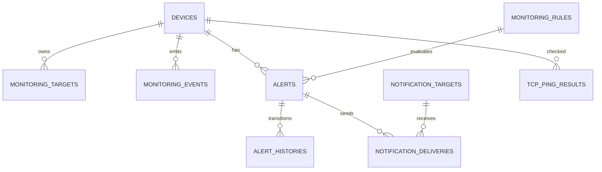

# 数据库设计

Flyway `V1__create_bms_schema.sql` 是结构唯一来源，`V2__seed_master_data.sql` 写入 10 台设备、监视对象、规则、通知对象和本地用户样例。JPA 仅做 `ddl-auto=validate`，不会在运行时擅自修改结构。

事件和告警严格分离：`monitoring_events` 保存每次原始/标准化事实和重复标记；`alerts` 保存聚合后的活动障害，`alert_histories` 保存不可变状态迁移。索引覆盖事件发生时间、来源、状态、设备、告警状态与末次发生时间；重复判定使用设备/来源/event key/时间窗业务查询。审计日志不级联删除。

PostgreSQL 用于本地和 Testcontainers；Oracle profile 使用 Oracle JDBC 与 Flyway Oracle 扩展。ADB Wallet、数据库密码、OCID 和连接描述符不提交 Git，生产通过挂载只读 Secret 与 `TNS_ADMIN` 提供。迁移应先在 PostgreSQL/Oracle staging 执行 `flyway validate` 与备份恢复演练，再滚动发布应用。
